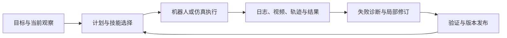

# RoboRSI 技术解读

阅读日期：2026-09-22。背景知识库只读；本文基于博客和官方仓库提交 `9b644d270560c440d760965cf1b859df674459de`，没有运行训练或机器人实验。

RoboRSI 把机器人执行、失败诊断、技能修改和验证发布组织为多轮闭环。理解这条路线时，可以把 harness 看成运行基础设施，把 RSI 看成持续改进过程，把代码技能和学习策略看成被改进的对象。官方仓库也把项目定义为多智能体机器人 harness。[官方 README](https://github.com/nssmd/RoboRSI/tree/9b644d270560c440d760965cf1b859df674459de)

## 多智能体与执行闭环

| 角色 | 职责 |
|---|---|
| Manager | 管任务队列、并发 worker、断点和技能版本 |
| Planner | 结合目标、观察和可用技能编排计划 |
| Engineer | 调用机器人工具，执行并实现候选技能 |
| Reviewer | 检查轨迹和结果，把修订建议反馈给负责节点 |

角色划分让计划、执行和复盘有明确产物与责任。真实机器人仍保留必要的人类监管；仿真复位和结果判定可以自动化。[博客方法](https://lab.noematrix.ai/blog/2-roborsi/#multi-agent-operation)

## 技能树与经验复用

博客的 TSR（Top-down Skill Refinement）按任务族、复合技能、原子任务和基础技能组织能力。稳定分支继续复用，失败沿调用路径回到最早出错节点修订。成熟调用链被参数化为代码；环境变化或执行失败时，Agent 再参与诊断。[TSR](https://lab.noematrix.ai/blog/2-roborsi/#feature-autonomy)

公开架构以 `long_horizon`、`atomic`、`base` 三类主要目录组织技能；复合代码可存在于原子任务内部，不必对应第四类顶层目录。基础技能同时可作为 Agent 工具和被程序调用的函数。原子任务还包含采集、训练、评测与复位等生命周期操作：成功轨迹转为数据集，训练策略，通过评测后切换 active executor。[架构](https://github.com/nssmd/RoboRSI/blob/9b644d270560c440d760965cf1b859df674459de/docs/architecture.md)、[技能结构](https://github.com/nssmd/RoboRSI/blob/9b644d270560c440d760965cf1b859df674459de/docs/skill-taxonomy.md)

可以用一个自拟例子理解：机器人取杯失败，执行链显示杯子已被正确定位，但进给路径碰到障碍。诊断应落到路径或接近技能；候选修复经过验证后复用。这个例子说明责任边界的作用，不是博客报告的具体实验。

这种系统需要区分两个闭环：一次任务中的观察与动作反馈，以及跨任务的代码/策略更新。基础技能仍须提供可执行的运动与控制接口，高层规划质量不能替代低层控制质量。

## 验证和统计口径

官方评测文档区分 `evolve` 和 `eval`：前者允许更新持久能力；后者冻结技能写回、计划提升、训练数据写入等能力变化。冻结评测仍运行角色链，最终成功由仿真器判据给出。评测日志、配置和独立审计用于复核分数。[评测协议](https://github.com/nssmd/RoboRSI/blob/9b644d270560c440d760965cf1b859df674459de/docs/EVALUATION.md)

作者报告以下结果：

| 设置 | 报告值 | 应如何读 |
|---|---|---|
| RoboTwin | Engineer-only 9/50；多角色 36/50 | 累计任务覆盖 |
| Code-off / Code-on | 129/600 → 174/600 | 120 任务 × 5 布局；+7.5 个百分点 |
| LIBERO-Plus | 固定版本 261/840；Adaptive Pass@2 398/840 | 带自适应和重试的扰动覆盖 |

效率面板另报告中位 token、VLM 调用、耗时下降 29.4%、27.2%、17.0%。以上均为作者自报，尚未经本次独立复现。[结果与口径](https://github.com/nssmd/RoboRSI/tree/9b644d270560c440d760965cf1b859df674459de#results)

累计覆盖表示不同版本中至少成功过一次，不能推导当前版本一次运行同样成功。自适应结果需要与相同重试、工具和计算预算的基线比较。该比较限制来自统计对象不同，而非数字计算错误。

## 学习策略与 RL 的边界

博客展示了一条纠正轨迹：304 帧构成 2,432 个训练样本，进行 1,000 步微调，再在相同任务和初始条件下展示混合执行。[策略实验](https://lab.noematrix.ai/blog/2-roborsi/#application-policy)

仓库的 `pi0_finetune/policy.py` 已封装实际 `lerobot-train` 子进程，能传递数据集、模型、步数和学习率等参数。这说明有训练调用实现，但不能仅从通用封装确定博客案例实际使用的模型或完整训练配置。[微调代码](https://github.com/nssmd/RoboRSI/blob/9b644d270560c440d760965cf1b859df674459de/roborsi/embodied/skills/_lib/training/pi0_finetune/policy.py)

另一个 `rl/pi0_posttrain/policy.py` 明确未实现，运行会抛出 `NotImplementedError`；算法、并行环境和奖励来源仍需接入。该接口证明项目预留了 RL 路径，不能证明博客已有 RL 成果。纠正轨迹微调的描述更接近模仿/监督式训练线索，确切算法仍待对应训练配置核实。[RL 接口](https://github.com/nssmd/RoboRSI/blob/9b644d270560c440d760965cf1b859df674459de/roborsi/embodied/skills/_lib/rl/pi0_posttrain/policy.py)

## 对后续 harness + RSI + RL 讨论的启示

以下是我们的研究推断：harness 能为 RL 提供任务切分、交互数据、复位、失败记录和发布评测；RL 则可改进某些原子技能的动作策略。接通这两层仍需明确观测/动作契约、奖励、终止条件、更新规则及留出评测。代码修改带来的收益、策略参数更新带来的收益和更多重试带来的收益，应通过分别消融来识别。

还应量化人工干预、机器人交互时长和旧技能退化。结构化自我改进提供可维护性，但技能树存在本身不构成持续提升或跨场景泛化的证明。
