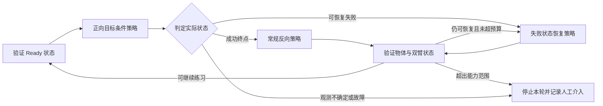

# 双向练习：动机审查与松灵双臂实现路线

> 最新条件：已有模型不等于已有好任务策略。用户确认当前可能接近零成功，首任务是 pick-and-place，可采少量成功示范。因此后续 DSRL/RLT 排序按[弱策略冷启动路线](07_弱基础策略下的PickPlace选型与冷启动路线.md)修订；本文的双向动机、恢复边界和因果对照仍适用。

> 2026-09-22 后续选型修订：用户允许 π0.5 等其他 VLA，且新核实 RLinf 已开放 π0.5 + RLT 真机训练配置。因此下文 DSRL 主方案保留为先前设计与对照，当前建议优先评估 π0.5 + RLT，并将 STEAM/CFGRL 与 PLD 作为基础模型更新路线。详见[较新基线与 π0.5 选型补充](06_较新基线与π05选型补充.md)。双向收益假设、恢复边界和对照实验仍适用。

日期：2026-09-22。用户现有条件：松灵 ALOHA 类双臂机器人，已有 π0、ACT、遥操作和人工接管 DAgger 能力。具体机器人型号、动作接口、π0版本、任务和算力尚未核定。本文提出工程与研究路线，未实施代码移植、训练或机器人试验。

## 1. 我的判断：方向值得做，但不能用“充分理解”作为既定结论

用户希望通过“正向完成任务—反向恢复—再次尝试”同时获得更强任务能力和更少人工。这包含三个不同主张：

| 主张 | 我的判断 | 如何验证 |
|---|---|---|
| 自动恢复降低每回合人工复位需求 | 有直接机制依据和既有真机实证，但效果取决于恢复覆盖率、故障与准备成本 | 人工主动分钟/机器人小时、人工事件次数、连续无人工时长 |
| 反向学习为正向学习提供有用的数据或共享表征 | 合理假设，不是必然收益；可能有负迁移和预算竞争 | 同任务、同数据/交互预算下，比较只学正向与双向共同训练 |
| 正反都会意味着充分理解任务 | 不成立，条件不足，也不是普遍必要条件 | 应替换为可测能力：新初态、扰动、失败恢复、物体变化下的表现 |

机器人可能在窄工位中记住两套动作而缺少泛化；反之，充分掌握某些任务也不要求能逆转物理变化，例如切割和撕开包装。人类反复练习的类比说明一种有价值的训练组织方式，不能直接证明神经网络必然得到同样的知识迁移。

我支持的可证伪假设是：**对可恢复的双臂操作任务，双向目标条件学习能够降低复位劳动；在控制初始模型、数据和机器人预算后，可能进一步改善正向任务的鲁棒性与样本效率。** 如果实验仅证明减少人工，仍有工程价值，但不能声称证明了充分理解或正向能力的额外提升。

## 2. 必须区分“反向任务”和“失败恢复”

正常循环是 `A → 正向 → B → 反向 → A`。实际训练还会出现 `A → 正向失败 → F`，此时 F 可能是夹歪、物体翻倒、双臂异常占用或视野遮挡。能从 B 返回 A，并不证明能从 F 返回可继续练习的状态。

因此反向/恢复目标应是一个 **Ready 状态集合**，例如：物体位于可抓取区域、双臂姿态和夹持关系有效、视觉可用、下一次正向任务仍可完成。不强求回到完全相同的位置，也不能只让机械臂归零便报告复位成功。

需要两类恢复数据：成功终点后的常规反向数据；真实正向失败后的恢复数据。它们分开采集和评测。若只在容易的状态闭环循环，即使人工介入下降，也可能牺牲了任务覆盖。

## 3. 现有方案证据怎样支持本项目

**SERL** 已有正反两个独立 RL agent 的箱间搬运实证。官方文档提供 `examples/async_bin_relocation_fwbw_drq/`，分别采示范、训练奖励分类器、启动两个 learner，再由 actor 切换。论文该双向任务总训练时间为 105 分钟，不能用摘要单策略时间替代双向总时间。这证明了特定任务的闭环可行性，没有证明双向共享参数优于只学正向。[论文 §4.3/Table 2](https://arxiv.org/html/2401.16013v1)、[真机文档](https://raw.githubusercontent.com/rail-berkeley/serl/main/docs/real_franka.md)。

**MEDAL++** 来自 Stanford，发表于 CoRL 2023；从双向示范学习视觉任务与恢复，并学习奖励，最直接支持自主练习的研究动机。真机协议为每任务正反各 50 条示范、约 30h 训练，初期人工复位，后期平均约每小时仍复位一次。原文不足以支持“正反训练必然让正向理解更充分”。[正式发表](https://proceedings.mlr.press/v229/sharma23b.html)、[实验正文](https://proceedings.mlr.press/v229/sharma23b/sharma23b.pdf)、[官方代码](https://github.com/rehaanahmad2013/self-improving-robots)。

**DSRL** 来自 Berkeley、Washington、Amazon 相关作者团队，CoRL 2025，能在冻结扩散/流策略时学习噪声控制策略；官方 π0 仓库开放了 ALOHA 仿真与 Franka 真机路径。它与已有 π0 较匹配，但这不是已经验证了松灵双臂真机移植，更不是已经验证了本项目的共享双向 DSRL。[项目](https://diffusion-steering.github.io/)、[π0 官方实现](https://github.com/nakamotoo/dsrl_pi0)。

机构提供的是作者和工作出处，工程可达性主要来自任务匹配、代码入口、许可与实验证据。它们不能替本项目新增的组合方案作性能担保。

## 4. 针对现有设备的主方案

**复用现有松灵双臂驱动与 DAgger 链路，先补齐 π0 的双向基本行为，再用目标条件 DSRL 做双向在线改进，外层以状态验证和有界恢复流程维持练习。** ACT 保留为固定恢复对照或已有救援能力；若 π0 噪声接口/时延不合适，再比较 ACT 残差 RL。

HIL-SERL 可参考其离策略训练、回放、奖励和 actor/learner 架构；目前不建议仅为采用其名称而重建你们已经可用的双臂控制栈。其公开实机示例主要为 Franka，旧 SERL 也已将后续使用指向 HIL-SERL。[HIL-SERL](https://github.com/rail-berkeley/hil-serl)、[SERL状态](https://raw.githubusercontent.com/rail-berkeley/serl/main/README.md)。

### 模型与更新边界

建议研究的执行关系为：

\[
z\sim\pi_\theta(z\mid o,g),\qquad
a_{1:H}=\pi_{0,\mathrm{frozen}}(o,\mathrm{instruction}(g),z),\qquad
Q_\phi(o,z,g).
\]

- `g` 指定正向目标或恢复目标，同时进入小型 RL 网络和 π0 的指令条件。仅改变噪声、仍给 π0 正向指令，不能保证产生反向技能。
- π0 先以现有示范/DAgger 数据补齐双向行为，再冻结。RL 更新 θ、φ；**这一阶段不更新 π0 基座权重**。得到的是更强的组合策略，不能说 π0 的权重已学会更深理解。
- 首版使用目标条件的噪声 actor 与 critic，双方向分开记账、平衡采样。保留独立双策略对照；如共享有负迁移，可采用共享特征与独立小输出头，但必须报告这一改变。
- 正向奖励评价任务完成；恢复奖励评价 Ready 条件。恢复成功不是正向成功，不能直接混用奖励。
- 若最终希望一个基础模型吸收双向经验，再将高质量双向轨迹与纠正片段蒸馏/SFT 回 π0，并另测旧技能退化。全模型在线 RL 不作为第一步。

现有 openpi 的 π0 `sample_actions` 支持显式 `noise` 张量，说明接口层有实现入口；还须核查你们实际部署版本及远程服务是否透传该参数。[原始实现](https://raw.githubusercontent.com/Physical-Intelligence/openpi/main/src/openpi/models/pi0.py)。

### 运行闭环

图中常规反向和失败恢复可以是同一目标条件网络，也可以先由不同已有能力承担。统一接口不意味着一开始就强制所有行为共享一套参数。

## 5. 分阶段实现路线

| 阶段 | 实现内容 | 交付/进入下一阶段的依据 |
|---|---|---|
| 0. 固定协议 | 确认关节/末端动作、左右臂与夹爪顺序、归一化、动作块长度 H、实际执行长度 k、时间戳及取消机制；固定任务和评价分布 | 原有 π0/ACT 行为通过适配层后不退化；可随时清除旧动作队列 |
| 1. 双向冷启动 | 从现有遥操作/DAgger 数据识别正向、常规反向和失败恢复片段；补少量缺失恢复示范；训练目标条件基础行为 | 在成功终点和真实失败状态两类留出集合上均能恢复；奖励/Ready 判定能独立验证 |
| 2. 无在线更新的循环 | 冻结策略，跑自动成功检测、正反切换、超时和异常记录；用托盘/挡边使物体保持可达 | 能持续练习，知道中断由策略、感知、出界还是通信引起；得到真实人力基线 |
| 3. 双向 DSRL | 冻结 π0，初始噪声行为与原先验一致；新增目标条件噪声 actor/Q；分别记录双方向 replay，再平衡更新 | 独立测试的正向与恢复性能不因共享而明显退化；自动循环中的人工负担不反增 |
| 4. 恢复覆盖扩展 | 对高频人工介入簇补 DAgger/自动恢复数据；扩大反向策略能到达的 Ready 状态集合 | 同一任务覆盖下，人工事件减少；不能靠剔除难例制造改善 |
| 5. 共享收益与蒸馏 | 完成独立/共享与固定恢复对照；有明确增益后再蒸馏回 π0或扩展多任务 | 证明新增训练环节值得其机器人时间和工程成本；未观察到增益则保留更简单实现 |

第一版任务宜尽量利用已有可靠能力。例如左右托盘间搬运；若已有稳定双臂交接，可扩为“左侧取物—双臂交接—右侧放置”及其反向。不要把正向轨迹按时间倒放当作反向示范；夹爪占用、接触与物体动力学不保证可逆。

移动操作后续再加入底盘定位、回工位和电量管理；若当前机器人有底盘，先驻车验证双臂闭环。固定工位成功不能直接外推为自主移动训练。

## 6. 工程上最容易出错的地方

### DAgger 经验不能直接当成 DSRL replay

现有数据首先可以用于双向基础策略与恢复能力的监督学习。普通 DAgger 的 `(观测,专家动作)` 未必含真实下一状态、奖励和边界；更没有产生专家动作的 latent noise。不能为这些轨迹编造噪声标签。

DSRL-SAC 的基本经验是 `(o,g,z,R,o_next)`；真实执行被人接管后，人的成功不能归给接管前的 z。首版将接管打断的 chunk 从普通噪声 replay 更新中排除，仍完整保存供分析/BC；接管不机械等于任务 terminal，边界语义须和选择的任务目标一致。需要更充分利用物理动作离线数据时，再实现 DSRL-NA 的动作价值到噪声价值转换。[DSRL机制说明](https://diffusion-steering.github.io/)。

建议每条记录至少含：时间戳、目标、阶段、观测、所选噪声、预测动作块、实际下发动作、有效执行步数、下一观测、奖励与判据版本、策略版本、动作来源、成功/失败、超时/接管/外部复位原因。人工复位前后不可伪造为连续动力学转移。

### 噪声接口与动作块必须匹配

设置随机 seed 不等于开放连续噪声控制。应传入实际张量，保持模型动作维数、padding、掩码、归一化与去噪设置一致；不能因为 ALOHA 常用某个维度就硬编码。实际执行 k 步与预测 H 步分开；在切换、接管和恢复时废弃旧缓存，按实际执行区间计算块级奖励与折扣。

官方 DSRL π0 真机例程仍有人按键标奖及复位等待，应替换成明确返回状态的自动接口，而不是删除等待语句就宣布无人化。[实际训练循环](https://raw.githubusercontent.com/nakamotoo/dsrl_pi0/main/examples/train_utils_real.py)。

### ACT 残差备选

若噪声接口无法开放或推理时延不适配，可保留 ACT，加入小残差策略。先完成现有 ACT 的动作块融合，再对当前待下发命令加有界残差，经原控制限制后执行；记录最终实际动作。明确残差是在关节位置还是末端增量上，夹爪单独处理，初始残差为零。这是备选工程设计，不是本次已经实现的系统。

### 自动判定先于复杂奖励

首个任务优先用可独立核查的物体区域、夹爪和机器人状态判据；单帧视觉成功分类要处理遮挡与误判。学习奖励与最终评测判据分开。使用 VLM 也必须评估错误接受率，不能让一个不可靠判断器同时决定奖励、切换与验收。

恢复起点随着正向探索变化，应持续用实际失败状态审查覆盖；只在示范终点测恢复会严重高估自主性。准备工位与写恢复脚本的劳动也要统计，避免把现场工时转移为未计入的大量工程工作。

## 7. 怎样验证你的核心动机，而不是只证明系统能运行

建议先做三个工程对照，再做共享机制对照：

| 对照 | 目的 |
|---|---|
| 冻结双向基础策略＋同一自动切换/恢复流程 | 判断原有 π0/ACT 加自动化是否已足够 |
| 只更新正向 DSRL＋固定恢复器 | 判断学习反向本身是否值得，不能省略 |
| 正反目标条件 DSRL＋自主循环 | 目标方案，检验人工与正向性能的联合收益 |
| 正反独立 DSRL＋同样自主循环 | 区分参数共享带来的额外收益 |

若进一步研究自主循环和参数共享的交互，采用 2×2：

|  | 正反独立小网络 | 正反共享、目标条件小网络 |
|---|---|---|
| 人工设置各方向起点 | A | B |
| 两方向自主循环产生起点 | C | D |

各组均有两个方向，D−C/B−A检验共享；C−A/D−B检验循环训练组织的影响，其中起始状态分布变化也是机制的一部分。这个矩阵仍不能替代“只更新正向＋固定恢复器”对照。共享/独立网络容量不同，还需记录参数量与计算量。

共同固定基础模型、双向初始示范、任务判据与独立评测分布。分别报告固定总机器人小时和固定正向训练预算两种结果：前者衡量整体经济性；后者有助于分析反向信息是否有迁移收益，同时公开其额外训练成本。若 ACT 救援参与，所有组用相同触发规则并单独报告调用次数。

核心指标是正向任务成功率、从成功终点的反向成功率、从失败状态的恢复率、人工主动分钟、连续无人工时长与任务覆盖。重试成功和单次成功分开。一个循环频繁失败但都能自行恢复，可能仍少人工；单次成功率高却偶尔陷入无人可恢复状态，也可能不适合值守目标。

训练数据与留出评测按场景/对象/采集批次分组；验收用独立设置的起点与失败状态，不仅在自身循环产生的容易状态上测。100次量级可作初筛，不足以证明很低的罕见人工事件率；例如独立同分布假设下，零事件的95%上界约为3/N。长期稳定性还要考虑相关故障，不能仅用这条近似公式保证。

## 8. 何时应修正或放弃某部分想法

- 如果固定恢复器已经完成绝大多数复位，而学习反向增加的工时和负迁移超过收益，保留固定恢复器，不能因偏好“像人学习”而强制加 RL。
- 如果双向独立训练优于共享，保留两个策略；这反驳强共享收益，不反驳自主循环的价值。
- 如果正向能力没提高、人工劳动明显降低，应将贡献表述为训练自主性，而非任务理解增强。
- 如果松灵双臂 π0 不覆盖反向行为，先补行为数据；不期待噪声 RL 凭空产生缺失技能。
- 如果失败大多来自不可达掉物、感知遮挡或机械约束，先改工位/感知；训练更大的逆策略未必解决根因。
- 如果前期自动化开发成本高而任务很少重复，人工复位可能总成本更低；应计算准备劳动在未来运行次数上的摊销。

## 9. 与 harness / RSI 的关系

本项目值得优先落地的是可验证的双向练习循环。其后再让外层代码代理根据失败日志提议课程、采样比例或新增恢复技能；不要让代理同时修改策略、奖励和评测定义后自报改善。

ENPIRE 的公开流程也要求用户先提供并验证 reset 与 reward/verification，然后才运行自动研究。这支持“先建立可重复试验环境”的工程顺序，但不证明本项目集成必然有效。[官方说明](https://raw.githubusercontent.com/NVlabs/ENPIRE/main/README.md)。

最终主推荐仍是 **基于现有 π0 与 DAgger 的目标条件双向练习系统，以 DSRL 作为首选小规模 RL 接入候选**。它有较清晰的接口和已有工作的支撑；共享双向改进、松灵真机兼容性以及正向迁移收益均属于本项目待验证部分。
