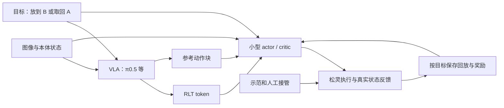

# VLA＋RLT 与 HIL-SERL 机制的组合方案

> 关于固定参考约束是否适合弱策略、ConRFT 与较新替代方案的当前判断，见[后续审核](09_参考动作约束改进与VLA替代基线.md)。本文件保留组合实现细节，不代表原版 RLT 已证明适合近零能力。

日期：2026-09-22。当前范围：保留 VLA，排除 ACT；松灵 ALOHA 类双臂，基础模型当前抓放任务可能接近零成功，可采少量成功示范并人工接管。本文仅作技术设计与原始代码审查，未实现、训练或实机验证。

## 1. 判断

**可以组合，且可以作为当前 VLA 路线的优先验证方案。准确组合是：VLA 提供语言条件表征，RLT 提供紧凑 token 和动作块 actor/critic，HIL-SERL 提供示范、接管、回放、奖励与训练组织方面的经验。**

前一轮因基础策略弱而将 RLT 降级，应理解为“不宜直接照搬强行为先验下的默认配置”，不是否定 VLA 表征与 HIL 学习机制可以结合。任务成功率很低，并不能直接推出 VLA 没有可用的视觉、语言或操作表征；但表征是否足以定位物体、判断夹持与指导恢复，需要实际验证。

不应把两个完整训练仓库机械拼起来，也不应声称接入 HIL 后自动解决冷启动。RLT 原论文已经有离策略回放和人类接管；RLinf 的 RLT 实现也已有示范池、人类动作监督和异步训练。新增的研究工作应围绕弱参考动作、少量示范启动与正反任务组织展开。[RLT 原文](https://arxiv.org/html/2604.23073v1)、[RLinf RLT 说明](https://raw.githubusercontent.com/RLinf/RLinf/main/docs/source-en/rst_source/examples/embodied/rlt.rst)

## 2. HIL-SERL 与 VLA 的兼容性分三层

| 层次 | 判断 | 需要落实的接口 |
|---|---|---|
| 学习机制 | 示范支持的离策略 RL、接管回放、奖励学习可以用于 VLA 系统 | 用 VLA/token 表征作为 actor/critic 的观测，记录真实执行动作 |
| 模型结构 | 原版 HIL-SERL 默认小型视觉策略，不是大 VLA 全参数训练器；RLT 正好提供轻量接口 | 替换输入编码与动作输出，保留明确的梯度边界 |
| 软件实现 | 原 HIL-SERL 主要 JAX，RLinf RLT 主要 PyTorch；原样复制模块不是即插即用 | 优先选一个训练栈，复用另一套的机制和数据契约 |

因此，当前建议**优先以 RLinf 已有 π0.5＋RLT 实现为起点，核查并补齐 HIL-SERL 式示范/接管工作流**。如果团队已有成熟 HIL-SERL 环境，也可通过冻结 VLA 特征服务接入，但会增加表征服务、数据传输和动作块训练适配成本。[HIL-SERL 训练代码](https://raw.githubusercontent.com/rail-berkeley/hil-serl/main/examples/train_rlpd.py)、[RLinf learner](https://raw.githubusercontent.com/RLinf/RLinf/main/rlinf/workers/actor/fsdp_rlt_ac_policy_worker.py)

RLinf 已公开的真实配置仍是 Franka；这不能视为松灵双臂已支持。π0.5 示例实现与 PI 原论文使用的 π0.6 也应分开归属。

## 3. RLT 的“修正”应怎样理解

RLT actor 接收 token、本体状态与 VLA 参考动作块，**直接输出实际动作块**，并通过 BC 正则约束其接近参考。它不是简单的 `VLA 动作 + 小残差`。

图中小型 actor 始终依赖 VLA 提取的任务表征；它不是 ACT，也不是把 VLA 完全丢弃的独立视觉策略。在线阶段若冻结 VLA/token，收益首先属于整个 VLA＋actor 系统；不能据此宣称裸 VLA 权重已经通过 RL 改善。

参考动作如果缺乏价值，合理的极端形态是“VLA 表征＋人类示范启动的小型 RL 动作策略”。这依然属于利用 VLA 的系统，但失去了“主要精修基础动作”的解释，需要以无参考输入消融检验其实际作用。

## 4. 针对弱基础策略，真正需要修改什么

### 4.1 用任务示范建立表征与动作启动条件

先采少量正向、反向及失败恢复示范，对 VLA 做任务适配并训练 token；用同一数据的可靠人类动作初始化小 actor。actor 的启动监督可以来自人类，并不要求首先复制基础 VLA 的所有预测。

这是针对少数据场景的实验设计，不是现有 RLT 论文已经证明的结果。原论文先做每任务 1–10 小时遥操作示范和微调，不能保证少量示范在本任务上达到同样效果。[RLT 实验设置](https://arxiv.org/html/2604.23073v1)

如果小 actor 在留出状态下仍无法产生有效抓取/放置进展，先检查 token、动作契约、数据覆盖与执行延迟。token 重建损失低并不代表保留了足够的控制信息；不能用增加在线尝试次数掩盖输入表征或控制接口错误。

### 4.2 分开“跟随人类”和“跟随 VLA”的约束

RLinf 当前的 RLT actor 目标是 Q 改进加 BC；普通步 BC 指向 VLA 参考动作，接管步指向实际人类动作，默认共享一个 BC 权重。[实际实现](https://raw.githubusercontent.com/RLinf/RLinf/main/rlinf/workers/actor/fsdp_rlt_ac_policy_worker.py)

进一步追到 replay 构建发现，现成实现不只是替换 BC target：真机 RLT 路径也会将 `current_obs.ref_chunk` 的接管段覆写为人类实际动作，随后作为 actor 条件输入。原论文有类似机制及 reference dropout，不能未经实验称为 bug；但人类 reference 与部署时弱 VLA reference 的差异必须评估。下面“原始 reference 与人类 target 分开”的方案是明确的实现改动。[transition 函数](https://raw.githubusercontent.com/RLinf/RLinf/main/rlinf/algorithms/rlt/transition.py)、[调用链](https://raw.githubusercontent.com/RLinf/RLinf/main/rlinf/data/schema/embodied_types.py)、[专项代码审查](research/rlt_hil_integration.md)

对本项目建议将两种监督拆开。概念目标为：

\[
L_{actor}=-\lambda_Q\,\mathbb E_D Q(x,\mu(x))
+\lambda_H\,\mathbb E_{D_H}\|\mu(x)-a_H\|^2
+\lambda_R\,\mathbb E_{D_R}\|\mu(x)-a_{VLA}\|^2.
\]

其中 x 是 token、本体、目标和可选参考动作；D_H 是有效示范/接管动作段，D_R 是使用参考约束的普通策略数据，a_H 为真实人类执行动作。各项按自身有效样本归一化。

这是**提案，不是现成的标准 RLT/HIL-SERL 公式**。首版保持人类动作约束，比较标准参考权重与固定较低参考权重；必要时做无参考约束消融。不要直接同时取消两种约束，也不要一开始用未经校准的 Q 给参考动作打可信度分。原 RLT 消融显示去 BC 会显著退化；我们只能提出“错误参考应降低影响”的假设，不能把完全解除约束当成既定改进。[原论文消融](https://arxiv.org/html/2604.23073v1)

原 RLT 已有 reference dropout，它减少 actor 对参考输入的依赖；**输入 dropout 不等于取消输出端的参考 BC 目标**，两者必须分开试验。

### 4.3 保留离策略回放和接管，先不同时更换全部损失

示范、接管和自主数据分别标记来源，采样时保证可靠示范与恢复片段不会被大量失败样本淹没；保留失败 transition 用于价值学习。不要把每个自主失败动作都变成 BC 目标。

RLinf RLT 的现成 objective 不是标准最大熵 SAC：固定标准差，关闭 entropy/alpha，Q 项加 BC。HIL-SERL 的 SAC 目标含熵/温度等机制。首版建议先沿用 RLT 的 chunk actor/critic，只改明确需要的数据与参考约束；若随后改为完整 SAC，应作为另一算法变体，重新核对动作概率、夹爪建模和训练稳定性，不能两套目标直接相加。[RLT learner 代码](https://raw.githubusercontent.com/RLinf/RLinf/main/rlinf/workers/actor/fsdp_rlt_ac_policy_worker.py)

## 5. 实现顺序与必须处理的数据边界

1. **离线核对。** 将现有遥操作数据转换到同一观测、动作和归一化定义；训练任务 VLA/token 与小 actor 启动版本，留出评测实际动作。
2. **单方向有人训练。** 先验证真实执行动作、接管标记、奖励和下一状态正确入库；依靠示范/接管建立成功数据，不等待弱 VLA 自己反复成功。
3. **比较参考约束。** 固定其他条件，比较标准 RLT 与分离人类/参考约束的版本。无效参考不应被当成人类示范同等可靠的监督。
4. **两方向独立闭环。** 共享已冻结的 VLA/token，第一版分别训练正反 actor/critic，方向同时进入 VLA 指令和学习器。恢复覆盖验证后再自动交替，后续才比较共享动作头。
5. **周期性回流 VLA。** 用经验证的正反/恢复轨迹更新基础 VLA，再重训或校准 token 与适配器、重算或隔离旧特征回放。评测关闭适配器后的 VLA，才能判断知识是否进入基座。

几个接口不能省略：

- **动作块与接管中断。** 保存原提议动作与实际执行动作，按实际执行步数 k 累积奖励与折扣 γ^k；处理有效 mask、终止和超时。固定长度配置并不自动正确支持任意时刻打断。首版可用较短执行窗口降低核对难度。
- **人类动作与模型输入分开。** 保存原 VLA reference、实际人类动作和逐步 mask；人类动作作为监督目标，不无说明地当成部署可用的参考输入。接管质量不合格的片段应标记，而不是一律当专家。
- **夹爪与双臂动作。** RLT/HIL 例程的夹爪连续或离散表示、末端增量和松灵关节目标不一定相同，需明确转换。不能仅把 7D 改成 14D 就视为接入完成。
- **输入时效。** token、图像、本体和参考动作需要时间对齐。VLA 推理时延仍存在，训练轻量头不会自动消除感知和参考动作的延迟。
- **表征版本。** 一轮在线学习内冻结 VLA/token，避免同一个 replay 中混入语义不同的旧特征；回流更新后重新验证。

## 6. 最小三组验证，全部保留 VLA

| 组别 | 配置 | 回答的问题 |
|---|---|---|
| A | 同一 VLA 的任务 SFT＋现有接管 DAgger | 少量示范与纠正是否已足以完成抓放？ |
| B | 标准 RLT，包含其原有接管与回放 | 公开基线在本任务的实际效果如何？ |
| C | 同一 VLA/token＋示范初始化 actor＋分离人类/参考约束 | 弱参考处理的组合方案是否比标准基线更有效？ |

A/B/C 对齐初始示范、额外人工分钟、机器人交互预算、底层控制、奖励验证与恢复调度；同一组无接管测试评价正向、反向、失败恢复及连续循环。C 若优于 B，再逐项消融 actor 初始化、回放配置、参考权重，不能直接把全部增益归为“结合 HIL”。

若 C 在固定预算内不优于 A，或必须持续高频接管才执行，暂不扩展共享双向训练；先诊断行为覆盖。若 VLA/token 无法支持可靠动作预测，则扩大任务适配或改变表征读出，不能认为 HIL 系统工程一定能弥补缺失信息。

## 7. 当前推荐的准确表述

**优先验证“VLA＋RLT 接口＋示范/接管驱动的离策略学习＋弱参考动作处理”，以 RLinf 现有实现减少工程工作，外层逐步建立正反抓放循环。** 这是可实现的研究路线，不是已验证的松灵低成功率自主学习产品，也不是仅因组合名称便成立的论文创新。

独立审查见[弱先验与实验设计](research/vla_hil_prior_review.md)。本轮不再考虑 ACT 或以独立小型视觉策略替代 VLA 的选型。

用户随后提出固定参考约束风险与较新替代方法，补核见[参考约束、ConRFT 与 FRS](research/reference_constraints_and_frs.md)。标准 RLT 的参考 BC、示范 BC 和残差幅度限制不是同一种机制。
