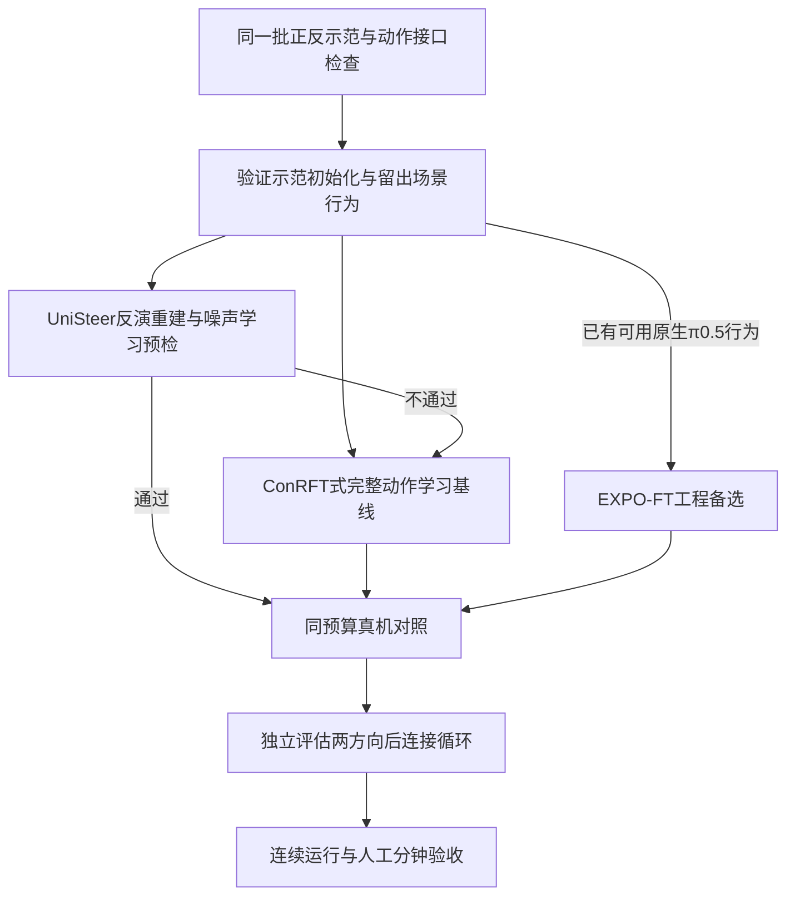

# ConRFT 之后：更适合弱 VLA 的方案与实施决策

> **最新先读 [12 低成功率策略再评估](12_低成功率策略的RL再评估与自主练习路线.md)：首任务单臂，可少量 SFT，成功率偏低包括零；仅按可行性选型。ConRFT／EXPO 按实际适配成本竞争，恢复分布与接管数据质量纳入路线，STEAM 用于混合数据阶段。** [11 固定源码审查](11_工程可达性与正反自主学习验证方案.md)保留详细工程证据。以下为本轮时点记录，论文初始百分比不作为跨任务排序依据。

2026-09-22。条件保持不变：松灵 ALOHA 类双臂、pick-and-place、当前任务基础成功率可能近零、允许少量成功遥操示范及接管；保留 VLA，不考虑 ACT。目标仍是正反练习降低人工复位、接管和值守。本报告是原始资料和公开实现审查，未进行训练或实机实验。

## 1. 结论：新增竞争方案，但尚无无条件更好的替代品

**ConRFT／HIL-ConRFT 仍适合作为当前基线，不能据此断言 consistency 动作头就是最终最优选择。** 这一轮新增了几条真正值得比较的路线：

1. **UniSteer：优先做低成本可行性预检的工程候选。** 同样有松灵 Piper、人类接管、低成功率适配和官方 π0／π0.5 代码；纠正动作被反演成噪声目标。若重建可靠、接口适配可控，值得与 ConRFT 正面对比。
2. **POCO：最相关的 ConRFT 同团队研究后续。** 支持原生 π0.5／GR00T flow 动作头、松灵平台；但公开实验起点较高，完整代码未找到，不宜直接取代开工基线。
3. **EXPO-FT：示范适配形成可用行为之后，较具体的原生 π0.5 工程备选。** 基础模型会跟随经验更新，不能归为永久冻结坏底座；其默认训练协议仍要求有效初始化。
4. **VLA 表征＋QC-FQL 完整动作头：有原理依据的研究对照。** 行为先验可随经验更新，代码可读；真机 HIL 与双臂组合需要自行实现，不能冒充现成复现方案。

**本轮没有查到一套现成方案同时证明：当前任务几乎不会、少量示范、原生 π0.5、松灵双臂、长期无人工复位，而且完整开源和广泛独立复现。** 这是本次检索边界内的结论，并非证明不存在。

## 2. 原理上更重要的筛选标准

前轮主要关注“是否长期模仿固定坏动作”。这仍重要，但还不足以选出稳定真机学习器。需同时回答四个问题：

- **有效动作从哪里来？** 人类示范／接管、可用生成先验、真实试错，至少要有一条足够有效的来源。更强 Q 不会凭空创造缺失的成功经验。
- **怎样利用人类数据？** 直接动作 BC、动作反演后的噪声 BC、偏好、优势加权，都必须匹配实际执行数据和接管边界。
- **价值估计能否支撑改进？** 少量全成功轨迹可能无法校准失败区的 Q；取消参考正则后，策略还可能追逐 Q 的虚假高值。
- **策略能否随数据增长而改变？** 既要分清固定 reference 与不断更新的数据先验，也要明确更新的是小头、噪声 actor，还是原 VLA 动作专家。

因此，“没有固定动作约束”只是有利条件，不是学习稳定性、可达性或低人工成本的保证。ConRFT 原文也需要示范离线初始化；在线起点不能和未经任务适配的基础 VLA 混为一谈。[ConRFT](https://arxiv.org/html/2502.05450v2)

## 3. UniSteer：本轮最值得新增的工程候选

### 3.1 它怎样利用接管

设冻结 VLA 的 flow 解码器为 G，输入状态 s、任务条件 g 与噪声 z，生成动作块 a。普通噪声 RL 通过试错寻找好 z；UniSteer 额外利用人类实际动作 a_h，近似求出能重现它的 z_h，再用 z_h 监督噪声 actor。奖励学习和人类监督作用到同一个小策略。

```text
人类纠正动作 → flow 近似反演 → 噪声监督目标
                                  ↓
图像／本体状态 → 噪声策略 → 冻结 VLA decoder → 动作块
                    ↑
              真实交互的奖励与价值学习
```

这与“把新动作拉回 VLA 原来那个错误输出”有实质区别；基础 VLA 权重仍不改变。理论上连续 flow 在特定条件下可逆，但数值反演与可学习性仍须验收。不能把“冻结”绝对解释为无法产生任何新动作。[UniSteer 论文 §3–4](https://arxiv.org/html/2605.10821v1)

### 3.2 为什么与现有条件更接近

论文是 2026-05 工作，Microsoft Research、清华、UTS 合作；松灵 Piper 单臂、主从遥操作、π0 架构，每任务 30 条示范适配后进入在线阶段，初始成功率 10–35%。官方微软仓库已提供 π0.5 配置。论文 π0 实验与后续 π0.5 实现支持应分别记录。[论文](https://arxiv.org/html/2605.10821v1)、[官方代码](https://github.com/microsoft/UniSteer)

但它还不是拿来即用的双臂系统：官方未发布硬件执行客户端，样例数据和动作是单臂 7D；奖励由外部 episode success 提供。学习器公开不等于成功检测、复位和接管硬件已全部交付。[官方 README](https://raw.githubusercontent.com/microsoft/UniSteer/main/README.md)

### 3.3 是否优于 ConRFT，要先过三个关口

以下是本项目拟议的预检，不是原论文提供的保证：

1. **反演重建。** 留出未用于训练的遥操片段，分别执行“真实动作→完整反演噪声→解码”和“完整噪声→代码的压缩／限幅→扩展→解码”。默认 π0.5 实现对执行窗口的噪声做 `mean_time` 投影得到 32D，再扩展到 50×32 布局；actor 还有限幅。完整 flow 的可逆命题不保证这一压缩子空间覆盖人工动作。检查位置误差、旋转误差、夹爪开合和时间对齐；不要只看归一化 MSE。阈值由抓放容差与控制噪声确定。
2. **噪声策略可学习。** 再检查“观测→预测噪声→解码”的误差，区分反演能重建与小 actor 能从视觉学会这两件事。低离线误差也不替代真实闭环成功率。
3. **接口和双向条件。** 核验 7D 到双臂联合动作的改动、双相机扩展、接管截断与实际执行日志。代码中的小 actor/Q 已获得图像和语言的 prefix 表征，不能误判为完全没有语言条件；但官方单任务例程不证明正反共享已验证。检查目标条件是否稳定可辨，或先用独立双策略。

**论文与默认配置还有一处差异：**代码支持将反演后的接管数据加入 RL buffer，但当前默认 `add_human_inverse_to_rl_buffer: false`；不能把默认配置说成已严格复现论文的双缓冲使用。需明确比较启用／关闭，并检查反演误差是否影响价值学习。源码复核见[独立短审](research/unisteer_code_review.md)。

如果纠正动作经反演仍无法稳定重现，继续调噪声 RL 的收益有限，应回到可训练完整动作头，或先适配 VLA decoder。反之，即使默认采样成功率低，UniSteer 也可能通过人类动作建立有效学习入口。

**推荐等级：与 ConRFT 并列进入可行性预检，不宣称已胜出。** 它的机构可信度和本体贴近度较强，但仓库关注度低、缺少已核实独立复现，不能把微软署名当成熟度保证。

## 4. POCO：同团队后续，更适合保留原生 flow 动作头

POCO，2026-04，ConRFT 核心作者团队后续，提出对当前策略候选动作块进行 Q 加权，再以裁剪的生成式回归目标更新策略。其约束依据是每轮策略与回放行为；不是永远固定的初始 VLA 输出。[作者项目](https://cccedric.github.io/poco/)

它有 π0.5／GR00T N1.6 原生 flow 动作头更新，冻结表征骨干，并在松灵 Cobot Magic 上实验。这比自行把 RLT 小头结构接到 π0.5 上，更直接面向原动作专家的 RL 训练问题。[论文](https://arxiv.org/html/2604.01860v1)

但是，VLA 分支每任务 50 条示范，π0.5 两任务在线前已有约 60–76.7% 成功率；人工标奖，单臂动作实验，作者配置为 8×H20。不能说这是最低硬件需求，也不能把它当近零启动实证。作者页仍标 under review，未定位完整官方训练仓库。[作者发表页](https://cccedric.github.io/publications/)

还有一个原理边界：裁剪发生在回归损失上，不是 PPO 概率比。它抑制激进更新的同时，也可能抑制距离当前行为很远的纠正。缺少源码与冷启动对照时，不能从“裁剪更稳定”推导“弱策略一定更容易学”。

**推荐等级：原生 π0.5 动作头的研究升级候选。** 在少量示范后仍很弱的当前条件下，不上调为首个落地基线。

## 5. EXPO-FT：更新中的基础策略，有别于固定坏 reference

Stanford，2026-05，作者实验室当前列为 CoRL 2026；官方 MIT 实现提供 π0.5 在线学习入口。方法包含小型有界 edit、动作块 Q 选择、人工接管，**同时用实际经验上的生成式监督更新基础 VLA**。Q 梯度主要优化 edit，VLA 通过自身训练目标更新，因此不能写成 Q 直接穿过完整 VLA。[项目](https://pd-perry.github.io/expo-ft/)、[官方学习器](https://raw.githubusercontent.com/pd-perry/expo-ft/main/expo_ft/agents/alg/expo_ft.py)

它虽有局部 edit，但中心策略能随经验移动，故不能仅见 residual 就认定一直受同一个坏初始动作限制。限制仍在于每轮候选质量和局部搜索范围。

默认协议用 10–40 条示范做初始化，建议 SFT 成功率约 40% 或以上后再在线；该数值是作者配方，不是通用门槛。附录随机初始化消融属于额外证据，未提供足以保证本项目成本的双臂近零冷启动结果。部分任务仍人工复位；松灵需适配现有 DROID/Franka 客户端。[论文及附录](https://arxiv.org/html/2605.25477v2)、[官方说明](https://raw.githubusercontent.com/pd-perry/expo-ft/main/README.md)

**推荐等级：示范适配通过后的工程备选。** 若用户未来要求裸 π0.5 持续获得能力，它比永冻底座更值得比较；首个静态抓放无需同时引入 Real-Time EXPO-FT。

## 6. 完整动作学习的研究对照：VLA＋QC-FQL

Berkeley 的 FQL（ICML 2025）和 Q-chunking（NeurIPS 2025）提供一种清晰结构：flow 行为模型从数据学习多解动作分布，快速 actor 同时受 Q 和行为蒸馏约束；行为模型继续跟随经验更新。Q-chunking 将价值学习对准实际执行的动作块，改善时间上的探索连贯性。[FQL 正式论文](https://proceedings.mlr.press/v267/park25f.html)、[QC 代码及论文入口](https://github.com/ColinQiyangLi/qc)

可据此构建“VLA 表征＋可更新 flow 行为先验＋完整动作 actor＋HIL 数据流程”，与 ConRFT 对照。优点是没有固定错误 VLA 输出的永久约束；缺点是本次核验的官方实证主要在仿真，VLA、双臂、接管和自主恢复组合均需开发。这是一项方法研究，不比有真机接管经验的 ConRFT 自动更低风险。

直接把动作块拉长还会增加 critic 误判和开环失控风险。首版优先短反馈周期；需要长时信用分配时，再考察 Q-chunking、DQC 或 DEAS 的价值学习机制，不把所有模块同时堆入。[DQC](https://colinqiyangli.github.io/dqc/)、[DEAS](https://changyeon.site/deas/)

## 7. 其余新增候选：深入后为何没有上调

本表提供筛选结论，具体公式、版本、机构、数字分母及代码证据见下方专项链接。新条目由本报告承载；原 41 项筛选器保持历史全域目录，不声称已经包含本表全部增补。

| 方法 | 可以借鉴的部分 | 当前不取代 ConRFT 的主要原因 |
|---|---|---|
| OTQL，2026-07 | 少量示范后直接更新 flow VLA；10 示范＋30 rollout 的真机分批训练 | 未发布代码；仍人工复位／标注，SFT 后已有约 30–47% 成功 |
| DEAS，ICLR 2026 | 将动作生成与价值学习解耦，降低动作块 Q 高估 | 真机 VLA 主要是 BC 后 best-of-N；部分完成评分不能当完整成功率 |
| Q-VGM，2026-06 | Cal-QL＋flow 动作专家更新 | 保留冻结 base velocity，固定离线回放；不是持续在线弱先验解法 |
| LWD，2026-05 | 双臂机群、原动作专家更新和数据复用 | 固定 reference，数百小时离线池；0.95 为混合任务评分 |
| ROVE，2026-06 | 分开接管适应期与有效恢复动作 | 约 220 条示范／任务另加视频；完整代码未核到 |
| WCM，2026-07 | 历史信息支持更可靠的 critic | 真机每任务 100 示范；开放主要是 critic，完整 RL 尚待发布 |
| VLAC，ICML 2026 作者声明 | Piper 真机、通用进展／终止判断 | 约 100 示范，PPO 而非离策略 Q；公开仓库未含 PPO 训练循环 |
| TwinRL，2026-02 | 用数字孪生扩大初始状态覆盖 | 增加合成数据与孪生成本；真机 RL 代码仍待发布 |
| SiLRI／GAINS，2025-12／2026-08 | 接管质量、状态相关模仿和接管时间偏差 | 原策略为小型视觉 actor，不是现成 VLA；迁移仍需实验 |
| FORCE，2026-06 | actor 更新前先校准 critic | 真机初始化已较好，仍人工标奖；VLA backbone 与开放实现不足 |
| APO，NeurIPS 2025 | 从接管前后动作学习偏好，正式发表且代码可读 | 主要离散 OpenVLA；不能直接套用 π0.5 flow，非近零起点 |
| SOP，2026-01 | 多机器人采集与异步训练组织 | 系统框架而非新的冷启动优化器；仍人工复位，机群资源与当前不同 |

证据文件：[离线到在线 flow 专项](research/deep_offline_online.md)、[新 VLA 系统专项](research/deep_vla_online.md)、[ConRFT 后续与 HIL 专项](research/deep_conrft_followups.md)、[UniSteer／EXPO／SOP](research/unisteer_expo_sop_audit.md)。

## 8. ConRFT 自身需要补强的地方

它较适合的原因是学习完整动作、利用示范和接管，而不是没有风险。原证据主要是单臂，许多任务只在数厘米范围随机化，多数仍需人工复位；冻结表征、奖励漏洞和稀疏反馈均是实际边界。[ConRFT 原文限制与附录](https://arxiv.org/html/2502.05450v2)

针对本项目，我优先做以下改进，按顺序验证：

1. **扩大示范覆盖。** 把正反两个目标区域、不同落点和朝向放进示范；先验证实际动作映射。对初始抓放，补覆盖可能比更换优化器更有效。
2. **校准初期价值。** 在固定策略下收集少量有代表性的成功／失败与纠正，先检查 Q 对实际回报和失败的判断，再逐步提高策略的 RL 更新强度；不要用未校准 Q 决定所有监督权重。
3. **准确记录接管。** 保留时间戳、控制权、实际执行动作、动作块有效长度、目标条件。不要把接管之后的人类成功全部归功于此前自主动作。
4. **分清语言目标与底层控制。** A→B、B→A 在 actor、critic、reward 和 replay 中保持一致。必要时先独立训练两个方向，再研究共享；输入语言并不自动保证所有价值网络也理解目标。
5. **维护自动成功判据。** 抓放成功需要物体位于目标区、释放并保持稳定；“夹爪到了目标点”不足以代替物体成功。自动判据独立验证，人工抽检成本也记录。

以上是拟议设计，不是新论文结论或已完成实现。冷启动时允许人工介入，后续以人力曲线下降和连续运行衡量自主性。

## 9. 具体实施决策



**第一阶段：统一可比较的数据。** 正反示范分开标目标，留出部分物体位置／姿态作评估；记录采集分钟。已有双臂可先固定一臂验证单臂抓放，如果任务必须双臂协同则直接联合建模，不能把单臂结果冒充双臂完成。

**第二阶段：只运行两条首轮学习路线。** 一条为同 VLA 表征上的 ConRFT 式完整动作头；另一条为通过预检的 UniSteer。若选择 Octo，ConRFT 更接近官方复现；若选择 π0.5，其表征适配和动作头更换应单独标为移植。保留同数据／同人工预算的 VLA SFT＋DAgger 对照。无需同时实现 POCO、QC-FQL 与全部新模块。

**第三阶段：根据失败原因升级。** 若完整动作头已学会但希望原 π0.5 自身改进，考虑经验回流或 EXPO-FT；若 Q 高估明显，再试 DEAS 式价值机制；若时序探索差，再试 QC-FQL；若接管时间偏差显著，再借 GAINS。问题没有出现时先不增加复杂度。

**第四阶段：正反循环。** 方向切换由真实成功状态触发；恢复到允许的状态集合即可，不要求逐帧逆放轨迹。超时、掉物、出界与正常反向任务分开计数。比较共享双向与独立双向时统一数据、人力和交互预算，避免把更多训练量解释成“充分理解任务”。

**验收指标：**无接管完整任务成功率、两方向分别成功率、连续自主往返次数、普通复位／异常救援次数、接管秒数、示范／标奖／复位总人工分钟、机器人占用时间、计算等待时间与更新退化次数。小样本结果给出试验次数，不把 20 次评测中的百分比当精确真实概率。

## 10. 开放程度与可信度账本

| 候选 | 原始来源／正式状态 | 代码与快照 | 本轮未确认事项 |
|---|---|---|---|
| ConRFT | RSS 2025 | 官方 Apache-2.0；前轮约 371 stars／25 forks | 松灵双臂与 π0.5 原生复现 |
| UniSteer | 微软／清华等；2026-05 预印本 | 官方 MIT；本轮 API 12／0；核心学习开放，硬件 executor 缺失 | π0.5 对应论文性能、独立复现、双臂 |
| EXPO-FT | Stanford；作者实验室列 CoRL 2026 | 官方 MIT；本轮 API 122／15；有训练及客户端 | 当前少示范后仍近零的双臂表现 |
| POCO | ConRFT 团队后续；作者页 under review | 项目公开，未找到完整官方训练代码 | 低起点、开源与单机资源成本 |
| FQL／QC | Berkeley；ICML／NeurIPS 2025 | 官方 MIT、算法可读 | VLA＋HIL＋双臂完整真机实现 |

Stars、正式发表、机构积累、代码范围和实验证据分别审查，不加成一个虚假的“权威总分”。本轮未取得统一可靠的引用／下载统计，也未核实足够多同协议的独立真机复现。GitHub 元数据见 [UniSteer](evidence/deep_repo_audit/microsoft_UniSteer/metadata.json)、[EXPO-FT](evidence/deep_repo_audit/pd-perry_expo-ft/metadata.json)。

本次所有资料保存于 `具身_harness_RSI_RL/`，科学家知识库保持只读；前轮 [09 参考约束审核](09_参考动作约束改进与VLA替代基线.md) 保留其时点与边界，本报告为后续补充。
