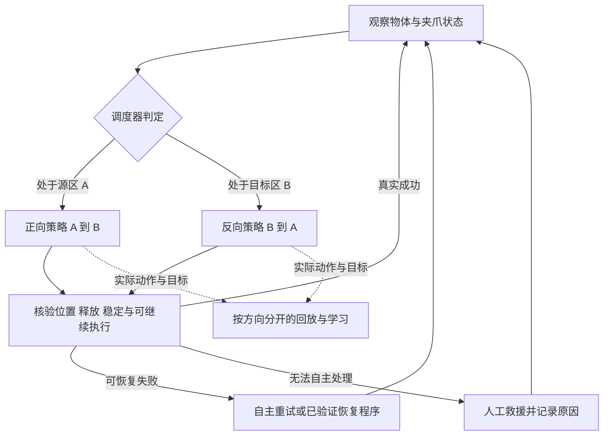

# 工程可达性与正反自主学习：代码审查后的选型修订

> **后续排序以 [12 低成功率策略再评估与自主练习路线](12_低成功率策略的RL再评估与自主练习路线.md) 为准。ConRFT 与 EXPO 均保留首轮资格；若现有 π 数据部署链可复用，EXPO 可能更省迁移，不再固定 ConRFT／Octo 第一。本报告保留固定源码、数据语义与验证方案；恢复分布、STEAM 和平台新证据见 12。**

2026-09-22。用户最新确认：松灵 ALOHA 类双臂平台，**首个抓放任务只用一只机械臂**；已有 VLA 和遥操作／DAgger，可采少量成功示范；基础策略可以做过少量 SFT，但进入在线 RL 时**成功率仍偏低，包括零成功率，尚未达到当前任务的可用要求**。目标是在尽量减少人工干预的条件下，通过 RL 持续学习使其变得可用。保留 VLA、不考虑 ACT；GPU 未确定。**对整模型更新还是保留 VLA 表征、重学完整动作头没有特殊偏好，主要按方案可行性选择。**

本轮对主要仓库固定提交审查，补充可复算的数学例子；EXPO 配套 OpenPI 分支尚未取得固定 SHA，其参数冻结结论仍属待核疑点。未安装学习系统、下载模型训练或执行机器人动作。科学家知识库保持只读。本报告优先于 [10 上轮筛选](10_ConRFT之后的深入筛选与实施决策.md) 中的工程优先级；原论文事实与历史记录保留。

## 1. 重新给出判断

**正反循环仍是合适的系统方向；当前首个实施基线建议采用 ConRFT 的官方 Octo 路线，正反两个方向分别学习，再由统一调度器连接。EXPO-FT 作为可以通过实测反超的竞争方案；UniSteer 暂列修复验证候选。** 这是进入工程预检的顺序，不是宣称已经证明哪种算法在你的机器人上最优。

| 当前优先级 | 本轮建议 | 为什么 |
|---|---|---|
| 首个实施基线 | **ConRFT／Octo＋完整动作头＋HIL＋独立正反策略** | 对当前弱任务策略，不必先验证冻结 decoder 的可达性或有界 edit 覆盖；官方离线／在线路径可审查，单步控制减少首版 chunk 接管语义。仍需修接口和核回放风险 |
| 竞争备选 | **EXPO-FT，同一批示范先测适配效果和资源** | 已有原生 π0.5、HIL 与更新代码，成功经验能改变 base；若示范效果、控制时延和人力表现更好，应改选它，不因 ConRFT 排第一而固守 |
| 修复验证候选 | **UniSteer，不直接投入首轮在线训练** | 本轮核出反演与依赖解码器的约定不一致，另有压缩、接管边界和正反标记问题 |
| 暂缓实现 | POCO、VLA＋QC-FQL 等 | 前者完整公开实现／低起点证据不足，后者需自行构建更多真机组件；暂不比已公开 HIL 路线更可达 |

为什么暂时把 ConRFT 放前面：用户不要求保留原生动作专家，因而无需承担 π0.5 移植；完整动作头可直接学习示范和接管，单步数据格式也贴近当前单臂任务。它**在线更新的参数范围较小**，但这只意味着优化器状态负担较小，不能直接推导总显存、总工期或样本效率一定优于 EXPO。冻结表征是否够用、Octo 能否顺利部署，以及仓库静态问题修复成本，都可改变排序。

**不因为“能更新更大的模型”给 EXPO 加分，也不因为“小头轻量”就断言 ConRFT 必胜。** 前者是可利用的能力，后者是复杂度方面的理由；最终比较同示范、人力和机器人预算的结果。上轮关于原生 π0.5 的分支仍可作技术解释，但不再让用户按模型结构偏好选型。

这也修正了上轮两个过强的倾向：ConRFT 不等于开箱即用的松灵正反系统；UniSteer 不应在关键反演未核通前与 ConRFT 并列进入真机训练。

**本轮按“基础策略成功率偏低，包括零成功率，尚不可用”选择在线学习机制。** 可以有少量 SFT、成功示范和人工接管；重点是如何利用这些来源使策略持续改善，以及人力能否随训练下降。不要求先把策略训练到较高成功率才能参加本轮验证。

不再设置固定狭窄的初始成功率区间。如确需数值参考，可把“50% 以下”作为本项目明显未达可用状态的粗略描述，但它不是算法准入门槛、跨任务统一标准或最终验收线；超过 50% 也不代表已经可用。可用性应由具体任务的可靠性、失败代价、有效吞吐与人工介入要求定义。

论文数字保留用于还原各自实验条件：ConRFT 的 HIL 在线起点来自 Cal-ConRFT，主表约 20–55%，不能误用 SFT 对照中的 5%；EXPO-FT 主流程使用约 40% 或以上的 SFT 工作点；UniSteer 论文任务起点约 10–35%，其 π0 实验与当前 π0.5 发布实现还须区分。**不同任务的这些百分比不能直接排序，也不据此排除 EXPO-FT 或证明 ConRFT 更适合弱策略。** 要审核的是任务技能覆盖、示范与接管依赖、更新机制、代码完整性及同协议改进；ConRFT 当前优先级仍是工程预检判断。[ConRFT 表 I](https://arxiv.org/html/2502.05450v2)、[EXPO-FT 初始化协议](https://arxiv.org/html/2605.25477v2)、[UniSteer 表 1](https://arxiv.org/html/2605.10821v1)

若自主成功暂时为零，首版应允许人完成成功示范／接管回合，再用这些经验训练；评估时仍只统计无接管完成。不能一边排除人类成功经验、一边声称只靠全零稀疏奖励能可靠冷启动。若已经偶有自主成功，则记录这些经验如何进入回放，防止被大量失败数据淹没。同任务、同起始分布和同评测协议下，成功率的前后变化仍是有效指标，但要和人工成本、连续运行能力一起判断。

## 2. 三条路线真正更新什么

| 路线 | 学到的新行为放在哪里 | 人类动作如何发挥作用 | 不能被忽略的限制 |
|---|---|---|---|
| ConRFT | 冻结 VLA 表征后的 consistency 完整动作头；另有独立视觉 critic | 示范与接管进入 BC／回放，价值学习支持策略改进 | 冻结表征可能不适合任务；新头需学会控制，原生 π0.5 动作专家不会因此被更新 |
| EXPO-FT | 小 edit 由 Q 改进；原生 VLA 通过实际数据上的 flow-matching 监督更新 | 成功示范、成功回合持续进入 base 更新；失败回合的有效局部接管默认不直接进入 base 成功池 | 每轮 edit 仍有界，候选质量和成功回流影响探索；Q 不是直接反传整个 VLA |
| UniSteer | 冻结 decoder 前的噪声 actor | 人类动作经近似反演成为噪声监督；另做 SAC | 反演数值、可实现噪声子空间、限幅、时序对齐和 decoder 的适配程度共同约束可达性 |

ConRFT 的“完整动作”表示它输出控制动作而非固定参考的残差，不表示没有行为正则、任意动作均可安全探索或必然摆脱弱先验。EXPO-FT 的中心策略会随监督更新，故它的有界 edit 不能简单等同于永久围绕最初坏动作修补。[ConRFT 原文](https://arxiv.org/html/2502.05450v2)、[EXPO-FT 原文](https://arxiv.org/html/2605.25477v2)、[UniSteer 原文](https://arxiv.org/html/2605.10821v1)

## 3. ConRFT：机制合适，但正反系统要自己接起来

### 已核实的实现边界

固定 ConRFT `a779fde7fa5db5a469960a8490c100f35b41b49e`，custom Octo `e454c7a1939163a7e1c70670d34dc504c4825247`。

- **更新的是动作头／critic，VLA 主干不随在线训练更新。** critic 使用独立视觉网络，不能将它描述为与 actor 共用全部 VLA embedding 的现成目标条件 Q。
- **在线 BC 不只学习高质量人工纠正。** 当前实现对混合 demo／online batch 计算行为监督，其中可以包含失败的自主动作；它不是固定坏 VLA reference，但也不能称为只向优秀动作靠拢。需要监测失败样本占比、BC 与 Q 的实际权重及其影响。
- **主训练入口按单任务运行。** 作者在 multi-task issue 中也明确当前代码不支持多任务。给模型两句自然语言，不能自动获得经过验证的共享双向训练器。
- **Octo 绑定超过更换模型名称。** embedding 提取／缓存／模型复制依赖 Octo，回放中的 embedding 维度固定为 384；π0.5 表征接入需要修改这些数据路径并验证。
- **基础设施中有正反奖励 wrapper，但当前 ConRFT 入口未将其接通。** 不宜说仓库完全没有正反元素，也不能说已有完整可用的正反训练。
- **接管回放需要专项检查。** 间断接管 transition 被加入 demo buffer，而节省内存的图像回放按连续帧重建历史；静态路径提示跨接管片段可能错误拼接图像。必须用带帧序号的间断接管数据验证，目前不是已实测复现的 bug。

[官方固定版本](https://github.com/cccedric/conrft/tree/a779fde7fa5db5a469960a8490c100f35b41b49e)、[作者 multi-task 讨论](https://github.com/cccedric/conrft/issues/10)。详细文件与证据见 [ConRFT 实现审计](research/conrft_implementation_audit.md)。

### 对本项目的含义

单臂首任务已消除双臂协同这一首版变量，但松灵控制接口、动作单位／坐标系、夹爪、相机、时间戳和停止／重置行为仍需适配。7 维接口只是形状一致，不表示控制语义一致。

首版用两个独立 actor/head、critic、replay 和 checkpoint，分别训练 A→B 与 B→A；一个调度器持有机器人控制权。不能直接同时启动两个原样 actor：现有入口每回合 `env.reset()`、固定任务与通信设置都需整理。若希望共享冻结的 VLA 实例来省显存，也必须实现模型调用和两套头的切换。

**我的判断：用户不限定动作头形式，因此首版直接验证官方 Octo 结构，比先自研 π0.5＋ConRFT 移植更能控制变量。** 这只是在 ConRFT 路线内部选择较少改造的起点；不证明它的表征或任务表现必然优于 EXPO-FT。

## 4. EXPO-FT：原生 π0.5 应提高优先级，但看清数据回流

固定版本 `803381fc3b4c91a0c47904f1b688fc5e35904f50`。

### 本轮最重要的纠正

默认 `actor_success_only=True`，base VLA 主要从成功 episode 学习。这不是“没有在线成功就完全无法启动”：公开数据路径允许把成功示范播种到 replay，或保留独立 offline 示范池；在线成功不足时仍有示范监督来源。官方 Cube Pick 抓起示例使用 10 条示范与 SFT checkpoint；它的成功判据不包含本项目所需的完整搬运、释放和反向循环。

真实限制是：**新采集的失败 episode 中，有用的局部接管默认可以进入 Q／edit 回放，却不会直接进入 base 的成功监督池；若接管使该 episode 成功，默认会将整条成功 episode 回流。** 因此 base 确实能移动，但吸收新纠正的条件比“有任何接管就学进大模型”严格。

### 为什么在你的条件下值得优先做预检

你允许采集成功示范，又暂不要求双臂协作。因此最先应该检查原生 π0.5 能否在这些数据上学出有效的接近、抓起、搬运和释放。若这条路径通，EXPO-FT 的基础模型更新、候选动作选择和接管接口已有官方实现，可以避免先自建 π0.5＋ConRFT 动作头移植。

作者默认协议推荐 SFT 后已有约 40% 成功再上线；这是作者经验配方，不是算法成立的数学阈值。它也不证明 0% 经过任意少示范就会达到该水平。论文随机初始化消融只能作为额外证据，不能替代本机器人、预算和当前模型的预检。

### 采用与停止投入的条件

**值得继续：** 即使完整任务成功率仍偏低、包括零成功率，示范能学入原生模型；候选动作或接管能提供有效抓取／释放方案；成功经验回流后 base 本身改善，而不只是 edit 临时救场。作者约 40% 的工作点不作为本项目门槛；是否适用应以当前任务的数据利用、技能覆盖和实际学习效果验证。

**先停下诊断：** 同一观察下候选反复无法到达有效抓取区域；夹爪时序一直错；大部分接管仍不能结束回合；仅 Q 估值上升而无接管成功率不变。先区分数据／动作映射、候选覆盖和价值高估，不能统一用扩大 edit 幅度解决。

如果确实有大量正确的局部接管被失败 episode 的成功筛选挡住，可以拟议“成功示范＋审核过的局部接管”监督池。接管的有效片段和动作块 padding 必须有 mask；不要把失败 episode 全部动作当作优质监督。这是需要消融的改动，不是 EXPO-FT 默认实现或已验证结论。

### 资源边界

论文实机配置使用 2×H200；其在线采集时间不能当作含 SFT、训练等待和设备准备的总工期。当前代码的 encoder 冻结配置与实际训练参数过滤需要运行前核对，不能仅见 LoRA 名称便认定只更新少量参数。EXPO 主仓库已固定提交，但此次读取的配套 OpenPI 分支未能固定 SHA，因此冻结差异只能列为静态疑点，采用前应固定依赖并测参数／梯度。用户 GPU 未确定，现阶段不给最低显存承诺。

[官方仓库](https://github.com/pd-perry/expo-ft/tree/803381fc3b4c91a0c47904f1b688fc5e35904f50)、[论文](https://arxiv.org/html/2605.25477v2)。具体参数、数据和 chunk 审查见 [EXPO-FT 实现审计](research/expo_implementation_audit.md)。

## 5. UniSteer：本轮新增的问题足以下调实施优先级

固定版本 `cd87d240f5ec646e7590476593c3e95eb765b473`；依赖 LeRobot 固定为 `c8ce413d738da15a2eed2d0832315779ea28cbf9`。

### 5.1 反演与解码的时间／符号约定不一致

公开 fixed-point 反演从人类动作开始，按 t=0.9→0、`x = x_next − 0.1*v(x,t)` 求解；而锁定 π0.5 decoder 从噪声开始按 t=1→0、负步长生成动作。adapter 直接传递速度与 timestep。要逐步逆转后者，逆序应从 t=0.1→1，并求解正号隐式关系。不同 flow 时间约定都可以成立，但同一条实现链必须一致。

根代理独立核对了反演、wrapper／adapter 与锁定依赖三段。子审查另做无需模型的常量速度场代数例：v=1、目标动作 0.25 时，发布反演形式接对应 decoder 得 −1.75；自报局部方程残差却仍可近零。它说明“内部残差小”不等于“往返重建正确”。

**证据级别：发布实现路径存在可定位的约定不一致，代数简例已复算；尚未加载真实 checkpoint 验证影响，也不能据此否定论文算法或论文实验。** 修正符号和时间只是第一关，固定点收敛、归一化、限幅和压缩之后的动作重建仍要测。

[反演源码](https://github.com/microsoft/UniSteer/blob/cd87d240f5ec646e7590476593c3e95eb765b473/src/tool/unisteer_actor_supervision.py)、[adapter](https://github.com/microsoft/UniSteer/blob/cd87d240f5ec646e7590476593c3e95eb765b473/src/model/openpi/pi05_original.py)、[锁定 decoder](https://github.com/huggingface/lerobot/blob/c8ce413d738da15a2eed2d0832315779ea28cbf9/src/lerobot/policies/pi05/modeling_pi05.py)。

### 5.2 另外三项与本项目直接相关的限制

1. 默认把前 10 步完整噪声平均成 32D，再重复扩展至 50×32；实际控制窗口与生成窗口不同。完整连续 flow 可逆不能保证这个压缩且限幅的子空间重建人类轨迹；但也不能仅凭 32<1600 就断言单步 7D 控制完全不可达。中间维度的扩展还需改投影代码，不是只改配置。
2. 接管切段后，成功奖励只留给最后一段，先前片段被设终止；这会截断跨接管段的回报传播。它可能是避免错误归功的选择，但需要与学习目标一致。可选人工反演数据进入 RL buffer 的路径还需对齐滑窗步长与 γ 的时间尺度，不宜只打开开关。
3. `meta.is_reset=true` 会将 trajectory success 置假。如果把 B→A 正常反向搬运沿用这个工程 reset 字段，会丢掉反向成功奖励。应给反向独立 goal/task，真正事故复位另行标记。

此外硬件 executor 尚未完整发布。即使它的 Piper 本体和 π0.5 支持很贴近当前条件，仍不应直接把现仓库当作最低风险路线。[详细审计与复算入口](research/unisteer_feasibility_audit.md)

## 6. 正反循环真正要解决什么

### 首版架构

**会从 B 回 A，不等于能从任意失败状态回 A。** 物体已掉到工作区边缘、仍夹在手里、空抓、被遮挡，都可能不属于正常反向策略训练过的起点。首版先覆盖常见可恢复情况，不假设反向策略自动成为通用恢复器。

正向终态必须落入反向能处理的起始集合，反向终态也必须落入正向覆盖集合。不是必须放回精确同一毫米位置，而是要落在下一方向已学会处理的范围；姿态、夹爪、机械臂预备位也在契约内。

### 你的动机中保留什么、修正什么

保留：正反练习可以把成功后的恢复劳动变成有效交互数据，增加反复练习机会，具有明确工程价值。SERL 的官方系统已有 reset-free object relocation 作为可行先例。[SERL](https://serl-robot.github.io/)

修正：这不必然等于充分理解任务，也不保证反向梯度改善正向。共享模型可能正迁移，也可能互相干扰；反向策略可仅作为自动数据采集基础设施发挥价值。先验上可以期待某些共享抓取表征有帮助，但实验前不能把它当作事实。

另一个需要纠正的直觉：单次任务 95% 或 99% 成功，不足以直接推出长时间无需人。假设正反每方向成功概率均为 p、各次独立且策略固定、没有自动恢复且每次失败都需人工，连续 20 往返的成功概率为 p⁴⁰：p=95% 对应约 12.9%，p=99% 对应约 66.9%。真实系统有相关性和恢复，不能直接据此预测；这个计算说明我们必须测**人工介入频率与连续运行**，并让可恢复失败尽量不升级成人工事件。[推导与数值](research/cycle_autonomy_feasibility.md)

## 7. 可以实际执行的分阶段路线

以下数量是本项目建议的初筛预算，不是论文保证、最低示范量或用户已批准的真机实验。

| 阶段 | 做什么 | 通过依据 | 不通过时怎么办 |
|---|---|---|---|
| 0：控制与数据契约 | 单臂遥操作往返；核动作单位、坐标、夹爪和相机；设 A/B 可接受状态集合 | 实际动作与日志一致，正反终态互相可用 | 先修接口，不训练 RL 掩盖问题 |
| 1：少示范可学习性 | 使用现有少量 SFT 数据；不足时可从每方向约 20 条成功示范作初筛预算，覆盖区域与朝向；另留评测起点 | 核对数据能否学入、已具备哪些子阶段；记录真实在线起点，允许成功率偏低、包括零成功率 | 诊断示范覆盖、归一化和感知；按缺口补数据，不通过强制拉高成功率规避低起点 |
| 2：选学习路线 | 优先验证 ConRFT／Octo 离线头；同批示范可做 π0.5 SFT＋EXPO 候选与资源预检，不同时实现两套完整循环 | 数据与更新正确，正确示范／接管能成为学习目标；从低起点开始的实测改进与成本决定是否改选 EXPO | 同预算 SFT／DAgger 更好时，不强行加 RL；ConRFT 表征或环境阻碍更大时，不固守排序 |
| 3：两个方向分别 HIL | 固定一个方向做短训练段；阶段性固定 checkpoint 评测 | 两方向都能处理独立起点及对方实际终态 | 短板方向定向补数据；不靠超时切方向维持假循环 |
| 4：接入循环 | 一个调度器，成功后换目标；失败先诊断／重试 | 连续往返增加，人工复位与救援下降 | 分析状态漂移、奖励误判与恢复缺口 |
| 5：减少值守 | 固定评测版本与有记录的更新窗口；新版本先受限试跑 | 人工主动时间和必须在场时间都下降 | 保留能稳定运行的版本；识别性能回退来源 |
| 6：研究共享收益 | 比较独立双头与共享目标条件模型 | 同预算下正向表现／人力进一步改善 | 保留独立双策略，循环价值仍成立 |

首版不同时引入共享双向、原生 π0.5 头替换、噪声反演、新 Q 算法和自动课程，否则失败原因不可区分。POCO 继续跟踪其公开实现与低起点证据，QC-FQL 留作针对明确问题的研究对照，不并行启动全部路线。

### 关键数据语义

- 正反 `goal_id` 在 actor、critic、reward、replay 中一致；两个独立 critic 是首版避免目标混淆的方法。
- 正常反向任务与事故 reset 分开；终止当前目标后再开始下一目标，不误将正向 reward 接到反向 Q。
- 保存建议动作与实际执行动作，接管控制权和动作块实际长度；不能把未执行的后半动作块当已执行。
- 同一个动作块只执行 k 步，下一观测和折扣须对应 k；成功终止、超时截断和接管边界分别处理。
- 成功需要物体到位、释放并稳定；夹爪到达目标点不是充分条件。成功检测器要独立验证，不能仅用自己的奖励分数证明策略改善。

## 8. 怎样判断值得继续投入

**第一组对照：RL 的增益。** 相同 VLA／初始化和人力预算，比较 SFT／DAgger 与加入 RL。若换了 Octo 与 π0.5，结果只能用于系统选型，不能单独归功于 RL 算法。

**第二组对照：循环的人力收益。** 同学习器比较人工复位和自动反向恢复，计入训练反向的示范、复位、接管和调试成本。短期人力可能上升，关注累计人力何时下降，不能仅报告稳定阶段的零复位。

**第三组对照：共享学习是否有帮助。** 独立双头与共享条件模型使用相同总预算，并报告正向数据量和交互机会。只在前两组成立后进行。

主指标：每方向无接管完整成功率、每小时有效完成次数、每百次目标尝试的人工复位／救援次数、自动重试次数、连续无人介入往返数、人工主动分钟、必须现场待命分钟、机器人与 GPU 占用时间。

初筛每方向 20 次可发现明显问题，却不能证明长期无人值守。在独立同分布、固定策略假设下，20/20 成功的精确单侧 95% 下界仅约 86.1%；连续机器人运行还存在相关性。应直接报告次数、独立 run 和中断原因。[NIST](https://www.itl.nist.gov/div898/handbook/prc/section2/prc241.htm)

**GPU 选型后置于实际测量。** 冻结 VLA＋小头也有大模型推理、激活和回放成本；单步控制还可能要求更频繁的推理，ConRFT 图像回放及视频缓存存在主存风险。需要用实际相机、batch、动作长度与训练参数集合测峰值显存、主存、更新吞吐和传感器到动作下发的端到端延迟。作者配置和单个用户 issue 均不等于最低配置。若 EXPO 在同人力／机器人预算下效果更好，增加的算力在资源边界内，即使算力成本不更低，也可优先采用；不要求它在所有指标同时胜出。

## 9. 可信度、开放程度和证据边界

| 项目 | 机构／发表与代码 | 当前证据如何使用 |
|---|---|---|
| ConRFT | 中科院自动化所等，RSS 2025；Apache-2.0 官方代码 | 正式论文和可审计路径提高机制可信度；不覆盖原生 π0.5、松灵迁移或共享双向训练 |
| EXPO-FT | Stanford；作者实验室列 CoRL 2026；MIT 官方代码 | 原生 π0.5＋真实 HIL 路径值得验证；资源、默认过滤和候选覆盖仍需实测 |
| UniSteer | Microsoft Research／清华等，2026 预印本；MIT 官方代码 | 机构可信不能替代版本一致性；发布实现问题直接影响当前采用顺序 |
| HIL-SERL／SERL | Berkeley 等；公开系统与部署展示 | 继续借鉴接管、回放、异步训练和复位机制；不把生态使用量当作本组合的独立复现次数 |

上一轮同日快照：ConRFT 约 371 stars／25 forks，EXPO-FT 122／15，UniSteer 12／0。它们只是关注度，详见 [10 的快照证据](10_ConRFT之后的深入筛选与实施决策.md)。本轮未取得统一可信的引用／下载统计，也没有核实足够多同协议独立真机复现，因此不以假想影响力排名决定选型。

[ConRFT 正式记录](https://roboticsconference.org/2025/program/papers/19/)、[Stanford 实验室发表页](https://irislab.stanford.edu/publications.html)、[UniSteer 官方仓库](https://github.com/microsoft/UniSteer)、[HIL-SERL](https://github.com/rail-berkeley/hil-serl)。

本轮证据分三类：论文报告的实验；固定源码能确认的数据／控制路径；需要真实模型／硬件验证的推断。代数复算仅验证所给公式，文档链接检查仅验证交付结构，均不代表完成算法复现。所有新增内容在本会话目录，未改动科学家知识库或工作区根目录文件。
