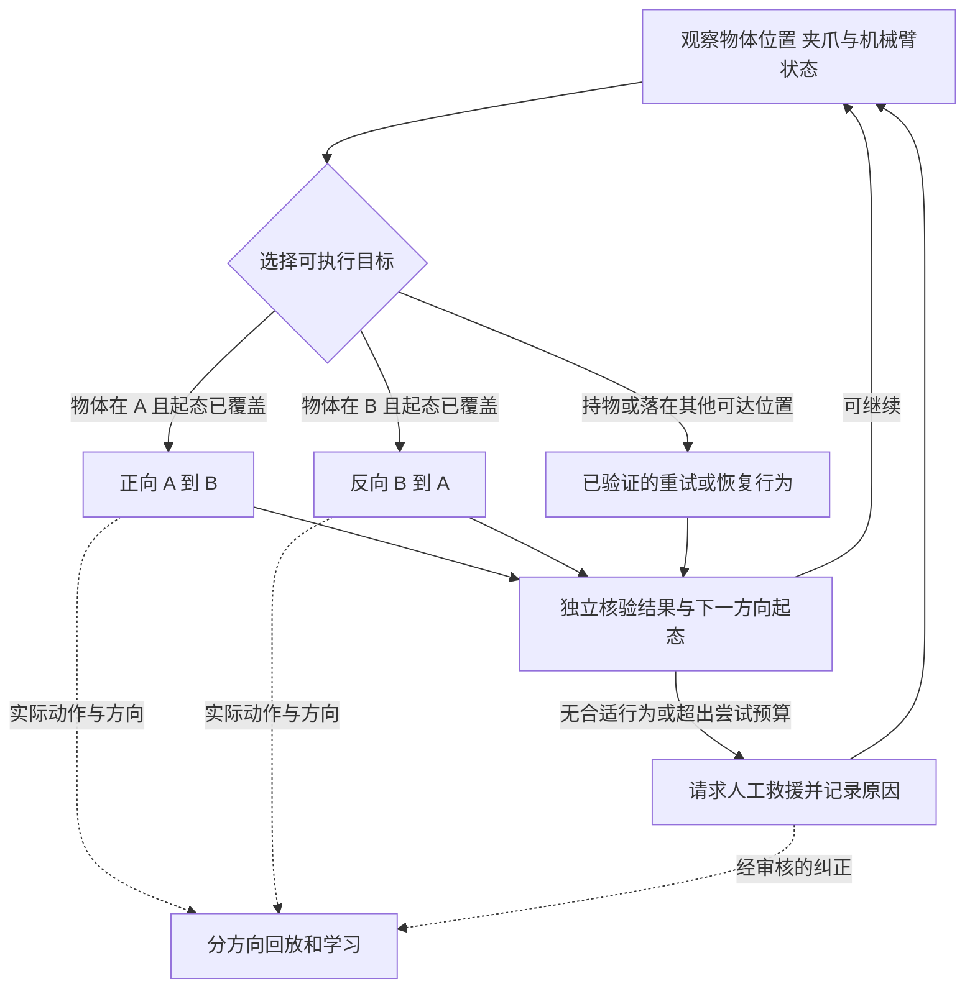

# 低成功率策略的 RL 再评估与自主练习路线

> **当前联合方案（2026-09-23 v2）：[RL＋Harness 真机自主学习技术方案](../03_RL_Harness自主学习系统_20260922/01_RL_Harness真机自主学习技术方案.md)。同一共享目标条件 VLA 完成正反任务，GPT-6 Harness 自动观察与纠正，采用 BC＋队列增广在线 RL；RPent 纳入主骨架比较。已重新核查 SmoothRL／ARLI 的真实异步语义。当前选择与实施边界以新主文、07 和 09 为准；下文保留此前调研，不把旧排序或旧术语当现行方案。**

2026-09-22。本文是当前选型入口，优先于 09—11 中的工程排序。依据原始论文、作者项目与官方源码，区分已发布方法、静态代码发现和本项目拟议改动。未进行模型训练、实机复现或机器人操作；科学家知识库保持只读。

## 1. 需求口径与本轮结论

用户条件统一为：**基础策略可以做过少量 SFT，但成功率偏低，包括零成功率，尚未达到任务可用要求；允许少量成功示范与人工接管，希望 RL 逐步减少人工、让策略变得可用。** 不以不同任务的初始百分比筛选论文。如需粗略描述，“50% 以下”仅作为本项目明显未达可用状态的参考，不是跨任务比较线、算法准入条件或最终验收线；超过 50% 也不代表可用。

硬件为松灵 ALOHA 类双臂，首项 pick-and-place 只用单臂；保留 VLA，不考虑 ACT。全模型更新或保留表征、重学完整动作头均可，只看可行性。已有模型、遥操作与 DAgger 不等于已经具备可靠的 VLA 部署和训练链；GPU 未确定。

**我的推荐是：示范／接管支持的 VLA 策略改进，加上正反两方向独立启动、按实物状态调度、恢复到可继续练习状态分布。首轮学习器保留 ConRFT 与 EXPO-FT 两个候选；不再固定认为迁到 Octo 的 ConRFT 必定最省工程。**

| 层次 | 当前建议 | 采用依据与边界 |
|---|---|---|
| 首轮学习器 A | **ConRFT／HIL-ConRFT：VLA 表征＋完整动作头** | 示范、接管、价值更新已有同一真机方法链；需核实 Octo 迁移、冻结表征、数据回放与失败动作 BC |
| 首轮学习器 B | **EXPO-FT：原生 VLA 更新＋候选选择／edit** | 若现有 π0／π0.5 数据部署链可复用，可能更快落地；base 会继续学习，但每轮候选覆盖和成功数据回流仍限制改进 |
| 自主练习机制 | **借鉴 MEDAL++ 的恢复分布，加上 SERL 式独立双向学习器** | 更直接针对复位劳动；两者与所选 VLA 学习器的组合是本项目设计，尚未验证 |
| 有混合数据后的批量改进 | **STEAM＋CFGRL** | 真机论文与公开策略训练代码兼具；适合评估能否更好利用已有自主／接管数据，不承担首轮“几条示范就自学”的承诺 |
| 接管减少的后续模块 | **UniIntervene** | 离线模块开源；机器人在线集成、数据、权重仍缺，不作为现成 VLA-RL 主线 |

若只允许先做一项预检：**已有 π 系列 SFT、加载和机器人执行链确实可用时，先预检 EXPO-FT；该链尚不可靠、且愿意采用官方 Octo 结构时，先预检 ConRFT。** 预检只验证示范／接管能否正确进入更新、输出是否可执行及资源是否可承受，不要求先达到较高成功率。首轮只把通过预检的一条路线接入完整训练系统；另一条保留为明确问题出现时的替代，不并行重建两套工位。

这修正了 11 的固定工程顺序，但没有宣称 EXPO 已在用户任务上胜出。当前公开证据仍不足以给出“低成功率 VLA 的普遍最优算法”。[ConRFT 论文](https://arxiv.org/html/2502.05450v2)、[EXPO-FT 论文](https://arxiv.org/html/2605.25477v2)

## 2. 低成功率相同，真正需要的改进可能不同

以下是工程诊断规则，不是论文已验证的任务分类器。完整任务未成功，可能只差可靠释放，也可能从未抓住物体；两者不能使用同一算法理由。

| 真实轨迹中观察到的问题 | 优先验证什么 | 不应直接推出什么 |
|---|---|---|
| 很少到达正确抓姿，夹爪或动作映射错误 | 数据／控制接口；正确示范能否被完整动作头或原生 VLA 学入 | 零终局成功就说明预训练表征全部无用 |
| 已会接近、抓起，但放置或局部纠错不稳定 | EXPO 候选覆盖、edit 有效性、成功经验对 base 的改进；ConRFT 仍可竞争 | 起点较低就必须放弃原生动作专家 |
| 已有成功、失败、接管混合轨迹，但监督回流质量差 | 接管片段质量、失败动作模仿权重；积累数据后试 STEAM | 失败数据越多，策略必然越好 |
| 单向评测尚可，连续正反却频繁卡住 | 两方向起终态覆盖、普通反向与异常恢复的区别 | 先更换 RL 优化器就能解决 |
| 接管有效，但必须长期有人盯着 | 求助触发、自动救援覆盖、成功检测与值守日志 | 接管步数变少等于现场人力同比减少 |
| 动态任务主要败在观测和动作延迟 | 测量端到端时延，再评估 Real-Time EXPO-FT | 越新的实时方法越适合静态抓放 |

ConRFT 的完整新动作头也可能因少量数据或冻结表征不合适而学不好；EXPO 的 base 也能通过示范学入新行为。二者差别是更新与数据利用路径，不能简化为“前者能学新技能、后者只能微调旧技能”。

## 3. 首轮两条路线：可达性与真实限制

### 3.1 ConRFT：适合作方法基线，不能等同于现成松灵系统

**已核实：** 官方路线使用冻结 Octo 表征、新 consistency 完整动作头与独立视觉 critic，离线示范初始化后做 HIL 在线学习。它不把动作限制为固定初始 VLA 输出的残差；但是官方实现也不直接更新 π0.5 原生动作专家，Octo 的数据和 embedding 路径有具体绑定。

**本轮更重视的代价：** 为采用它而更换已有模型栈，可能增加 JAX／定制 Octo、单步动作和数据格式迁移工作；重新训练动作头还可能舍弃原动作专家已经学到的控制能力。因此“小头更新”不能直接推导总工程、总显存或总示范需求更小。

**代码层关键限制：** 在线 BC 默认作用于混合回放，其中包含失败自主动作；并非只模仿优秀接管。当前入口按单任务工作，正反要分开 actor/head、critic、replay 与成功判定，再由一个调度器连接。间断接管的图像历史、日志内存等疑点仍需实测，详见 [11 工程审查](11_工程可达性与正反自主学习验证方案.md) 和 [ConRFT 固定版本审计](research/conrft_implementation_audit.md)。

**采用条件：** 正确示范能训练出可执行动作，视觉表征足够区分物体与目标，真实执行与回放一致，接管经验能改善固定版本的无接管评测。没有要求初始成功率达到某个百分比。[官方代码](https://github.com/cccedric/conrft/tree/a779fde7fa5db5a469960a8490c100f35b41b49e)

### 3.2 EXPO-FT：有界 edit 不等于永远困在最初坏策略附近

**已核实：** Q 引导候选与 edit，base VLA 从实际成功数据做 flow-matching 更新，因此参考中心随学习变化。默认成功池可以用示范启动；自主成功暂时为零不意味着完全没有 base 监督来源。

**仍然存在的限制：** 当前候选和有限 edit 可能覆盖不到有效抓取；失败回合中的好接管默认可以进入 Q／edit，却不自动进入 base 成功池。接管救成的整条回合回流时，前面的坏动作也可能被纳入监督。应核实示范池是否长期保留、局部片段如何筛选、截断动作块是否正确 mask，而不只看训练 loss。

**为什么提高预检地位：** 用户允许原生 VLA，也已有 π 系列模型。如果数据、推理和动作语义已经打通，保留这些资产可能比换 Octo 更可达。相反，若候选长期不覆盖正确动作、人工救成的数据无法推动 base 改进，EXPO 的在线样本效率仍可能很差。两者都需要同任务证据。[官方代码](https://github.com/pd-perry/expo-ft/tree/803381fc3b4c91a0c47904f1b688fc5e35904f50)、[详细审计](research/expo_implementation_audit.md)

2026-09 的 **Real-Time EXPO-FT** 进一步解决慢 VLA 与快纠正控制的时延，但论文讨论明确实验仍由人复位。“没有人工 intervention”不能改写为全流程无人。该后续论文的可训练视觉塔设置，也不能反向证明旧论文／所有配置的冻结问题已解决。当前静态抓放先用普通路线，除非轨迹证据表明时延是主要瓶颈。[实时论文](https://arxiv.org/html/2609.18207v1)、[本轮直接核验](research/reassessment_direct_adaptation.md)

## 4. 比继续扩大模型更值得先审的事项：如何使用失败与接管

**失败经验可以帮助学习价值，但失败动作不应一概成为策略的模仿目标。** 这不是要求删除失败数据，而是区分 critic 学习、actor 监督、成功指标三种用途。

| 数据类型 | critic／经验回放 | actor 的监督使用 | 评测与归因 |
|---|---|---|---|
| 可信成功示范 | 保留真实 transition 与奖励 | 稳定的监督种子，防止被失败数据冲淡 | 不计自主成功 |
| 自主失败轨迹 | 保留，用于学习失败后果与可恢复性 | 不因“进入 replay”就默认高质量 | 记录失败阶段与后续恢复 |
| 接管前自主动作 | 保留实际状态、动作和控制者 | 按局部质量判断，不能因人最后救成而整体升级为优质 | 人的救援不计为本策略独立完成 |
| 接管期间动作 | 保留实际执行动作和持续时长 | 只将可信、有效的纠正片段作为强监督；人工动作也可能失误 | 记录主动操作时间和反应延迟 |
| 自主成功轨迹 | 保留并持续回流 | 可用，但检查绕路、无效前缀、动作块 padding | 固定 checkpoint 下独立统计 |

**一个值得做、但尚未实现的 ConRFT 小改动：** 先复现原始目标，再只改变 BC 数据 mask，使其侧重成功示范和经审核的有效纠正，保留全部真实 transition 供 critic 使用；与原版做一次单因素比较。没有证据前不同时增加新 Q 算法、共享双向网络和自动课程。该改动可能减少错误模仿，也可能削弱行为正则、加重 Q 外推，需要实测。

EXPO 的相应小改动是显式保留成功示范，并试验把可信局部接管纳入 base 监督池；不能直接把整个失败回合加入优质监督。这同样是拟议实验，不是官方默认功能。

HABC 对接管前后归因的讨论有参考价值，但不能机械地删除所有跨控制者 transition。离策略 TD 可以学习真实的人类动作；“真实奖励回传”与“自主成功能力标签”不是同一个目标。先明确更新目标和终止语义，再决定接管边界如何处理。[HABC 原文](https://arxiv.org/html/2606.17043v1)、[补漏审查](research/reassessment_algorithms.md)

## 5. 正反练习的改进：从固定复位到可继续练习的状态

### 5.1 MEDAL++ 提供的有用机制

MEDAL++ 的恢复策略倾向把系统带回**示范覆盖的状态分布**，给后续练习提供不同难度的起点，而非仅追求回到固定初始点。这个思路很符合用户的反复练习动机。

但作者真机条件包括每任务正反各 50 条示范、最初约 30 分钟人工复位增加多样性、随后约每小时一次人工环境复位。其代码还有固定步数切换、人工输入窗口和周期性机械臂归位。它提供减少劳动的机制证据，不能当成少示范、零人工、开箱 VLA 系统。[官方实现与论文入口](https://github.com/rehaanahmad2013/self-improving-robots)、[恢复专项复核](research/reassessment_reset.md)

对本项目的拟议迁移：反向任务先定义为把物体放回 A 区内已覆盖的位置和朝向，夹爪释放、物体稳定、下一方向可以开始；稳定后再扩大合法起态分布。MEDAL++ 真机代码也会选取示范前后窗口构造奖励正例，并非任意中间状态都可作为恢复目标。完整方法还包含其他算法组件，此处只借鉴恢复分布与课程思想，不宣称复现其完整方法。

课程中的容易起点必须与正式完整任务的起态分布分开记账。例如“物体已经拿在手里”可以训练释放，但不能计作从桌面抓起到放下的完整成功。验收仍从预先固定的业务起态抽样，避免通过缩小困难状态范围制造成功率上升。

### 5.2 两种朴素交替方式，都对弱策略有缺陷

SERL 的公开 bin relocation 例程确有一个 actor、两个方向 learner，但训练入口只在当前方向 reward 成功时切换。**若正向一直失败，反向可能长期缺少在线状态与数据。** MEDAL++ 的有界时长交替可以给另一方向机会，但若不判断实物状态，也可能把异常状态交给不擅长它的策略。两者都不能原样当作自动冷启动保证。[SERL 训练入口](https://github.com/rail-berkeley/serl/blob/main/examples/async_bin_relocation_fwbw_drq/async_drq_randomized.py#L239)

**拟议首版采用：两方向独立示范／起态预算＋有界尝试＋实物状态路由。** 冷启动阶段允许人分别设置 A 和 B 的起点、给必要接管；普通循环形成后再减少这些劳动。超时只结束当前尝试，不自动证明另一方向已经具备合法起点。

此处“恢复行为”初期可以是少量明确条件下的已验证控制程序或示范策略，不强制每个动作都用 RL。机械臂回预备位和物体回源区是两个不同操作。物体仍夹在手里、滑落边缘、遮挡，均不能笼统交给普通 B→A。

**正反互相促进的假设仍需检验。** 两个独立策略也能显著减少复位劳动，并不要求反向梯度改善正向。先证明自主练习时长和人力收益；随后才比较共享表征／共享策略的正迁移与干扰，避免把“能够循环”描述为“充分理解任务”。

## 6. 新一轮候选中，哪些真正改变实施路线

### 6.1 STEAM＋CFGRL：上调为有价值的第二阶段

这条路线从成功示范的时间关系学习进度／优势信号，再对混合数据做优势条件的 flow-matching 策略更新。它能减少逐帧人工质量标注，且没有固定初始坏动作距离约束。

需严格区分：**原论文真机使用 π0；RLinf 当前公开策略配方提供 π0.5 路径。** 代码包含进度模型、数据标注和策略训练，并非只有奖励推理；允许完整策略更新或仅动作专家训练。论文单臂抓放用了 50 条成功示范＋594 条自主 rollout，只有专家数据时抓放效果略降，因此不支持用它替代少数据冷启动。[原论文](https://arxiv.org/html/2606.29834v1)、[官方训练流程](https://rlinf.readthedocs.io/en/latest/rst_source/examples/embodied/steam.html)

**建议的采用节点：** 已积累混合轨迹后，在同一 VLA、同一数据和训练预算下，与普通继续 SFT、可信示范／接管 SFT 比较。先验证进度模型能否识别本任务的有效纠正、空抓与恢复，再更新策略。它不能凭评分创造从未采到的成功经验；论文中的逆序帧对也不是物理反向搬运。更多配置差异、资源边界见 [平台与 STEAM 审核](research/reassessment_platforms.md)。

### 6.2 HABC、UniIntervene、RedFlow：有价值，但缺口不同

| 方法 | 本项目可借鉴的内容 | 暂不做首轮主线的具体理由 |
|---|---|---|
| HABC，2026-06，ACE／清华／CUHK | 接管归因与分层优势估计 | 官方仓库仍为 README 预告；每任务 200 示范等条件与少量数据预算有距离；附录 action-expert training disabled，不能直接声称完整动作专家训练 |
| UniIntervene，2026-06，NTU／北邮 | 从历史接管数据学习何时介入、怎样恢复 | MIT 公开离线模块；未提供机器人在线集成、数据和权重。真机是 HIL-SERL＋模块，不能冒充 π0.5 在线 RL |
| RedFlow，2026-07，HKUST 等 | 用成功行为为失败片段构造有方向的纠正，更新 flow VLA | 100–600 示范和离线 rollout 数据；人工复位；未定位完整官方训练代码；检索状态／进度错配是风险 |

UniIntervene 报告的接管率变化是控制步数占比，不能直接翻译成总人力同比减少。HABC、RedFlow 的示范数用于核算实现条件，不用于证明它们性能差。[HABC 代码状态](https://github.com/ACERobotics-VLA/HABC)、[UniIntervene 官方代码](https://github.com/Denghaoyuan123/UniIntervene)、[RedFlow 原文](https://arxiv.org/html/2607.27782v1)

InSight 的原子技能增长、成功片段回流可作后续自学习参考，但它是自动采集＋监督学习的邻近路线，不是新的 Q-learning 主线。TEMPO 等近期工作缺可核验训练实现；EXIMO 依赖已有可靠原子技能；不因发布时间新而提高实施优先级。AutoSERL、PAINT 的自动救援也有任务／标注／oracle 边界，见专项，不将“自动干预”写成物理复位和奖励都已自动化。[算法补漏](research/reassessment_algorithms.md)、[直接适配补充](research/reassessment_direct_adaptation.md)、[恢复机制审查](research/reassessment_reset.md)

## 7. 开源、机构可信度与框架成熟度的再审核

这里的“可信”分别指来源可核验、实现可检查、实验已报告；不表示在用户硬件上已经复现。下载量、论文引用和独立真机复现若未核准就记未知，不用机构或 stars 补齐。

| 对象 | 机构／发布与开放状态 | 当前证据能够支持的判断 |
|---|---|---|
| ConRFT | 中科院自动化所／国科大等，RSS 2025；Apache-2.0，核心训练／HIL 代码 | 正式论文＋可读真机训练链；缺用户任务数据、权重与松灵闭环验证 |
| EXPO-FT | Stanford，作者实验室列 CoRL 2026；MIT，更新与 HIL 实现 | 原生 π 路线较具体；实时后续仍人工复位，不能当无人系统 |
| STEAM／RLinf 实现 | 清华、中科院、跨维智能等；论文与 Apache-2.0 实现 | 批量更新路径可审；论文 π0 与当前 π0.5 配方的证据要分开 |
| MEDAL++／SERL | 大学机器人学习团队的原始论文／真机源码 | 恢复分布、双向训练机制有依据；不是现成 VLA 移植 |
| HABC／RedFlow | 机构可信，真机论文可读 | 未发布完整训练实现使复现成本仍高，不能只看署名排第一 |
| RLinf／verl-vla | 活跃框架或官方组织项目，Apache-2.0 | 可作为工程底座；不能把多个独立支持项拼成已验证组合 |

本轮平台快照：RLinf 5342 stars／745 forks，verl-vla 97／20，LeRobot 27704／5712，VLARLKit 311／43，均为 2026-09-22 的仓库关注度，覆盖各自全部功能。它们不能与 ConRFT／EXPO 的单篇方法仓库作性能排名。固定提交、API 来源和许可范围见 [平台审查](research/reassessment_platforms.md)；既有方法快照见 [影响力记录](03_影响力与开放性快照.md)。

两项代码事实直接影响可达性判断：

1. **RLinf 官方文档明确 Piper 目前只有连接／控制测试，尚无受支持的真机任务训练流程。** RLinf-USER 论文展示的 π0 真机在线提升对应 HG-DAgger，SAC-Flow 示例对应小 flow policy；不能将这两项合并为已经完成原生 VLA SAC，也不能据此概括 RLinf 的全部 VLA 能力。[真机索引](https://rlinf.readthedocs.io/en/latest/rst_source/examples/real_world_index.html)、[USER 官方结果](https://rlinf.readthedocs.io/en/latest/rst_source/resources/publications/rlinf_user.html)
2. **verl-vla 有原生 π0.5 TD3+BC／CQL 实现，但固定版本 PiperEnv 的 reward 恒为 0、success 恒为 False。** 已发布训练结果在 LIBERO 自动复位环境；用户需补任务观测、奖励、结束、动作与接管适配。该缺口可修，不能据此否定整个框架，也不能称现成 Piper VLA-RL。[固定源码](https://github.com/verl-project/verl-vla/blob/c1de826c7c9256e4d9b6900091e4b0e243d16f5e/src/verl_vla/envs/piper/piper_env.py#L78)

松灵 ALOHA 类平台的具体型号仍未核对，因此不能直接假设用户设备就是已被这些接口支持的 Piper。

## 8. 可执行的实施路线与改变选择的依据

下表是待实施路线，不是已完成实验。GPU 未确定，因此不虚构显存最低值、训练天数或成功保证。

| 阶段 | 具体工作与产物 | 通过或转向的依据 |
|---|---|---|
| 0：同一数据与控制契约 | 固定相机／时间戳、动作单位、坐标、夹爪；记录建议动作、实际动作、控制者、方向和实际执行时长；定义 A/B 合法状态 | 一段遥操作和一段接管在日志中可完整还原；无归一化、截断 chunk 或奖励语义错误 |
| 1：两方向有监督启动 | 利用现有少量示范，不足时按缺失子阶段补采；独立保留评测起点；分别给 A→B 和 B→A 可执行起态 | 示范确实能改变策略行为；允许完整成功率仍偏低或评测零成功，不用百分比阻止继续研究 |
| 2：只选一个首轮学习器 | 能复用 π 链则先预检 EXPO；否则在接受 Octo 迁移时预检官方 ConRFT。用一个真实 demo batch 和含接管轨迹核对学习链、梯度范围与资源 | 能学入正确动作且满足控制需求；若数据链都未通，先修接口而非叠加 RL |
| 3：分别做 HIL 在线学习 | 两方向独立 replay／Q／checkpoint；允许人提供暂时缺少的成功经验；固定评测窗口 | 与同人工预算 SFT／DAgger 相比，是否产生更多自主改进；若无，诊断数据与 Q，不强行维持 RL 主张 |
| 4：连接正反自主练习 | 状态路由、有界尝试、异常恢复、成功检测；将对方真实终态逐步纳入起态分布 | 往返可持续，人工复位与救援减少；失败时能定位是哪类状态缺口 |
| 5：减少人工与批量更新 | 按主瓶颈只增加一个模块：恢复课程、BC 质量 mask，或 STEAM 批量更新；有接管数据再评估 UniIntervene | 所加模块在保留任务质量的同时减少人工成本，收益超过数据标注／集成维护代价 |
| 6：研究双向共享 | 独立策略作为对照，再考虑目标条件共享 VLA／头／critic | 控制示范、人力与交互预算后，正向质量或总人力确有改善，才声称正迁移 |

成功检测先用当前任务可核验的信号：物体位于目标区、已释放并保持稳定；遮挡或检测不确定不能自动算成功。前期人工确认可计入成本，稳定后才逐步减少。奖励／成功分类器的误判审查是训练闭环的一部分，不能无限交给训练中的策略自身打分。

正反目标身份必须在 actor、critic、reward、replay 中一致。首版可以用独立分支、独立回放和日志中的 `goal_id` 保证，不要求给 ConRFT 现有单任务 critic 强行增加 goal tensor。结束一个目标再开始下一个，避免把反向价值当作正向 TD 后继；以后改为共享模型时，才需显式目标条件并定义对应的 bootstrap 规则。超时、真实终止、人工接管和事故复位要分别记录。

### 必须保留的评价账本

- **任务效果：** 固定策略、相同起始分布下的无接管成功率，失败阶段与不确定性；不把接管救成记作自主成功。
- **生产性：** 正向有效完成次数／总墙钟小时；反向耗时计入成本，不以正反总步数冒充有效产出。
- **人工：** 示范、奖励确认、接管、普通复位、事故救援的主动分钟；另记必须现场等待的时间。
- **自主运行：** 两次人工之间的持续时间、连续往返数、自动恢复覆盖与失败原因；有限试跑全成功不等于长期无人值守。
- **资源：** 推理与更新显存、端到端时延、训练等待、集成和维护成本；论文采集分钟不是项目总工期。

ConRFT 与 EXPO 使用不同模型栈时，对比回答的是“哪套系统更适合我们”；若要证明算法本身更优，需进一步匹配 backbone、数据、动作空间和执行频率，不能混为同一个结论。

## 9. 本轮改变了什么、仍未知什么

已改变：取消固定 ConRFT／Octo 第一名，以现有链条与数据利用决定预检顺序；把 STEAM 明确放回混合数据阶段；把“失败与接管如何被学习”和“恢复到哪里”提高到与优化器同等重要的位置；发现成功才切方向可能导致另一方向没有在线练习机会；具体核清 RLinf／verl-vla 的 Piper 训练缺口。

仍未知：哪条路线在用户具体机器人上用相同示范、接管和交互预算最有效；实际 GPU 需求；奖励误判率；恢复覆盖；长时间运行的人力收益。机构、论文年份和开源星数都不能替代这些验证。

**因此，当前最可达的研究计划是先用一条有真实示范／接管更新链的 VLA 学习器建立双向练习，再针对实际瓶颈加入数据质量处理与恢复分布课程。** 不要求先有好策略，也不承诺只有坏轨迹和零有效监督时 RL 能自动创造完整抓放能力。

### 本轮审查材料

- [算法补漏：HABC／RedFlow／UniIntervene 等](research/reassessment_algorithms.md)
- [框架与 STEAM：官方版本、许可、代码和资源](research/reassessment_platforms.md)
- [恢复机制：MEDAL++／SERL／PAINT](research/reassessment_reset.md)
- [直接适配：Real-Time EXPO-FT／InSight](research/reassessment_direct_adaptation.md)
- [上一轮固定实现审计与自主运行验证](11_工程可达性与正反自主学习验证方案.md)

初始 41 项筛选目录保留为全域资料库；本轮专题新增／复核候选由本文和专项承载，不把新增论文强行塞入原表或假装原表已穷尽当前领域。
