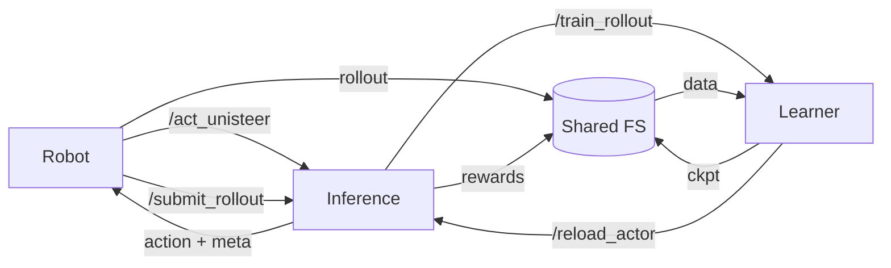

# UniSteer

**Unified Noise Steering for Efficient Human-Guided VLA Adaptation**

<h3 align="center">
  <a href="https://arxiv.org/abs/2605.10821">📄 Paper</a> +
  <a href="docs/README_zh.md">中文文档</a>
</h3>

<p align="center">
  
  <a href="LICENSE"></a>
  
  
  <a href="https://github.com/microsoft/UniSteer/pulls"></a>
  <a href="https://github.com/microsoft/UniSteer/blob/main/README.md"></a>
</p>

> [!IMPORTANT]
> **Spotlight: Microsoft Logo with Beads**
>
> We successfully completed a two-stage Microsoft Logo bead-placement task. Two stage-specific noise actors place 16 beads with a 5 mm radius one at a time to form the logo. The GIFs are shown at $3\times$ speed.
>
> <table>
>   <tr><th>First 8 Beads</th></tr>
>   <tr><td align="center"></td></tr>
>   <tr><th>Last 8 Beads</th></tr>
>   <tr><td align="center"></td></tr>
> </table>

UniSteer adapts a flow-matching vision-language-action policy with a compact noise actor while keeping the pretrained action decoder frozen. Human corrective actions are mapped into noise-space supervision through fixed-point inversion, so supervised learning and reinforcement learning update the same actor.


Across four real-world manipulation tasks, UniSteer raises average success from 20% to 90% in 66 minutes. The tasks are **Pick up Spoon**, **Stack Blocks**, **Insert Square**, and **Fold Towel**, covering pick-and-place, contact-rich insertion, and deformable-object manipulation. The released repository implements the shared training and online-adaptation pipeline, with $\pi_{0.5}$ as the default policy and $\pi_0$ as an alternative.


<details>
<summary><strong>Successful rollout videos for the four paper tasks</strong></summary>

Each task includes two successful main-camera rollouts. All GIFs below play at original speed.

<table>
  <tr>
    <th colspan="2">Pick up Spoon</th>
  </tr>
  <tr>
    <td align="center"><br>Rollout 1</td>
    <td align="center"><br>Rollout 2</td>
  </tr>
  <tr>
    <th colspan="2">Stack Blocks</th>
  </tr>
  <tr>
    <td align="center"><br>Rollout 1</td>
    <td align="center"><br>Rollout 2</td>
  </tr>
  <tr>
    <th colspan="2">Insert Square</th>
  </tr>
  <tr>
    <td align="center"><br>Rollout 1</td>
    <td align="center"><br>Rollout 2</td>
  </tr>
  <tr>
    <th colspan="2">Fold Towel</th>
  </tr>
  <tr>
    <td align="center"><br>Rollout 1</td>
    <td align="center"><br>Rollout 2</td>
  </tr>
</table>

</details>

## 🧭 Method

UniSteer starts from noise-space reinforcement learning and adds human supervised fine-tuning to the same compact noise actor. The actor predicts decoder noise, while human corrections are recorded as action chunks, so an inverse is needed to map each human action back to its corresponding noise target. UniSteer computes that target with fixed-point inversion through the frozen flow decoder, then applies human SFT alongside RL while keeping the pretrained decoder frozen.


<details>
<summary><strong>Method details, objectives, and reference hyperparameters</strong></summary>

A frozen flow decoder $G_\theta$ maps observation $s$ and initial noise $z$ to an action chunk:

$z \sim \psi_\phi(\cdot \mid s), \qquad a = G_\theta(s,z).$

For one forward Euler step $y = x + \Delta t v_\theta(x,t_k,s)$, its inverse is the fixed point of

$x = y - \Delta t v_\theta(x,t_k,s) = g_y(x).$

Here, $v_\theta$ is the frozen decoder's velocity field and $\Delta t$ is the Euler step size. If $v_\theta(\cdot,t_k,s)$ is $L$-Lipschitz and $\Delta tL<1$, then $g_y$ is contractive and fixed-point iteration converges to the unique inverse.

Starting from a human corrective action chunk $a^h$, UniSteer reverses all $K$ decoder steps recursively. For reverse step $k$,

$\hat z^0 = a^h, \qquad z_k^{(0)} = \hat z^{k-1},$

$z_k^{(m+1)} = \hat z^{k-1} - \Delta t v_\theta\left(z_k^{(m)},t_k,s\right), \qquad m=0,\ldots,M-1,$

$\hat z^k = z_k^{(M)}, \qquad k=1,\ldots,K, \qquad \hat z = \hat z^K.$

The implementation uses a fixed compute budget of $K=10$ flow steps and $M=16$ fixed-point iterations per step. The recovered noise target supervises the mean $\mu_\phi(s)$ of the compact noise actor on the human-correction buffer $\mathcal B_{\mathrm{demo}}$:

$\mathcal L_{\mathrm{demo}} = \mathbb E_{(s,\hat z^h)\sim\mathcal B_{\mathrm{demo}}} \left[\left\|\mu_\phi(s)-\hat z^h\right\|_2^2\right].$

The RL stage stores noise-space transitions $(s,z,r,s',d)$ in $\mathcal B_{\mathrm{RL}}$ and applies SAC. With two critics and target critics $\bar Q_{\omega_i}$, the implemented objectives are

$y = r + \gamma(1-d)\min_j \bar Q_{\omega_j}(s',z'), \qquad z'\sim\psi_\phi(\cdot\mid s'),$

$\mathcal L_Q = \mathbb E_{\mathcal B_{\mathrm{RL}}} \left[\frac{1}{2}\sum_{i=1}^{2}\left(Q_{\omega_i}(s,z)-y\right)^2\right],$

$\mathcal L_{\mathrm{RL}} = \mathbb E_{s\sim\mathcal B_{\mathrm{RL}},\,z\sim\psi_\phi(\cdot\mid s)} \left[\alpha\log\psi_\phi(z\mid s)-\min_i Q_{\omega_i}(s,z)\right].$

At the objective level, this RL branch follows DSRL's SAC formulation: $z$ is the action in the latent-action MDP while $G_\theta$ remains frozen. UniSteer adds the action-to-noise inversion and $\mathcal L_{\mathrm{demo}}$ above. The default schedule is actor SFT followed by RL.

| Component | Value |
| --- | --- |
| Policy | $\pi_{0.5}$; optional $\pi_0$ |
| Action horizon | 50 |
| Flow steps | 10 |
| Fixed-point iterations | 16 |
| Compact noise dimension | 32 |
| Full decoder noise | $50 \times 32$ |
| SAC actor / critic learning rate | $1\times10^{-4}$ / $3\times10^{-4}$ |
| Actor SFT learning rate | $5\times10^{-5}$ |
| Replay batch / capacity | 256 / 33,333 |
| Reward | Binary reward: 1 on the final transition of a successful episode, 0 otherwise |

</details>

## 🚀 Usage Overview

1. **[Install]** Install the locked environment with `./scripts/setup.sh` and verify it with `./scripts/test.sh`.
2. **[Prepare]** Prepare a local $\pi_{0.5}$ or $\pi_0$ checkpoint and the gated PaliGemma tokenizer with `./scripts/prepare_model.sh`.
3. **[Warmup SFT]** Format demonstrations according to the trajectory contract and run warmup SFT.
4. **[Online RL: System]** Bootstrap the compact noise actor, then start the learner on GPU 1 and inference on GPU 0.
5. **[Online RL: Robot Interface]** Implement the hardware-specific robot executor against `/act_unisteer` and the rollout sidecar contract.
6. **[Online RL: API Workflow]** Submit completed rollouts through `/submit_rollout` and monitor asynchronous training through learner `/status`.

## 🖥️ Hardware

### Robot

The paper experiments use an AgileX Piper arm with master-slave teleoperation, one side RGB camera, and one wrist RGB camera. At 30 Hz, the policy receives both camera views, the 6D end-effector pose, and gripper state, and returns an end-effector target pose plus a gripper command. The robot executor must provide this observation/action contract and implement workspace limits, action scaling, camera ordering, gripper conventions, takeover arbitration, and emergency-stop behavior. Hardware-specific executor code is not included in this release.


### Warmup

In the paper experiments, warmup trains the full VLA policy on 30 demonstrations per task using one NVIDIA A100 GPU. The released $\pi_{0.5}$ warmup configuration is intended for a GPU with 80 GB of memory. Run warmup on Linux with Python 3.12, a recent NVIDIA driver, and a CUDA environment compatible with the PyTorch version installed by this repository.

### Online

The reference online setup uses one Linux workstation with two NVIDIA GeForce RTX 5080 GPUs. GPU 0 runs the frozen policy decoder and inference server; GPU 1 runs the UniSteer learner, including inversion, actor SFT, SAC, replay, and checkpointing. The services communicate through loopback HTTP and shared local paths, so both GPU processes and the robot executor must see the submitted trajectories and checkpoints at the same absolute paths. Reward, replay, checkpoint, and API tests can run on CPU without robot hardware.

## 🛠️ Installation

Install [uv](https://docs.astral.sh/uv/getting-started/installation/) before setting up the project.

```bash
git clone https://github.com/microsoft/UniSteer
cd UniSteer
./scripts/setup.sh
./scripts/test.sh
```

Dependencies are locked in `uv.lock`. The setup script uses `.cache/uv` unless `UV_CACHE_DIR` is set.

### Lightweight clone

For a code checkout that excludes the large demo assets under `docs/assets/demos/`:

```bash
git clone --filter=blob:none --no-checkout https://github.com/microsoft/UniSteer
cd UniSteer
git sparse-checkout init --no-cone
git sparse-checkout set '/*' '!/docs/assets/demos/'
git checkout main
./scripts/setup.sh
./scripts/test.sh
```

This keeps the source code, documentation, and smaller figures while leaving the demo assets on the remote. Run `git sparse-checkout disable` to download and restore them later.

### Model weights

The policy loader reads a local directory containing `config.json` and `model.safetensors`.

```bash
# pi0.5
./scripts/prepare_model.sh pi05 ./models/pi05_base ./models/paligemma-3b-pt-224

# pi0
./scripts/prepare_model.sh pi0 ./models/pi0_base ./models/paligemma-3b-pt-224
```

The PaliGemma tokenizer is gated. Accept the Google license on Hugging Face and authenticate with `hf auth login` before downloading it.

## 📦 Data Interface

Warmup accepts a task dataset containing trajectories with JPEG camera frames and NumPy robot signals. The released scripts and configurations use Pick up Spoon as the concrete example, but the trajectory contract is task-independent:

```text
task_data/
├── dataset_statistics_train.json
└── <trajectory>/
    ├── images/
    │   ├── primary_image_crop/
    │   │   ├── 0.jpg
    │   │   └── ...
    │   └── wrist_image_crop/
    │       ├── 0.jpg
    │       └── ...
    ├── left_arm_poseuler_arm.npy     # float32 [T, 6 or 7]
    ├── action.npy                    # float32 [T, 7]
    ├── left_arm_joint_status.npy     # optional state-gripper source
    ├── gripper_ctrl_smooth.npy       # optional action-gripper source
    └── task_instruction.txt
```

`proprio.npy` may replace `left_arm_poseuler_arm.npy`. The policy still requires 7D proprioception and 7D actions; the two gripper files are optional only as input sources. For a 6D pose without `left_arm_joint_status.npy`, the state-gripper value is reconstructed from the preceding action. Without `gripper_ctrl_smooth.npy`, the action-gripper value falls back to `left_arm_joint_status.npy` and then to the final column already present in `action.npy`. Verify the seventh dimension's units, timing, and open/close convention before training.

Camera frame filenames must be integer indices, and each camera must contain one frame per action step. Image resolution must remain constant within one camera sequence.

Before training, [src/tool/prepare_data.py](src/tool/prepare_data.py) converts both JPEG sequences into memory-mapped NumPy arrays:

```text
<trajectory>/primary.npy    # uint8 [T, 3, H, W]
<trajectory>/wrist.npy      # uint8 [T, 3, H, W]
```

Conversion is atomic and idempotent. Existing arrays are reused. Training indices are then generated from the robot arrays and stored as an internal cache. [scripts/train_warmup.sh](scripts/train_warmup.sh) performs these steps automatically.

```bash
./scripts/check_warmup_prereqs.sh "$DATA_ROOT" "$BASE_MODEL" "$TOKENIZER_DIR"
```

## 🔥 Warmup SFT

```bash
export DATA_ROOT=/path/to/spoon_data
export BASE_MODEL=$PWD/models/pi05_base
export TOKENIZER_DIR=$PWD/models/paligemma-3b-pt-224

# One optimizer update
GPU_ID=0 ./scripts/train_warmup.sh \
  "$DATA_ROOT" "$BASE_MODEL" ./outputs/pi05_spoon_smoke pi05 1 "$TOKENIZER_DIR"

# Full warmup
GPU_ID=0 ./scripts/train_warmup.sh \
  "$DATA_ROOT" "$BASE_MODEL" ./outputs/pi05_spoon_warmup pi05 25000 "$TOKENIZER_DIR"
```

Use `pi0` as the fourth argument for [config/warmup/pi0_spoon.yaml](config/warmup/pi0_spoon.yaml). The default configuration is [config/warmup/pi05_spoon.yaml](config/warmup/pi05_spoon.yaml).

## 🔄 Online System

**Robot control client: coming soon.** Hardware-specific robot executor code is not included in the current release. Until it is published, users must implement the executor against the action, intervention-annotation, sidecar, and rollout-submission contracts below.

The robot executor, inference server, and learner have separate responsibilities:

| | Robot executor | Inference server | UniSteer learner |
| --- | --- | --- | --- |
| Address | Application-specific | `127.0.0.1:8000` | `127.0.0.1:9200` |
| Owns | Robot I/O and trajectory persistence | Frozen decoder and current noise actor | Replay buffers, inversion, critic, and optimizers |
| Input | Sensors and operator takeover | Images, proprioception, task text, and completed rollout paths | Resolved model/human trajectory paths |
| Output | Executed actions and local trajectory files | Action chunks, noise metadata, and reward sidecars | Trainer and actor checkpoints |
| Backpropagation | No | No | Yes |



The HTTP requests carry filesystem paths, not trajectory or checkpoint bytes. The reference services accept only loopback URLs, so all three processes run on one host. Isolated containers require host networking or explicit loopback tunnels. Cross-host direct service URLs are not supported without changing the loopback validation. In every deployment, each submitted trajectory and generated checkpoint must be available at the same absolute path in the process that consumes it.

### Start

```bash
BASE_MODEL="$BASE_MODEL" DATA_ROOT="$DATA_ROOT" \
  ./scripts/bootstrap_noise_actor.sh ./outputs/pi05_spoon_unisteer/actor_initial.pt pi05 cpu

GPU_ID=1 ./scripts/start_unisteer_server.sh \
  "$DATA_ROOT" "$BASE_MODEL" "" pi05 "$TOKENIZER_DIR"

GPU_ID=0 ./scripts/start_inference_server.sh \
  "$DATA_ROOT" "$BASE_MODEL" \
  ./outputs/pi05_spoon_unisteer/actor_initial.pt pi05 "$TOKENIZER_DIR"
```

UniSteer uses binary rewards. Successful episodes receive reward 1 only on the final transition; failed episodes receive zero throughout. The final transition is terminal in both cases.

### Rollout files and sidecars

A *sidecar* is a metadata file stored beside the trajectory's image and robot-signal arrays:

| File | Producer | Contents |
| --- | --- | --- |
| `meta.json` | Robot executor | Task/outcome metadata, including the episode `success` result |
| `is_human.npy` | Robot executor | Per-frame ownership mask used to distinguish model and human-control spans |
| `unisteer_episode.msgpack` | Robot executor | `/act_unisteer` decision records: request ID, task text, decision indices, state vectors, and sampled noise actions |
| `unisteer_reward_result.json` | Inference server during `/submit_rollout` | Per-decision binary rewards and terminal flags plus an episode summary |

Model-controlled trajectories require `unisteer_episode.msgpack` because SAC trains on the returned state/noise pairs. Pure human trajectories do not require that sidecar; their decision indices are derived from the recorded frames for inversion and actor SFT. A mixed trajectory is split at changes in `is_human.npy`, with generated training segments stored under `.unisteer_segments/<submission-id>/<source-relative-path>/` inside the submitted rollout root.

### Human-intervention annotation

The user-provided robot executor owns control arbitration and trajectory annotation. For a trajectory with $T=\texttt{action.npy.shape[0]}$, it must write `is_human.npy` as a Boolean array of shape $[T]$:

- `is_human[t] = false` only when `action[t]` was taken unchanged from a UniSteer model chunk and sent to the robot.
- `is_human[t] = true` when `action[t]` came from teleoperation or a human modified, blended, replaced, vetoed, or safety-overrode the model command.
- `action[t]` must be the command actually sent to the robot. Images and proprioception at index `t` must describe the corresponding control frame.
- A takeover boundary is the first frame at which a human-authored command is sent. Discard the unexecuted remainder of the current model chunk. After control is released, request a fresh model chunk instead of resuming the stale one.

Boolean dtype is recommended; numeric 0/1 values are accepted. `/submit_rollout` rejects missing files, values other than 0/1, and lengths that do not match `action.npy`.

| Trajectory type | `is_human.npy` | `unisteer_episode.msgpack` |
| --- | --- | --- |
| Model-only | All `false` | Required; contains every executed model decision |
| Human-only | All `true` | Not required |
| Mixed takeover | Changes at actual control boundaries | Required; contains executed model decisions only, including decisions after control returns to the model |

`meta.json.success` describes the outcome of the complete episode, not the intervention segment. When inference splits a mixed trajectory, only the final segment inherits a successful terminal reward.

### Robot executor interface

The robot executor calls inference only when it needs a model action. `POST /act_unisteer` uses `application/msgpack`. A minimal request and response decoder is:

```python
request_payload = {
    "o": primary_jpeg_bytes,
    "s": np.asarray(proprio, dtype=np.float32).tobytes(),
    "t": task_description,
}
if wrist_jpeg_bytes is not None:
    request_payload["w"] = wrist_jpeg_bytes

response = requests.post(
    "http://127.0.0.1:8000/act_unisteer",
    data=msgpack.packb(request_payload, use_bin_type=True),
    headers={"Content-Type": "application/msgpack"},
    timeout=30,
)
response.raise_for_status()
result = msgpack.unpackb(response.content, raw=False)
chunk_size = int(result["meta"]["inference_chunk_size"])
action_chunk = np.frombuffer(result["action"], dtype=np.float32).reshape(chunk_size, -1)
```

The request fields are primary JPEG bytes `o`, optional wrist JPEG bytes `w`, float32 proprioception bytes `s`, and task text `t`; optional `deterministic` overrides actor sampling. For each returned chunk that is actually executed for at least one model-controlled frame, the executor records one decision at the chunk's starting frame index:

```python
episode_steps.append(
    {
        "step_index": frame_index,
        "state": result["meta"]["state"],
        "noise_action": result["meta"]["noise_action"],
    }
)
```

Do not record speculative chunks that are never executed. At episode end, write the model decision records using msgpack:

```python
episode = {
    "request_id": request_id,
    "task_description": task_description,
    "decision_indices": [step["step_index"] for step in episode_steps],
    "steps": episode_steps,
}
(trajectory_dir / "unisteer_episode.msgpack").write_bytes(msgpack.packb(episode, use_bin_type=True))
```

Omit this sidecar only when `is_human.npy` is entirely `true`. The executor then writes `meta.json`, the aligned trajectory arrays, and `is_human.npy`, and submits the completed directory through `/submit_rollout`. The inference server performs splitting and reward labeling; the executor must not pre-split mixed trajectories.

### Filesystem contract

- The executor chooses the rollout directory. There is no default rollout inbox and neither service copies uploaded data.
- `/submit_rollout` expands `~`, resolves the supplied `trajectory_dir`, and rejects paths that are not existing local directories on the inference host.
- The submitted path may be one trajectory directory or a parent directory. Parent directories are scanned recursively for trajectories containing `meta.json` or `unisteer_episode.msgpack`.
- The inference server passes resolved model and human segment paths to the learner. Each submission uses a distinct segment tree and retains the source-relative trajectory layout, so recursive inputs and overlapping asynchronous submissions do not overwrite one another. Those exact paths must remain readable and must not be removed until asynchronous training finishes.
- By default, the learner writes checkpoints under `<log_dir>/unisteer_checkpoint`. After saving an actor checkpoint, it sends that resolved path to inference through `/reload_actor`; inference must be able to read the same file.

### Synthetic rollout

```bash
./scripts/create_dummy_rollout.sh ./examples/dummy_rollout success
./scripts/submit_dummy_rollout.sh ./examples/dummy_rollout
curl --silent http://127.0.0.1:9200/status | python -m json.tool
```

The synthetic rollout does not control robot hardware.

## 🔌 API Workflow

### Inference server

The robot executor uses `/act_unisteer` for normal UniSteer collection and `/submit_rollout` after persisting the completed episode:

| Method | Path | Role in the workflow |
| --- | --- | --- |
| `POST` | `/act` | Baseline/warmup inference with only the frozen VLA; it does not return noise-space records for online RL |
| `POST` | `/act_unisteer` | Normal online action endpoint; returns an action chunk plus state/noise metadata for `unisteer_episode.msgpack` |
| `POST` | `/submit_rollout` | Synchronously validate and scan a local rollout, split mixed spans, write reward sidecars, and dispatch training |
| `GET` | `/actor_status` | Inspect the loaded actor and checkpoint |
| `POST` | `/reload_actor` | Learner callback that loads a newly saved actor checkpoint |

`/act` returns raw action bytes. `/act_unisteer` follows the robot executor interface above and returns a msgpack object with `action` bytes and a `meta` object containing the state, sampled noise action, chunk size, and actor checkpoint state.

### UniSteer learner

| Method | Path | Role in the workflow |
| --- | --- | --- |
| `POST` | `/train_rollout` | Central inference-to-learner handoff; accepts resolved model/human paths, returns `202 Accepted`, and starts asynchronous actor SFT followed by SAC |
| `GET` | `/health` | Liveness |
| `GET` | `/status` | Busy state, latest job, replay/update counts, errors, and checkpoint paths |

The normal sequence is:

1. For each policy decision, the executor calls `/act_unisteer`, executes the returned action, and records the returned state/noise metadata.
2. At episode end, the executor writes the recorded decisions to `unisteer_episode.msgpack` alongside `meta.json`, `is_human.npy`, and the trajectory arrays, then posts the directory to `/submit_rollout`:

   ```bash
   curl --fail --silent --show-error \
     -H 'Content-Type: application/json' \
     -d '{"request_id":"episode-0001","trajectory_dir":"/shared/rollouts/episode-0001"}' \
     http://127.0.0.1:8000/submit_rollout
   ```

3. Inference finishes local preprocessing and returns `200 OK`, then automatically posts the resolved path lists to learner `/train_rollout`. This response does **not** mean training has finished. The normal handoff payload is:

   ```json
   {
     "request_id": "episode-0001",
     "model_trajectory_dirs": ["/shared/rollouts/episode-0001"],
     "human_trajectory_dirs": []
   }
   ```

4. `/train_rollout` returns `202 Accepted` and trains asynchronously. Poll `/status` until `busy` is false and inspect `last_job` for completion or errors.
5. After training saves a new actor checkpoint, the learner automatically calls inference `/reload_actor` when `infer_server_url` is configured, as it is in the reference online configuration. Confirm the active checkpoint with `/actor_status` before the next rollout when strict round boundaries are required.

## 🗂️ Repository Layout

```text
config/       pi0 and pi0.5 warmup and online configurations
scripts/      local setup, training, server, and test entry points
src/agent/    frozen-policy and compact-actor inference
src/dataset/  trajectory loading and normalization
src/model/    OpenPI adapters and noise layout
src/tool/     data preparation, inversion, rewards, servers, and CLIs
src/trainer/  policy SFT, actor SFT, SAC, replay, and checkpoints
tests/        data, reward, replay, checkpoint, and API contracts
```

## ™️ Trademarks

This project may contain trademarks or logos for projects, products, or services. Authorized use of Microsoft trademarks or logos is subject to and must follow [Microsoft's Trademark & Brand Guidelines](https://www.microsoft.com/en-us/legal/intellectualproperty/trademarks/usage/general). Use of Microsoft trademarks or logos in modified versions of this project must not cause confusion or imply Microsoft sponsorship. Any use of third-party trademarks or logos is subject to those third parties' policies.

## 📝 Citation

```bibtex
@misc{lu2026unisteerunifiednoisesteering,
  title={UniSteer: Unified Noise Steering for Efficient Human-Guided VLA Adaptation},
  author={Junjie Lu and Xinyao Qin and Yuhua Jiang and Kaixin Wang and Chuheng Zhang and Bin Liang and Jun Yang and Min Xu and Li Zhao},
  year={2026},
  eprint={2605.10821},
  archivePrefix={arXiv},
  primaryClass={cs.RO},
  url={https://arxiv.org/abs/2605.10821}
}
```