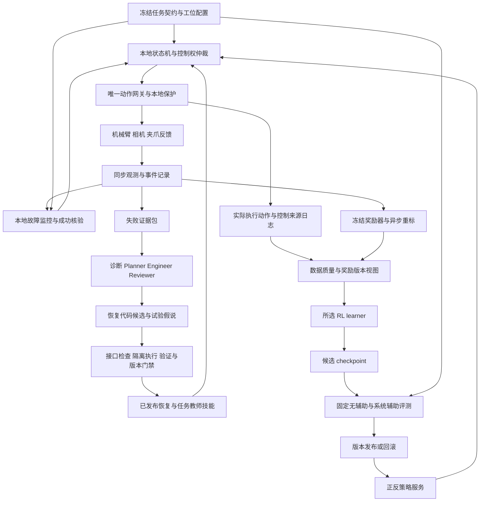
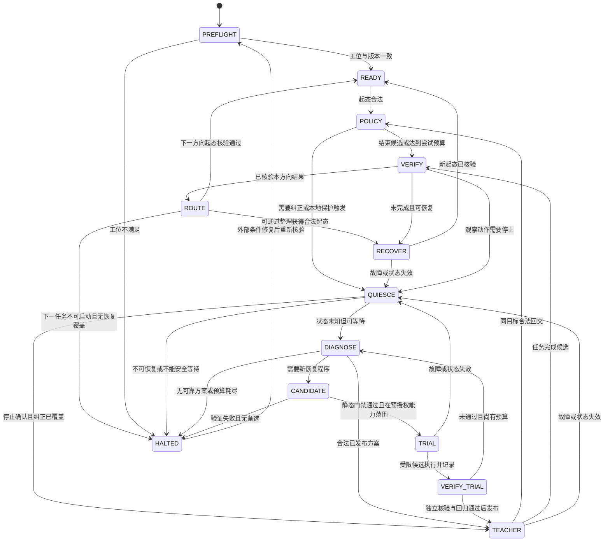

# RL＋Harness 真机自主学习技术方案

**审阅版 v1.0｜2026-09-22｜松灵 ALOHA 类平台，首任务单臂 pick-and-place**

本文用于审核技术方向、模块职责、融合兼容性和实施路线。所有系统图、接口、门槛与改动均为拟议设计；论文结果、公开代码事实在对应位置引用。尚未安装训练系统、运行模型或执行机器人实验。科学家知识库只读，所有产物保存在本会话目录。

本方案继承已确认条件：已有 VLA、遥操作与 DAgger；允许少量成功示范和 SFT；基础策略成功率偏低，包括零成功率；不限定完整 VLA 更新或保留表征后重学完整动作头，不考虑 ACT；GPU 未确定。首任务只使用一条机械臂，另一条不参与。不同论文的初始成功百分比不作选型依据。

## 0. 核心决策与可行性结论

**在限定工位、可恢复任务、可靠观察和已有基础操作能力的前提下，RL＋Harness 实现阶段性的无人工接管学习，具有工程可行性；从弱策略出发，在任意真实场景永久无人介入，目前没有足够证据支持。** 本项目应把“完全自学习”落实为可测的运行范围和学习结果，而非仅以“没有按过接管键”定义成功。

推荐的整体方案是：**优先预检 Zetta 的监控、恢复和代码版本管理骨架，保留唯一的本地真机控制网关，参考 ENPIRE 的工位与转移协议、RoboRSI／ASPIRE 的技能修订方法；让 Harness 同时承担观察、复位和自动 DAgger 教师，再根据它实际提供的数据选择 EXPO-FT 或 ConRFT。** 只集成一套主运行时和一条主学习路线。Zetta 整体许可尚未核实，当前只能优先作技术评估，不能无条件承诺直接 fork；许可或实体迁移不合适时，在现有真机控制栈上独立实现所需接口。GPT-6 按用户指定作为候选诊断／代码模型，具体版本、接口、视觉可靠性、时延和费用需实测；不以型号名称预设它已经能替代机器人专家。

| 决策 | 当前推荐 | 不能省略的成立条件 |
|---|---|---|
| 系统运行主体 | 一个明确状态机和单一机器人控制网关 | 任何策略、恢复程序和 Agent 都不能绕过网关直接控制硬件 |
| Harness 结构 | 优先预检 Zetta 骨架，真机协议参考 ENPIRE，技能演化参考 RoboRSI／ASPIRE | Zetta 公开执行链为仿真、VLA 冻结；需核许可并实现实体与训练桥，不同时运行多套控制主循环 |
| 大模型职责 | 异步观察、失败假说、恢复计划／代码候选、离线实验分析 | 不承担每个控制周期的运动生成或最终安全判断 |
| 成功与奖励 | 固定任务核验器；稀疏奖励先闭环，连续奖励后消融 | 训练奖励、成功判定、正式评测三个输出分开；允许不确定 |
| 首轮 RL | 优先预检 EXPO-FT＋独立教师动作池，复用已有 π 栈 | 可信成功或可信局部／未执行动作标签均可供 base；后者需新增 actor-only 数据通路与有效动作 mask，真实交互另供 Q／edit |
| 替代 RL | 需要完整动作头重学、EXPO 适配或改进受阻时，评估 ConRFT＋质量受控 BC | 不因成功少就自动胜出；Octo 迁移、探索与监督质量需实测，质量 mask 属拟议改动 |
| 正反练习 | 独立双向启动、状态路由、合法交接状态课程 | 普通 B→A 与异常恢复分开，两个方向均有独立初始数据 |
| 教师数据 | 历史真实示范长期保护；实际纠正与未执行动作标签分开持久保存 | 前者可用真实转移更新 critic；后者可用于 RL 训练中的动作辅助目标，不能伪造后继状态 |
| 自我改进范围 | 优先更新策略参数和受限恢复技能 | 首版固定 RL 优化器、任务真值、底层控制边界；不同时无限制自改所有组件 |

**最终算法选择由三类能力反推：评分器能否可靠评价、恢复器能否重新开局、任务教师能否提供可学习的正确动作。** 三者不能互相替代。这是相较此前仅讨论 RL 的主要修订。

## 1. 项目目标与“完全自学习”的操作性定义

### 1.1 希望得到的结果

在预设任务与工位中，机器人从尚不可用的 VLA 策略开始，经少量前期示范和初始化后，自主执行、发现失败、恢复、采样、更新和验证；随着学习推进，**冻结策略本身的无辅助成功率提高，人工分钟减少，必须在场的时间减少，系统持续完成有效任务的能力提高**。

使用三类清楚区分的运行结果：

| 对象 | 定义 | 用途 |
|---|---|---|
| Policy 单独能力 | 固定 checkpoint，从正式起态执行；没有恢复代码或教师代做，保留底层保护 | 判断 policy 是否真正学会 |
| Policy＋Harness 系统能力 | 允许记录在案的重试、恢复、任务教师和规划辅助 | 判断实际系统是否可用，必须计入辅助成本 |
| 自主学习能力 | 在指定时间窗内持续采集、更新与评测，不使用在线人工控制／标奖／手动复位 | 判断人是否已退出日常训练闭环 |

安全停机后一直等待，不计作持续自主学习；Harness 独自完成任务而策略没有提升，不计作 policy 自我改进；前期人工建设和事后研究标注必须单独记账，不能从总成本中消失。

### 1.2 首版自主运行范围

建议首版限定为单物体、固定 A/B 放置区、稳定光照、已标定相机、已知可抓物体与容许姿态、物体始终处在机械臂可达且可观察范围内的桌面工位。优先用可复用托盘、挡边和简单场景布置降低掉落与遮挡概率。它们属于自主学习系统的一部分，需记录成本和限制。

“正向”定义为 A→B，“反向”定义为 B→A，均包含抓取、搬运、释放与稳定。反向恢复不是动作倒放，也不等同于回到唯一精确位置。后续才逐步扩大对象、起点和扰动范围。

前期人员可参与标定、提供示范、验证基础技能与成功判据；进入冻结的自主运行窗口后，人工远程点击、遥操作、手动改参数和物理复位都算介入。若运行必须有人持续盯着屏幕，即使没接管，也还没有达到无需值守。

“零接管”是指定范围和有限时间窗内的实测结果，不外推为永久保证。发生超出可恢复范围的事件，应如实判该次自主运行中断，而不是通过修改目标、丢弃日志或持续空转延长记录。

## 2. Motivation：保留用户方向，修正两个过强前提

### 2.1 对 SFT 与 RL 效率的判断

“SFT 效率低，RL 真机提升一定更快”不能作为通用事实。SFT 在有高质量动作标签时可以很有效；RL 还需要交互、奖励、探索和恢复，可能增加总墙钟与机器人占用。某篇论文的训练曲线不能直接证明本工位上的效率优势。

更准确的研究动机是：**已有少量示范不足以覆盖实际失败状态；希望在同等示范、机器人交互和人工预算下，利用在线反馈改进策略，并由 Harness 提高可持续采样能力。** 是否快于继续 SFT／DAgger，要作为实验结论。

### 2.2 对失败数据利用的判断

RL 可以通过带真实反馈的失败 transition 学习价值、代价和更好的动作选择。但全零奖励、没有正经验、没有有效探索时，也未必能自举；错误自动奖励会让失败学习走向相反方向。

SFT 并非只能使用整条成功轨迹。失败回合里的正确局部动作、经过纠正的片段和自动教师示范也可用于监督；直接模仿错误动作才是问题。ConRFT 和 EXPO 本身也包含行为监督，选择它们不意味着彻底不用 SFT。

RL 具有超越给定示范行为的可能性，但不保证成功率上限更高。上限还受观测信息、动作空间、探索覆盖、奖励正确性和物理可恢复性限制。

### 2.3 本项目真正要检验的假说

| 编号 | 可证伪主张 | 必需对照 |
|---|---|---|
| H1 | 相同工位与反馈下，RL 比继续 SFT／DAgger 更有效利用交互 | 相同初始数据、教师、奖励／筛选信息、交互与调参预算 |
| H2 | Harness 减少人工，而不是只把人类动作换成更多系统重试 | 记录总墙钟、有效产出、辅助调用、主动人工与待命时间 |
| H3 | 自动恢复让有用经验增长，并推动 policy 单独能力提升 | 关闭辅助的固定 checkpoint 评测；单独报告系统辅助成功 |
| H4 | 连续奖励比只用可靠终局信号更有帮助 | 固定学习器、数据预算和恢复条件，比较稀疏／连续两版 |
| H5 | Agent 生成的新恢复代码优于固定恢复菜单 | 相同基础技能、试验预算与合法初态，比较新异常处理 |
| H6 | 正反共享学习比独立双策略进一步有益 | 首先固定循环系统，再比较共享与独立模型 |

本项目优先证明 H2、H3，并检验 H1；H4—H6 逐项加入。即使 H6 不成立，反向自动复位仍有工程价值。

## 3. 最近工作、可复用资产与证据边界

| 工作 | 对本项目最有价值的内容 | 不能直接继承的结论 |
|---|---|---|
| Zetta | 已实现运行时 critic／恢复、结构化候选、版本绑定和评测晋级 | 公开后端为仿真，论文冻结 VLA；不能直接继承真机取消、自动教师回流和整体许可 |
| RoboRSI | 技能树、失败定位、代码技能固化、执行证据、冻结评测 | 博客明确真机仍有人监管；公开 RL 后训练接口是 skeleton |
| ENPIRE | 先建设 reset／verify 工位，再开展代码和策略改进；真实 RL 生命周期 | 依赖已验证工位与初始化人工，公开 PLD 路径不等于任意 VLA 即插即用 |
| ASPIRE／RHO | 细粒度执行证据、程序修复、技能积累与隔离评测 | 主要改善代码策略；ASPIRE 仍明确依赖复位、成功检测和标定，不等于学生模型已学习 |
| ConRFT／HIL-SERL | 示范、纠正、回放与离策略更新的真实方法链 | 人类能纠正的能力不能由 Harness 名称自动替代 |
| EXPO-FT | Q 引导动作候选与 edit，成功数据推动原生 VLA 更新 | 不保证任意弱基础模型都能在当前候选范围内探索成功 |
| PARTS／UniIntervene／AutoSERL | Agent 程序、局部 RL 或自动干预的直接证据 | 各自依赖已有技能、引导数据或人工环节，非任意弱 VLA 的通用专家 |
| DAgger／ThriftyDAgger／RLIF | 纠正聚合、预算门控、从介入反馈学习 | 教师质量与触发语义有条件；介入信号不等于动作标签或物理失败 |
| IDE／SAGE／VLA-Corrector | 语言纠正、自动教师与学生分流、VLA 动作块监控 | IDE 仍人工语言指导；SAGE 非真机且仓库未含实现；Corrector 不更新学生 |
| MEDAL++／SERL | 正反练习、恢复分布与双 learner 组织方式 | 两方向弱策略、奖励、失败恢复仍需分别启动和验证 |
| Robometer／RoboReward | 自动奖励与任务进展建模 | 视觉评分可能误判，物理复位并未因此消失 |
| Sentinel／Code as Policies | 分时标失败监控；利用感知与控制 API 编排代码行为 | 识别失败不等于会恢复；代码生成不能创造缺失的感知和控制原语 |

RoboRSI 当前核验版本为 `9b644d270560c440d760965cf1b859df674459de`。它的 `rl/pi0_posttrain/policy.py` 调用直接抛出 `NotImplementedError`；已有微调子进程封装不能当作现成在线 RL。[RoboRSI 博客](https://lab.noematrix.ai/blog/2-roborsi/)、[RL 接口](https://raw.githubusercontent.com/nssmd/RoboRSI/9b644d270560c440d760965cf1b859df674459de/roborsi/embodied/skills/_lib/rl/pi0_posttrain/policy.py)

ENPIRE 与本项目整体目标更接近，但其自动实验建立在已固定的工位、复位和核验接口之上；其公开 RL 设计中的单步接口不能直接承载未经适配的 π 动作 chunk。[ENPIRE README](https://github.com/NVlabs/ENPIRE)、[RL 接口设计](https://github.com/NVlabs/ENPIRE/blob/main/enpire/env/docs/RL_PIPELINE_DESIGN.md)

新增 Zetta 改变了 Harness 预检顺序：固定 SHA `1fee179644d52c32fa5a7728751cf0853a29b9c0` 已有实际运行时和候选管理实现；但已开始的环境 step 不能中断，注册后端未含实体机器人，逐步记录还需补实际动作和教师来源，项目许可正文未取得。因此优先检查其可复用部分，不将“源码公开”写成“真机 RL 自主系统已经开源可用”。[Zetta 原论文](https://arxiv.org/html/2608.16590v1)、[固定代码](https://github.com/air-embodied-brain/Zetta-Embodiment/tree/1fee179644d52c32fa5a7728751cf0853a29b9c0)

完整覆盖、机构／开源边界和取舍见 [调研证据](03_调研覆盖与选型证据.md)。该表区分源码深审、论文精读与预筛；新论文缺引用积累不等于不可信，机构声誉和星标也不能替代接口可用性及独立复现。

本项目主要是带明确研究问题的系统集成。不能把“RL＋Agent＋恢复代码”这个组合名字本身当作方法创新；新意应来自自动教师质量、恢复与学习的闭环兼容、可验证的低人工持续改进等可测贡献。

## 4. 总体架构：控制、观察、学习和代码进化分别闭环



首版不把四个大模型角色放入每一步控制链。日常循环由确定性程序和已发布技能运行，Agent 在停滞、未知状态或跨轮分析时被调用；已有可靠恢复无需重新推理。

### 4.1 五个闭环及其时间尺度

| 闭环 | 输入与输出 | 调度原则 |
|---|---|---|
| 硬件闭环 | 实测状态→驱动目标与故障处置 | 本地、按硬件要求；不等待网络大模型 |
| 策略闭环 | 同步观测→单步或动作块→真实反馈 | 测量端到端延迟；动作有效期和已执行长度明确 |
| 观察／恢复闭环 | 时序证据→失败类型→合法技能→新起态 | 事件触发，先用已发布技能；不把正常探索全拦掉 |
| 参数学习闭环 | 经核验回放→learner→候选参数→评测 | 异步计算，按训练轮次固定奖励与数据视图 |
| 代码改进闭环 | 重复未知失败→代码候选→验证→技能新版本 | 最慢、修改范围受限；不直接热改正在执行的函数 |

具体 Hz、最大延迟和显存不在无测量时指定。先测相机到动作的 p50／p95／p99、队列覆盖与暂停响应；再选择频率、chunk 长度、执行前缀和 Agent 超时。

### 4.2 人类接管员职责如何被拆解

| 人原本做的事 | 拟替代模块 | 仍需提供的基础条件 |
|---|---|---|
| 判断成功 | 几何／时序核验器 | 可观察的释放、目标物和目标区 |
| 判断快要失败或停滞 | 本地检测器＋异步语义观察员 | 校准数据、误报预算、允许探索范围 |
| 纠正错误动作并完成任务 | 自动任务教师 | 真正能执行的控制技能，不只是文字建议 |
| 把场景摆回起点 | 恢复器、反向策略、工位设计 | 可达、可抓、可验证的恢复路径 |
| 调整训练并判断是否变好 | 实验调度器＋固定评测 | 可重建数据与配置，独立真实任务指标 |
| 处理硬件、标定或未知物理故障 | 本地检测与停止；超出范围后人工维护 | 首版不能承诺全部由 Agent 修复 |

## 5. 基础能力与工位契约：自学习之前必须具备什么

### 5.1 三个相互独立的启动条件

1. **评分启动：** 至少能可靠识别真实成功和关键假成功，不依赖正在训练的策略自报。
2. **恢复启动：** 至少能把常见失败／完成状态送回一个有效起态。策略从 A→B 很弱时，仍要有办法取得 B→A 的训练起点。
3. **动作启动：** 示范或自动任务教师能提供至少一部分正确行为，或者任务已有可验证的探索／课程机制能产生有效正经验。没有它，评分与复位再完善，也可能只得到无限重复的失败。

自动教师可以是校准后几何抓放程序、运动规划＋抓取原语、已验证 VLA 技能或它们的组合。模型生成了 `pick(object)` 这一调用，并不证明该函数存在、可靠或能处理当前姿态。

### 5.2 首轮确认清单与缺省处理

| 项目 | 当前状态 | 对设计的影响 |
|---|---|---|
| 具体松灵型号、驱动、关节／末端接口 | 未确认，不直接假定为 Piper | 必须决定动作转换与记录方式 |
| 相机数量、视角、深度与同步 | 未确认 | 不假设有 3D 物体真值；必要时用标定平面、第二视角或简单传感器 |
| 夹爪实际开度、夹持／电流等反馈 | 未确认 | 没有触觉时不能把闭合命令当作已抓住 |
| π 模型的数据、归一化与部署链 | 已有模型，工程可复用程度待验证 | 决定 EXPO 是否确实比 Octo 迁移省事 |
| 自动恢复／完整任务教师 | 尚未证明存在 | 是去掉日常人工接管的首要工程缺口 |
| GPU 与主机资源 | 未确定 | 先分离进程与资源计量，不承诺最低卡型 |

任务契约至少固定：对象身份、A/B 区域及坐标、容许姿态、释放与稳定判据、正式评测起态分布、允许动作模式、控制边界、最大尝试预算、传感器与标定版本。学习过程中的 Agent 对这些真值定义只读。

代码教师可能使用额外深度／物体位姿，而 VLA 只看单目图像。此时应检查学生观测是否含足够信息来模仿；若对象长期对学生不可见，加入更多教师数据也可能无法学会。要么改进学生观测，要么承认该能力依赖 Harness，不将其算作已迁移到 policy。

## 6. 一轮完整流程：Harness 作为 DAgger 教师参与 RL

**Harness 不仅是观察员和复位器，还应是能够在学生实际访问状态上提供纠正的自动教师。** 这是本方案的核心数据通路。首版采用稀疏自动接管、纠正数据聚合与离策略 RL 联合学习；它更接近 HG-DAgger 式交互数据采集，不能直接套用原始 DAgger 对全状态专家标注等条件下的保证。

### 6.1 用一次抓空解释整个闭环

| 步骤 | 发生什么 | 系统必须留下什么 |
|---|---|---|
| 1. 学生尝试 | 正向 VLA 接近物体、闭爪、抬升，但物体仍在桌上 | 同步图像、实际动作、夹爪反馈、策略版本 |
| 2. 识别失败 | 本地时序检测发现物体没有随夹爪移动；语义观察员必要时辅助消歧 | 证据、失败类型、检测延迟；未知不能强行判成功 |
| 3. 交出控制 | 运行时取消未执行动作块，等待网关确认与最新实测状态，再切教师 | 最后实际执行索引、租约版本、接管原因 |
| 4. 教师纠正 | 已发布的重抓技能根据新状态重新对准、抓起；未知失败才交 Agent 提议新流程 | 教师动作、前后状态、技能版本；全过程逐步采样 |
| 5. 回交学生 | 达到已验证的“稳定持物”状态后交回学生继续搬运；教师也可在预算内完成整个任务 | 明确是局部纠正、完整任务辅助，还是场景复位 |
| 6. 核验结果 | 独立核验物体已在 B 区释放并稳定 | 自主／教师辅助／失败／未知各自标签 |
| 7. 聚合与更新 | 真实失败和纠正进入 RL 回放；可信纠正进入动作监督；完整成功按学习器规则回流 | 数据用途、质量、目标、奖励和教师版本 |
| 8. 反向练习 | 从合法 B 起态开始 B→A；异常状态先走恢复路由 | 新目标与独立回放，不能延用正向成功奖励 |
| 9. 检验学会 | 候选策略在没有教师代做的固定评测中再次尝试 | 抓空是否减少、教师是否更少、任务质量是否提高 |

同一次教师动作既可帮助当前回合继续，也可成为下一轮学习的监督。**在线帮助与长期内化必须分别验证。** 若每次都由教师抓起、学生只负责搬运，系统可以成功，但不能声称学生已学会抓取。

### 6.2 自动教师可以提供五种不同监督

| 教师输出 | 如何产生 | 可用的学习方式 | 禁止混用的情形 |
|---|---|---|---|
| 实际执行的低层纠正 | 规划器／代码技能／可靠策略接管当前真实状态 | RL transition＋质量受控 BC／flow 监督 | 未记录工具内部动作时，不能只有终点就伪造每步 transition |
| 未执行的纠正建议 | 在学生观测上查询教师动作或候选轨迹 | 长期存入教师标签池；可信标签可参与 RL 训练的 BC／flow 等 actor 辅助目标 | 不能配上学生动作的后继状态作教师动作的真实 TD 样本；不是只能存着等待执行 |
| 技能／语言纠正 | 重选子目标、调整抓取方式、提示“先释放再退出” | 训练高层选择器，或训练接受该条件的 VLA | 不能把一句话直接充当连续动作标签；改变指令含义后不能沿用旧目标标签 |
| 好坏／偏好／介入信号 | 核验候选、评判进度、预测失败 | 奖励／偏好／价值学习的候选信号 | 接管不一定意味着前一个动作错，可能只是传感器或资源故障 |
| 纯复位行为 | 将物体送回 A、整理夹爪／机械臂 | 训练独立恢复任务或反向任务 | 恢复成功不等于正向任务完成，不能写进正向成功池 |

首版优先实际执行且可核验的纠正，以降低未执行标签质量的不确定性。对反复出现的错误，可在学生访问的相同状态查询纠正、聚合数据并重训；若没有可执行的完整 chunk 教师，不编造未来若干步的动作标签，只监督有效动作或实际轨迹。

自动教师不需要理论最优，但应在其声明的状态范围内比被纠正行为更有用。采用状态分区的质量记录：适用条件、验证次数、恢复／任务成功、失败类型、介入代价和当前可靠性。一个技能在无遮挡位置可靠，不自动授予其在边缘遮挡场景的教师资格。

教师资格分开判断：能否可靠执行、动作能否在 learner 接口表达、依据的信息能否被学生观察、纠正是否经训练迁移到学生。前三项决定数据是否适合进入监督，最后一项通过独立评测验证；技能可用于恢复不代表它自动具有全部教学资格。

### 6.3 数据聚合与 RL 的联合方式

每轮保护初始可信示范 `D_demo`，聚合学生访问状态上的可信纠正 `D_corr`，另记录所有有效真实交互 `D_real`。未执行的动作建议长期保存在 `D_query`，质量合格者也可进入 actor 监督视图。`D_corr` 是按质量与用途筛选的数据视图，不是把带 `teacher=true` 的所有动作都认作专家；各视图可以指向同一原始记录，按样本 ID 控制重复采样权重。

```text
D_real  ← D_real ∪ 实际执行且状态/动作/目标记录有效的 transition
D_corr  ← D_corr ∪ 通过质量审核的纠正状态—动作片段
D_query ← D_query ∪ 未执行的教师状态—动作标签及其质量与来源

critic：使用 D_real 中有效奖励版本的数据，学习真实后果
actor 监督：使用 D_demo、D_corr、可信 D_query 与适用的成功经验
原生 RL actor 更新：按所选算法保留其价值目标及正则
```

ConRFT 可在原行为监督目标上增加纠正质量 mask；EXPO 的 base 更新本来是 flow 监督，默认成功池外的局部纠正需要显式接入。两者都属于“RL＋交互监督”，但梯度去向不同，不能写一个通用 `loss = RL + DAgger` 就声称已兼容。

**“没有在本轮执行”与“从来没有执行过”必须分开。** 历史遥操作示范已在采集时真实执行，只要保留对应观测、动作、后果以及可解释的目标／奖励，就能长期用于离策略 RL，无需重演。新查询的 `(观测, 教师动作)` 也能长期存储并参与 RL 的动作辅助训练，但没有该动作的实测后果。纯动作标签的价值不应被否定，也不能为了塞入原版 replay 就补一个假的后继状态。

源码核查发现，这不是存储名字的问题：ConRFT 的 demo 与在线数据混合供 critic 和 actor；EXPO 会从连续记录重建动作块和后继观测；HIL-SERL 则不能因有 demo buffer 就假定 actor 原生带 BC。故首版应在原始存储之上分开提供 **真实转移 batch** 和 **教师动作 batch**，由所选 learner 明确消费。有限环形 buffer 也不等于示范永久保留：需设置不可覆盖的初始示范分区、教师标签持久归档和有界在线回放。具体代码入口与改动见 [buffer 专项审计](research/teacher_buffer_code_audit.md)。

学习不能只拟合教师：保留自主探索与失败数据；在固定任务边界内给学生完成动作的机会；随无辅助能力与风险校准变化调整查询预算，避免教师永远抢先做掉关键阶段。也不能为减少接管数字而盲目关闭纠正门控。

### 6.4 哪些人的工作可以逐渐替代

从最容易标准化的顺序推进：普通成功判断与正反调度 → 重复失败的固定恢复 → 在学生状态上补局部纠正 → 自动完整任务教师 → 未知失败的受限代码修订 → 训练与发布管理。初期保留少量人类示范及异常帮助，随后测量每类依赖能否降至零；不是把所有人的职责一次交给同一个多模态模型。

DAgger 的价值是纠正学生自身状态分布造成的偏差；它不要求教师一定是人。原理依据见 [DAgger](https://proceedings.mlr.press/v15/ross11a.html)，自动教师与不完美干预的扩展审查见本目录调研材料。

## 7. Harness 运行时：控制权、状态机与中断协议

### 7.1 最小状态机



图中的学习与奖励服务异步运行，不能因为等待训练或大模型而把机器人停在不适合等待的姿态。`QUIESCE` 的具体动作由底层控制模式与是否持物决定；不能把“关闭电机”当作统一的停止方案。

候选试验和已发布教师是两种资格：`TRIAL` 使用有限预算的候选租约，不能因为尚待真机验证就先伪装成成熟教师。其数据先保留在候选质量视图，独立验收后再决定是否用于动作监督。上图的故障入口对所有有运动的状态生效，包含观察动作；网关保护不依赖运行时恰好处于 `POLICY`。

### 7.2 只有一个硬件动作写入者

策略、教师、恢复程序只提交动作意图。Gateway 持有硬件通道，按控制租约和递增 `epoch` 检查来源。每个命令携带唯一 ID、有效时间、参考坐标、单位、来源模型／技能和观测版本；过期租约与旧队列不能继续执行。

接管顺序固定为：请求暂停 → 禁止新策略下发 → 撤销尚未执行前缀之外的动作 → 确认最后执行索引 → 获取新观测 → 发新租约 → 执行教师。回交同理。大模型迟到返回的计划必须重新检查前置条件，不得沿用旧状态的坐标。

迟到建议如果仍能准确绑定原始历史观测、目标和动作语义，可作为 `D_query` 的历史动作标签参与质量审核与学习；“不能用于当前控制”不等于“不能用于离线学习”。若教师推理混用了当前场景与历史状态，则不能保留为该历史状态的可信标签。

进程重启先读取真实硬件状态、清旧租约并核验未决命令，不自动重放增量位移。对网络重试做命令去重，不承诺软件事务可以撤销已发生的物理运动。

### 7.3 正常反向、重试、纠正与事故恢复

四类行为单独编码：`reverse_task` 是完整 B→A；`retry` 是同目标再试；`correct` 是教师帮助同目标继续；`reset_recovery` 是恢复起态。调度器根据实物状态选择，而非见到超时就盲目正反切换。

每个方向都有独立的初始数据和练习预算。普通正反成功后才交接，但启动阶段不依赖另一方向先成功才能得到全部训练机会。逐步扩大合法交接分布，同时维持固定正式评测分布。

## 8. 自动奖励与成功核验

### 8.1 三层观察系统

1. **本地事实层：** 同步图像、目标物检测、夹爪／末端实际反馈、合法区域、动作是否执行、传感器健康。
2. **固定任务核验层：** 指定物体进入目标区、实际释放、在时间窗内稳定，输出 `pass / fail / unknown`。与底层保护和训练 reward 分开。
3. **学习／语义层：** 任务专用分类器或 Robometer 等冻结进度模型；GPT-6 处理较慢的多视角失败分析、标签争议和候选程序生成。

先比较规则＋小分类器与 Robometer，不默认 4B／8B 奖励模型一定更合适。Robometer 有真机异步回放重标证据，但论文仍需人工物理复位；RoboReward 原生面向回合视频评分，不能直接当控制周期内连续奖励。[Robometer](https://arxiv.org/html/2603.02115v1)、[RoboReward](https://arxiv.org/html/2601.00675v1)

关键误判包括：空夹爪靠近目标、持物悬在容器上方、物体掉在容器旁、错物体、遮挡后消失。初始成功稀少时，少量假阳性就可能主导所谓成功池；因此应测成功 precision、困难负例误报、漏检、拒答和检测延迟，而不只看总体准确率。

`unknown` 是缺少可信证据，不自动给正奖励或判任务失败。可追加合法观察动作；仍无法确认时暂停该训练样本／当前流程，不能靠模型自报高置信度绕过核验。

### 8.2 从稀疏奖励到连续奖励

先以经核验的任务成功事件训练；稳定后，再添加冻结版本的势函数 shaping。对于实际执行 `k` 个低层步的动作段，拟议形式为：

```text
R_base(t,k) = Σ[i=0..k-1] γ^i r_base(t+i)
R_train    = R_base(t,k)
             + λ [γ^k Φ_v(z_(t+k), goal) − Φ_v(z_t, goal)]
```

`γ` 按记录的低层时间单位定义，`k` 是实际长度，`v` 固定奖励模型／预处理／任务版本，`z` 为因果状态或历史表示。若学习器按决策步定义折扣，应相应改定义，不把两个时间尺度混用。

势函数可由物体接近、抓持、搬运和放置的可观察状态构造；输出有界。经典策略不变结论要求相应 MDP／折扣和边界条件，不能直接保证部分可观测机器人的视觉评分正确。[Ng 等，1999](https://people.eecs.berkeley.edu/~russell/papers/icml99-shaping.pdf)

实施时必须保持：真实终止用一致的吸收边界势，超时截断另处理；正反目标不跨边界相减；一轮训练固定奖励版本；两端势同时重标；不用未来成功信息伪装当前因果势；不随意对差值剪裁、只保留正数或按模型置信度逐条置零后仍声称保留原保证。

**连续 reward 不参与成功布尔判定。** 不能把 `reward > 0`、`return > 0` 或旧例程中的 `if reward` 继续用作成功池、目标换向和晋升条件，否则接近目标的过程奖励就会被错算为任务成功。

### 8.3 异步奖励与版本管理

传感器与动作先落原始日志，奖励服务按 transition ID 追加标签。学习器只读取满足当前奖励视图的数据；`pending` 不能无声变成零奖励。可使用整轮固定的仅稀疏视图，或等待完整标签再训练，但不能让网络返回速度决定同一 batch 的目标定义。

晚到标签可修订训练数据，不能直接终止已切换目标的当前回合。奖励器更新先离线验收，随后重标并生成新数据视图；不可覆盖旧标签或在策略更新中途偷偷换评分标准。

正式评测使用独立留出录像、外部可核验信号及必要的离线人工审查。训练奖励器、计划生成者和结果裁判共享同一幻觉时，多 Agent 一致也不构成独立真值。

## 9. 自动恢复代码怎样产生、验证和变成教师

### 9.1 先检索与参数化，再生成新程序

失败证据包包含目标、最近实际动作、短视频和关键帧、物体／夹爪状态、失败阶段、历史尝试、可调用技能及版本。Agent 输出失败假说、证据引用、备选解释和恢复提案；“原因”在验证前是待检验假说。

优先复用已发布技能；只在覆盖不足时生成新程序。新程序使用明确的能力 API：观察、规划到可达姿态、抓取、移动持物、释放、核验、停止等。首版可用受限 DSL／行为树表达条件和有界循环，由工具 schema 编译为执行计划；不把任意 Python 的 `exec` 直接接到硬件。

### 9.2 候选发布流水线

```text
失败聚类与假说
→ 选择已有技能／生成受限程序
→ schema、前后置条件、动作范围和资源检查
→ 隔离环境静态检查＋旧录像上的触发回放
→ 可用时做仿真／运动学检查
→ 受限真实试验与独立结果核验
→ 回归检查
→ 发布不可变技能包
→ 在合法状态调用并持续监测
```

录像回放只能证明触发逻辑和已有证据上的一致性，不能证明新动作的物理后果；仿真通过也不等于真机恢复可靠。自动真机试验必须处于预先建立的工位运行范围内，并由 Gateway 和本地监控约束。超出已知能力范围的底层新原语不自动获得执行资格。

自主窗口内的域内候选试验由固定程序门禁自动调度，不以“等人点击批准”作为隐藏的默认环节。门禁只能放行已经声明的原语、参数范围、停止条件和试验预算；无法满足时退回已发布技能或结束本次自主窗口。扩大原语与物理运行范围属于下一次工位建设，不能临时由生成代码自己放宽。

### 9.3 代码、动作监督和经验如何分离

发布技能保存三类产物：程序和契约；真实执行轨迹；适用状态与成功／失败统计。程序执行成功后，只有可还原的有效低层动作片段才有资格加入 `D_corr`；“代码通过审核”不等于“它产生的每一步都是优质教师标签”。

恢复技能与任务教师可以共用原语，但使用不同目标。例如 `place_in(A)` 可以是正向失败后的复位，也可以是反向 B→A 的最后阶段；必须由当前目标和实际起态决定数据用途。

Agent 可改恢复策略的实现，不能改“什么算恢复成功”的外部契约。若确需改变工位、目标或奖励定义，开启新的实验版本并重做可比性验证。ENPIRE 原版实验期固定 reset／verifier；本项目允许恢复技能版本化更新属于额外扩展，需要独立发布通道。[ENPIRE 实验契约](https://raw.githubusercontent.com/NVlabs/ENPIRE/main/enpire/policy/autoresearch_instruction.md)

### 9.4 防止教师和学生互相放大错误

教师资格以分状态实测与独立核验建立；不能只用学生 critic 的高 Q 作为教师正确性证据。新技能先在候选数据区，确认有效后才提高 BC 权重；保留失败片段和反例。若教师覆盖全部任务且成本很低，应将代码教师单独执行作为强基线，明确为什么还需要学习一个 VLA。

理想的长期结果是：教师调用下降，学生在正式起态上的独立能力上升，教师只处理新颖或少见状态；不能通过缩小评测难度或隐藏恢复调用得到这一趋势。

## 10. 按完整系统重新选型：为什么不是原算法直接加 Agent

### 10.1 先用最终流程反向检查候选

最终流程要求的不只是“能优化一个 policy”，而是：**从弱策略访问的状态采集 → 自动纠正或复位 → 真实数据与教师标签分流 → 学习更新 → 关闭教师验收 → 继续练习**。据此，关键筛选项如下。

| 完整系统提出的要求 | 对 RL 的约束 | 对 Harness 的约束 | 本方案处理 |
|---|---|---|---|
| 学生很弱，甚至当前任务零成功 | 不能只假设初始策略已覆盖成功行为 | 必须提供有效课程、示范或局部教师，不能只反复重置 | 三个启动条件分别验收；未通过时继续补能力，不启动空转训练 |
| 教师可能只纠正一小段 | 能利用失败回合中的真实转移和可信动作标签 | 必须记录纠正发生的状态及微步动作 | actor 与 critic 数据分流；不只保存整条成功回合 |
| 教师查询不一定执行 | 允许只含状态—动作的独立辅助 batch | 保存标签对应的历史状态，不编造结果 | 持久 `D_query`＋算法明确支持的辅助损失 |
| VLA 输出动作块、教师随时接管 | TD 和监督只覆盖真正适用的执行前缀 | 控制器必须确认停止并拒绝旧队列 | 先验收取消、来源切分和有效长度，再上自动接管 |
| 正反循环持续交替 | 目标、终止与 critic 语义不能串接 | 从实物状态决定任务，不靠计数机械交替 | 首版独立 learner／回放；共享是后续研究项 |
| 奖励可能由异步模型提供 | 训练读取冻结版本及完整标签 | 管理 pending、修订与拒答，不把晚到标签用于当前状态 | 稀疏先闭环；连续奖励另加消融 |
| 自动教师会犯错 | 真实失败可学，错误动作不能无条件强模仿 | 独立评价教师、允许拒绝及降级 | 来源和质量分开；保留初始示范，质量监督做对照 |
| 代码和模型都能改变 | 数据、缓存和 optimizer 的语义要可恢复 | 分通道发布；不能以修改裁判实现“进步” | 一次主要改变一个组件；固定任务真值与正式评测 |

这张表给出的是融合硬门槛。即使两个模块各自在论文中有效，只要动作、目标或数据语义不一致，组合就不能进入自主真机阶段。

### 10.2 Harness：优先评估 Zetta 的部分复用，而非运行三套框架

拟采用一条控制主线：**现有松灵驱动 → 本地 Gateway → 单一运行时 → 策略／教师服务**。Zetta 可优先贡献 critic／恢复描述、诊断与候选生命周期、版本绑定、评测记录；ENPIRE 提供实体工位、接管转移和 learner 生命周期参考；RoboRSI／ASPIRE 提供失败证据与技能积累思路。

采用 Zetta 的前置条件是许可、依赖、可替换 backend 与执行协议通过预检。其当前代码不能取消已经开始的环境 step，所以实体 adapter 不得把整段长脚本封成一个不可中断 step。若迁移代价过高，保留已有真机 runtime，独立实现这些模块契约更可行。**这不是降级成无 Harness，而是保留同一系统设计、替换实现来源。**

首版新增工作收敛为五个桥层：

| 桥层 | 交付内容 | 为什么已有仓库不够 |
|---|---|---|
| B1 实体与动作 | 松灵环境 adapter、同步观测、学习动作语义、单臂控制 | 仿真 backend 与 Franka／DROID 数据变换不代表用户机器人 |
| B2 控制权与取消 | 设备级唯一 owner、命令去重、暂停确认、动作块截断 | 会话锁不是跨进程硬件独占，取消推理不等于停止运动 |
| B3 自动教师 | 有限域感知／抓放／恢复技能、微步日志、质量记录 | 所有框架都依赖某种真实可执行能力来源 |
| B4 学习与存储 | 真实 replay、教师标签池、奖励视图、learner adapter | rollout 成功记录不是可直接训练的 transition |
| B5 验收与发布 | 真机起态分层、无辅助评测、技能／模型版本发布 | 仿真相同 seed 和 Git 回滚不能重现或撤销真实物理状态 |

五层接口与验收例子见 [开发附录](02_接口契约与开发验收.md)。不在主流程同时接入多套任务调度器，也不为“模块完整”而先实现所有 Agent 角色。

### 10.3 RL：以教师供给和已有模型栈决定第一条集成路线

**当前不能无条件宣告 EXPO 或 ConRFT 一定最好，因为自动教师和具体动作接口尚未验证。可以明确的是，只让一条路线进入完整真机集成，另一条保留为有触发条件的替代。**

建议先做 **EXPO-FT＋独立教师动作池** 的小型兼容性预检，因为已有 π 系列模型，而且源码中的 base flow 监督有明确的纯动作标签接入点。这个选择包括新增数据通路，并非原版直接可用；完整成功轨迹不是使用教师标签的必要条件。同时审查 ConRFT 所需表征和 7D 控制迁移成本，不并行重建两套完整系统。完成 B1—B3 后，按下表作工程决策，而不是继续无限延长论文选型。

| 可观测条件 | 主路线 | 采用理由 | 需要修正或验证的部分 |
|---|---|---|---|
| π 数据／部署链已通；教师有可信成功轨迹，或能给出可信且可学的局部／未执行动作标签 | **优先 EXPO-FT＋自动教师数据桥** | 保留原生 flow VLA；真实数据训练 Q／edit，可信标签通过 base flow 监督移动动作分布 | 默认 success-only 不覆盖纯标签；须拆出不经 critic 字段变换的 actor batch，处理局部监督、chunk mask 和示范保护 |
| EXPO 迁移受阻、只有单步标签而其部分 chunk 监督未通过，或 base／edit 仍难覆盖关键动作；完整动作头迁移可承担 | **备选 ConRFT＋质量受控动作监督** | 新完整动作头不被旧 VLA 参考动作局部范围直接限制；单步头更直接承接单步标签，可复用价值与 consistency BC 结构 | 原版并非 π0.5；完整空间不保证探索更易；BC 混合数据与纯标签分流需改，不能因有 demo 库就视为原生支持 |
| 已有大量混合真实轨迹，允许按批次更新，持续在线训练维护成本高 | **STEAM＋CFGRL 候选** | 可利用片段进展结构筛选和加权混合经验，采集与训练解耦 | 不是缺失动作的生成器；进度估计必须在本任务校准，不能把代理分数当物理真值 |
| 仅能打分和复位，教师几乎不能补动作，学生长期没有正经验 | **先解决动作启动，暂不宣称任何 learner 可无人自举** | 算法名字不能替代可探索性与有效数据 | 少量双向示范、缩短任务课程、改善感知或可执行技能；继续记录失败以供后续利用 |

ConRFT 的优势是“可以重新学习完整动作”，不是“从零更容易探索”——完整动作空间也可能更难探索。EXPO 的 edit 有边界，但它并非永远锁住最初 base：可信新示范可通过 flow 监督移动 base。是否能突破本任务的薄弱环节，取决于新数据实际覆盖，而非仅看 residual／token 名称。[ConRFT 代码](https://github.com/cccedric/conrft/tree/a779fde7fa5db5a469960a8490c100f35b41b49e)、[EXPO 原论文](https://arxiv.org/html/2605.25477v2)

这修正了本轮早期“完整成功少就更偏向 ConRFT”的判断。最新 buffer 审计表明，EXPO 的 `Pi05Agent` 监督步骤本身只需要观测和动作；障碍在默认采样与上层 batch 变换，并非必须获得完整成功才能训练 base。局部标签仍需正确长度与可信质量；把一句语言建议复制成整个动作块不成立。改造后 EXPO 的具体参数冻结范围、外部 OpenPI 依赖和推理缓存也须锁版本核验，不能把主仓库 SHA 当整个环境已固定。[源码核查与入口](research/teacher_buffer_code_audit.md)

**局部标签不等于只乘一个 loss mask 就已适配 π。** 官方 OpenPI 参考实现会用整块动作构造 flow 的加噪输入，同块动作 token 互相影响；未知尾部即使不计 loss，也可能影响已知位置的预测。首版优先使用完整可信的监督 chunk；若只有部分标签，必须验证动作输入、噪声、注意力及损失的联合处理与推理一致，或改用确实支持该粒度的动作头。这个门槛会实际影响 EXPO 与 ConRFT 的选择；不能为了推荐 EXPO 而略去。[OpenPI 参考实现](https://github.com/Physical-Intelligence/openpi/blob/main/src/openpi/models/pi0.py)、[独立联合审查](research/final_joint_review.md)

**保留 HIL-SERL 作为可信的系统与数据参考，但不把它当作用户所需 VLA 的直接替代。** 其人类接管与 off-policy 回放已有可检查实现；换上 VLA、自动教师、变长 chunk 后，关键算法接口仍需重审。单独用小视觉策略完成任务也许容易，但不满足本项目明确的 VLA 方向。[HIL-SERL 官方代码](https://github.com/rail-berkeley/hil-serl)

RLT、DSRL 等受基础动作先验约束的路线，本轮不列首选：若教师供给已经完整，它们可以比较；若基础策略和教师都缺少有效动作，仅增加推理侧搜索／修正仍可能没有足够覆盖。ALOE、IDE 等新近真机方案值得跟踪，但公开实现不足时，不能只因论文新或机构强就替代可审查基线。UniSteer 的既有源码疑点未解决前不升为主线。[既有 RL 再评估](../02_自主RL调研_20260922/12_低成功率策略的RL再评估与自主练习路线.md)

### 10.4 三种 learner 的融合改动不能混称为“适配”

| 项目 | ConRFT | EXPO-FT | HIL-SERL 参考链 |
|---|---|---|---|
| 真实教师转移 | 原接管回放可承接；需扩展来源与质量 | 原实际动作回填可承接；需验证连续序列 | 原接管数据可承接；不自动具备 VLA |
| 未执行教师动作 | 新增独立动作 batch／BC 分支 | 新增 base flow 监督分支，处理有效动作长度 | 原生 SAC 更新不能仅靠插入 `(s,a)` 完成；需新增明确目标 |
| 自动标签质量 | 改 BC 采样／权重，保留原配方作对照 | 改成功与片段监督视图，避免救回整回合无差别模仿 | 人类来源变自动来源后重新校准质量，不能沿用“专家”假设 |
| 动作块中断 | 原单步比较简单；换 chunk 属实质改动 | 原生 chunk，但教师切分、尾部 mask 和折扣仍需审核 | 原单步路径不等于任意 VLA chunk 可用 |
| 正反策略共享 | 当前 critic 无 goal，首版两个实例 | 语言条件存在不证明 Q 与回放完整含 goal，首版两个实例 | 同样按目标独立，除非明确重建 goal-conditioned 学习 |

坐标和字段转换可以是薄接口；新增训练损失、质量过滤和回报语义则属于方法改动。它们必须在同一数据与预算下单独评估，不能把原论文实验结果当作改造后可靠性的证明。

## 11. 数据与训练：让每一次纠正真正进入模型

### 11.1 数据池是不同用途的视图，不是互不相干的文件堆

原始执行日志按时间追加保存，图像可独立存储并以 ID 引用；其上生成可重建的训练视图。至少包含：

| 视图 | 内容与保留方式 | 使用者 |
|---|---|---|
| 初始真实示范 | 经核验的双向示范；独立保护分区与可恢复归档 | critic 与动作监督，按各算法规则采样 |
| 真实交互 | 学生、教师、恢复的实际因果转移；保留来源、目标和版本 | off-policy critic，部分可供 actor |
| 教师动作标签 | 历史状态上的已执行／未执行纠正；质量与有效长度明确 | BC／flow／明确设计的辅助目标；不要求全部有后继状态 |
| 可信成功 | 真实验收通过的回合及动作质量视图 | EXPO 等所需成功回流；区分学生独立和系统辅助 |
| 未定或争议样本 | 奖励 pending、传感器异常、动作配对不明、教师质量未定 | 留存核查，默认不进入要求这些事实已确定的损失 |
| 评测与审计 | 开发诊断集、反复晋级集、最终保留审计集分别登记 | 晋级集允许按计划复测但不宣称完全未见；最终审计集不用于迭代选优或回流训练 |

保护示范不是将其采样比例永久固定为某个论文数值。先复现选定基线，再调覆盖与质量权重；记录有效样本数、采样年龄、控制来源和重复率，防止少数教师片段被高频抽样造成过拟合。可用多种合法动作时，不能仅因新教师与旧教师不同就判错，应结合目标与后果判断。

### 11.2 一个必须消除的动作歧义

机器人链路至少有四种量：**策略／教师建议动作 → 学习接口真正接受的命令 → 底层 IK／限速后的驱动命令 → 测得的关节／物体运动**。它们要分别记录。

RL 的 `action` 定义在选定的学习接口边界。例如策略输出归一化末端增量，IK 属环境内部，则 critic 应使用该接口真正被采纳的末端命令，不能直接改填测得的关节位移。若教师完全替换学生建议，记录教师在同一学习接口上真正被采纳的命令；未执行的学生建议只留作提案。若要把动作改定义为投影后的关节目标，actor 输出、critic 输入、数据转换和部署都必须一起改。

首任务另一臂不参与，也不能不加区分地把输出后半维填零：绝对关节零位和“保持当前姿态”含义不同。优先用显式活动臂 mask 和保持模式；具体维度、归一化、夹爪符号与单位由 B1 确认。

### 11.3 接管边界的 TD 与监督

若计划动作块长 20，实际执行 6 步后切教师，则前 6 步是真实学生片段，其余 14 步不是环境经验。教师从新观测开始另一个片段。单步方法可按真实微步训练；chunk 方法须支持其实际长度或清楚定义的截断语义。

实际中检测到第 6 步时，第 7 步可能已经部分生效，既不是“完全执行”也不是“从未执行”。记录命令生效区间、停止过程和实际持续时间；已确认完整前缀单独保留。若 learner 不能表达部分控制步，不把它硬塞成完整一步：保留原始记录、隔离不兼容片段，不跨缺口重建连续轨迹。保持与制动造成的运动也应有来源记录。

对于固定目标的真实 `k` 步片段，常用目标形式为：

```text
y = Σ[i=0..k−1] γ^i r_(t+i)
    + γ^k (1 − terminal) Q_target(o_(t+k), π_target(o_(t+k), goal), goal)
```

这是说明折扣与实际长度关系的形式，不是要求把每个候选算法改成同一公式。多步跨教师切换时还涉及 off-policy 回报偏差；首版优先切开来源边界、采用算法已有可验证的短片段目标。不能把教师救回后的整段高回报直接解释为学生原动作本来就能成功。

普通监控接管通常是学生结果被提前截断，未必是环境失败。独立保存 `terminated`、`truncated`、接管原因与目标边界：基础设施故障、观察不确定、课程查询、已发生物理失败，不能统一写成负奖励。纯学生评测中因任务风险必须中止的试次，应按预先约定的任务失败标准记录，不能从分母删除。

对 PPO 类替代方案，仅遮掉教师动作的 actor loss 并不足以消除后续教师动作对 returns 的影响；不能伪造学生 logprob 来把教师动作变成普通 on-policy 数据。这也是本项目优先研究可接收真实异源数据的离策略路线的原因。

### 11.4 学习轮次、缓存与发布

建议先采用“采集一批 → 固定数据／奖励视图 → 更新 → 评测 → 发布”的异步批次运行，降低初版调试难度。算力允许后再增加持续 actor–learner，并保持同样的版本边界。分时训练可以降低推理与训练的并发峰值，但不会消除模型训练本身的显存需求。

每个可发布包绑定：模型权重、网络与动作配置、normalizer、相机与预处理、任务／奖励版本、教师技能版本，以及续训所需 optimizer／回放索引。若 encoder 更新，旧 embedding 缓存必须重算或隔离；固定 ConRFT 表征与可更新 VLA 的缓存策略不同。

候选先通过接口检查与隔离评测，再在可暂停的回合边界原子切换。正在执行的 chunk 固定原版本；切换后清空旧推理结果。失败可回滚软件包，但须重新观察和恢复真实场景，不能以 Git checkout 代替物理恢复。

标签被撤销后，不只修改 replay：沿数据视图追踪受影响的候选 checkpoint 和已发布后继版本，暂停其晋级，评估是否需要退回最近可信包并重新训练。物理上已经产生的影响单独核验。学习器故障可暂停更新，仍由冻结的已验证策略／教师在资源预算内采集；评分故障冻结相关样本，必要时暂停任务；控制或观测故障则暂停运动。不能把所有服务故障都处理成无限等待，也不能把“持续采集但没有学习”记成持续改进。

## 12. 正反任务循环：先解决练习供给，再研究互相促进

正反任务共享物体、抓取与释放等能力，因而可能产生正迁移；但不等于“完成正反就是充分理解”。反向可能更简单、抓取姿态不同，甚至与正向产生梯度冲突。**其最确定的工程价值，是把一次任务结束后的场景变成下一次练习起点，减少人工摆放。** 共享表征的额外收益需消融。

建议调度遵循实际状态：

```text
物体在合法 A 起态 → 练 A→B
物体在合法 B 起态 → 练 B→A
物体仍在手中     → 判断同目标续做，或执行受控放置恢复
物体在可达异常区 → 调用有覆盖的恢复技能；核验后再选目标
物体不可见／不可达、状态不可信 → 暂停并记一次自主运行中断
```

启动时两个方向都要有可取得的起态与少量示范，不让反向训练永久等待正向先学会。初期可由教师把物体放到 B 来产生反向练习机会；该过程计入教师成本，不算正向学生成功。

首版分别维护双向 policy／head、replay、核验器与采样预算。可共享冻结编码器以节省资源，但是否可同时加载两个完整模型取决于实测资源；也可分时加载。后续若合并为同一 goal-conditioned 模型，必须同时保证 policy、critic、样本和目标回报都携带一致 goal。

当前方向成功只满足它自己的终局条件，未必属于下一方向可启动集合。例如物体虽然已放入 B，却紧贴边缘、反向无法抓取；应先整理并重新核验，不能直接进入反向 `READY`。反向失败也不意味着正向自然可启动。任务成功、下一任务起态可用与物理状态可信，是三个独立输出。

恢复器不应总把物体摆到最容易的同一位置。对已具备能力的合法区域逐步扩大交接分布，同时保留固定正式评测。记录每个方向的有效尝试、起态覆盖与被恢复器拒绝的状态，防止“只练容易状态”制造上升曲线。单独统计异常恢复时间，不能将其藏在反向任务耗时里。

## 13. 实现路线与每阶段的退出条件

以下是可执行的研发顺序，不是已完成实验。GPU、驱动与教师能力未测，不给虚假的周数或显卡下限；每阶段以交付件和是否能进入下一阶段判断进展。

| 阶段 | 主要工作 | 交付件 | 进入下一阶段的条件 |
|---|---|---|---|
| P0 契约与代码预检 | 确认型号／动作语义、现有 π 数据链与算力；核 Zetta 许可／backend；选一个 learner 做最小读取和更新预检 | 工位说明、依赖固定版本、接口差异清单、资源实测、算法选择记录 | 动作和观测定义清楚；选定训练路径能消费一批合法样本，无需先达到某个成功率 |
| P1 单一实体执行链 | 实现 B1/B2；保持、取消、去重、时序同步、遥操和策略同入口 | 可回放的执行日志；故障注入报告 | 无双写入和旧动作复活；可确定每步动作来源及真实后果 |
| P2 固定自动教师与核验 | 少量双向示范；构建抓空、偏位、未放开等常见失败的局部纠正和复位；核验假成功 | 教师覆盖表、独立评分留出集、失败分类、初始数据归档 | 对声明状态范围能产生可信纠正／起态；核验器和教师都可拒答；盲区明确 |
| P3 纠正回流与第一轮 RL | 用冻结 Harness 采集；保护示范、双池分流；做动态纠正模仿基线及选定 RL 更新 | 可追踪训练样本、一次完整 checkpoint 发布、同预算初步对照 | 无辅助策略指标能可靠测量；若未提升先定位数据／优化问题，不靠更多 Agent 遮盖 |
| P4 持续正反练习 | 状态路由、独立双向预算、断点恢复、批次训练和自动评测 | 有限时窗连续运行账本、有效尝试与人工分钟统计 | 有效采样持续增长，资源稳定，异常可计数；明确仍需人的事件类别 |
| P5 受限代码进化 | 对 P4 暴露的重复缺口生成候选，固定判据下做真实小范围试验与回归 | 新旧技能对照、发布／回滚记录、教师数据质量变化 | 新技能覆盖扩大且无关键回归；不能同时改奖励器掩盖结果 |
| P6 扩大自主范围 | 扩大对象／位置／扰动，试验 dense reward、STEAM 或共享模型 | 预注册对照与范围扩大记录 | 每次扩展重新验收观察、教师和数据契约；不将旧范围结果外推 |

P2 的教师可以从局部纠正开始，不要求事先具备通用完整任务专家；但它应在学生实际访问的失败状态上产生新增有效行为。若连局部有效纠正也做不到，优先增加少量示范、改善感知或缩小任务范围。只有“程序从整齐起态能演示一次”不足以进入无人工纠正阶段。

P3 的纠正模仿基线用于分清“自动教师供给”的收益与“RL 优化”的收益，不替代本项目 RL 研发目标。RL 先使用其原有监督项和可靠终局奖励跑通，再逐个加入查询标签、质量权重和连续奖励，避免首轮同时改三种学习机制后无法诊断。

首次自主窗口应固定任务、奖励、发布技能与预算，自动生成运行账本；是否需要前期现场调试由实际硬件接入决定。研发期间的人工调试不冒充无人实验。后续只有在无需人员实时确认动作、标签和发布的冻结窗口内，才统计“在线零人工接管”。

## 14. 评测：同时回答人是否更少、模型是否更强

### 14.1 必做的三条系统对照

| 对照 | 更新什么 | 回答什么 |
|---|---|---|
| A：固定初始 VLA＋相同 Harness | 模型不更新 | 教师／恢复本身能带来多少系统收益 |
| B：Harness＋动态纠正聚合 | 使用新增可信教师动作做 VLA 原生监督更新 | 自动教师数据是否已经足够，不能只与静态 SFT 比 |
| C：Harness＋所选 RL 混合训练 | 在可比数据和预算下加入原生价值／策略目标 | RL 是否进一步提高独立能力、节省交互或减少后续纠正 |

若代码教师能独立完成大部分任务，再加入“教师代码单独执行”的成本基线；若预算充足，加入无自动教师的少量人工 HIL 参考，以估算教师能力差距。初期不要为十几个算法重建整个工位。

先在同一冻结数据集上比较优化器的利用能力，再在匹配初态分层、示范、机器人时间和教师预算下比较在线闭环。在线算法会改变访问状态，因此不能声称其数据完全相同。若 ConRFT 与 EXPO 使用不同骨干，报告为系统路线比较，不能把全部差距归于 RL 算法。

### 14.2 最少需要公开的指标

| 指标组 | 建议记录 | 防止的误判 |
|---|---|---|
| 策略能力 | 固定 checkpoint 无任务教师成功率、试次数与区间、任务耗时，正反分别报告 | Harness 代做被算成学生学会 |
| 系统生产能力 | 限定时窗有效任务数、系统辅助成功、每小时有效练习、运行中断 | 无限重试或停机也被称为自主运行 |
| 人工依赖 | 初始建设／示范、在线操作、物理复位、实时标奖、必须值守、事后审计分别计分钟 | 把人工从复位转移到远程盯屏后称“无人” |
| 自动帮助 | 教师查询／接管／恢复次数与时间、动作占比、拒答、分状态救回率 | 只看接管次数，不看长时间代做和失败覆盖 |
| 评分与数据 | 假成功、漏检、unknown、时延；有效 transition 比例、未执行标签误入 TD 数 | 错奖励、自我确认和数据拼接伪造进步 |
| 计算与维护 | GPU 占用和峰值、训练墙钟、LLM 调用／token／费用、发布失败与维护时间 | 将高额推理、调试成本排除在方案可行性之外 |

任务可用门槛由实际错误代价、吞吐和允许停机共同确定。此处不设跨任务统一成功百分比；用户提出的“偏低，包括零”用于描述起点，并非统一基准线。正式评测应固定计划、给出样本量与置信区间，避免不断试到偶然过线再发布；开发集与最终保留集分开。

具体采用三层：开发诊断集用于修改方案；晋级集可反复比较候选，记录试验次数与选择历史；最终保留集只在预定里程碑审核泛化，不能作为反复调参信号。若将保留集失败交给 Agent 修复，该集合便转为开发资料，下一次独立审计须使用新的保留实例。真机难以精确复现同一 seed，采用预定义起态分层与交错测试，并记录实测起态及复位失败。

零人工事件只说明观察窗口内未发生。报告运行时长、尝试数、对象与扰动范围、被拒绝状态和中断；不同天／物体的相关性要披露，不能凭几十次连续成功证明永久无人。

### 14.3 消融顺序

第一轮固定奖励和教师代码，比较 A/B/C。第二轮只增加可信未执行标签，检验它们对动作学习的净作用。第三轮比较只用终局信号与势函数奖励。第四轮才开放生成恢复代码，检验新增覆盖与误恢复。最后研究共享正反表征、语言教师和 STEAM 等后续改进。

每轮都留失败录像及版本，可根据以下反证改路线：RL 未优于同预算纠正模仿；系统变强而独立学生不变；自动成功标签增长但实物任务不变；恢复耗时吞掉全部采样收益；人工从操作转移到修 Harness；反向学习增加复杂度但未减少劳动。以上均是应接受的实验结果，不能通过更改统计口径回避。

## 15. 主要失败模式与处理边界

| 失效链 | 最先检查什么 | 修正方向 |
|---|---|---|
| 学生不会、教师也不会，持续重试 | 是否有新增正确动作或可达课程，而非只有零奖励 | 补示范／局部技能／感知，不宣称可无条件自举 |
| 教师救回很多，学生始终抓空 | 纠正是否回流抓取阶段；学生观测可否区分抓取状态 | 核动作对齐、片段监督、遮挡与接管门控；保留独立抓取评测 |
| 模型学习在目标附近悬停刷分 | 成功布尔是否被 reward 替代；势与终止边界是否一致 | 冻结可靠终局核验，撤回不合格 shaping |
| 新恢复代码造成旧任务退化 | 代码／模型／奖励是否同时变；评测是否排除了难复位起态 | 单通道发布、完整回归、恢复物理状态后再回滚比较 |
| 教师标签大量增加后模型变差 | 标签质量、目标冲突、特权观测、重复采样和错误前缀 | 分质量分目标采样、保留可信初始数据；必要时退回原配方 |
| 网络或模型慢导致动作过期 | 时间戳、有效期、动作队列、保持状态 | 本地监控接管，过期建议只留历史分析；不等待云端急停 |
| 传感器故障被当作任务失败 | 观测健康与标签 unknown 是否独立 | 隔离污染数据、修复后重验，不处罚所有相关动作 |
| 正反成绩变好但覆盖越来越窄 | 恢复器是否总选最简单位置，失败是否被删 | 固定评测分布，记录拒绝状态，逐步扩展起态课程 |
| 磁盘／显存增长导致长时崩溃 | 图像视频生命周期、回放上限、缓存失效、服务资源 | 持久原始归档与有界训练缓存分离，先做长时资源测试 |
| 超出可达区域或硬件异常 | 是否仍在已声明自主范围 | 如实中断并记录人工维护需求；代码推理不能凭空修复物理条件 |

RL 的边界在于：需要有效观测、动作、学习信号和可探索性，不能修复未知硬件或从错误事实中保证学对。Harness 的边界在于：它能组织已有能力、产生并验证新组合、扩充纠正数据，但不能仅凭语言推理创造缺失的传感器信息和可靠运动原语。二者结合后最值得验证的能力，是把过去每次都由人做的局部判断与纠正变成可复用技能，再将其内化到学生策略。

## 16. 开发交付与当前待决项

本文已给出整体设计、条件选型和实施顺序；目前交付的是技术方案与源码审核，不是已验证的真机系统。后续开发第一阶段需要实测四项信息：具体松灵型号和控制语义、相机与夹爪可观测性、已有 π 部署／训练链、可用 GPU。它们决定 B1 adapter、教师实现、learner 分支和并行方式，不影响本文关于因果数据与独立验收的要求。

开发分工可围绕五个桥层展开：机器人同学负责 B1/B2；感知与任务同学负责 B3 及固定核验；学习同学负责 B4；系统同学负责版本、调度与 B5。接口负责人统一维护动作与任务契约，避免各模块各自解释同一字段。首版完成一个可审查闭环后，再增加复杂模型和新任务。

阅读与审查入口：

- [快速入口与决策摘要](README.md)：几分钟掌握闭环与实施先后。
- [接口契约与开发验收](02_接口契约与开发验收.md)：模块边界、时序、数据及故障测试。
- [调研覆盖与选型证据](03_调研覆盖与选型证据.md)：机构、开源深度、真机证据与未选原因。
- [审查与修订记录](04_审查与修订记录.md)：需求覆盖、原判断修正及剩余不确定性。

建议审核时首先检查三个决策：首任务的自主运行范围是否现实；自动教师的动作能力从何而来；何种无辅助评测结果才足以认定 policy 已变得可用。明确这三项后，按 P0—P3 交付的实际证据锁定唯一主学习器，而不是以模型名称或论文机构替代工程决策。
