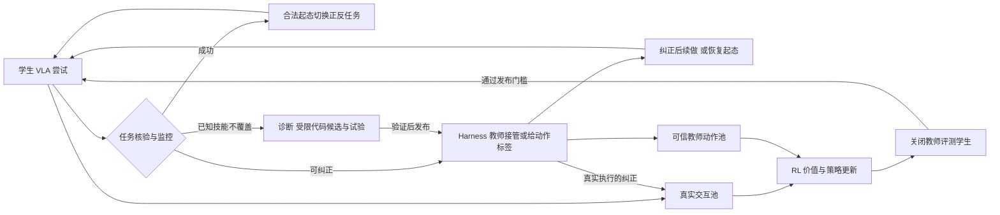

# RL＋Harness 真机自主学习：开发者入口

2026-09-22｜审阅版 v1.0｜首任务：松灵 ALOHA 类平台的一条机械臂完成抓放，另一臂暂不参与。

**要做的系统：让尚不可用的 VLA 在真实工位持续练习，由 Harness 观察、评分、纠正和复位，再将真实交互与可信教师动作送回学习器，最终减少人和自动教师的帮助。** 当前交付是文献／代码审核后的技术设计，未实现训练系统、运行模型或执行机器人实验。

## 先读什么

| 文档 | 用途 |
|---|---|
| [01 完整技术方案](01_RL_Harness真机自主学习技术方案.md) | 动机、总体架构、一轮完整流程、联合选型、实施路线与评测；审核技术方向先读这份 |
| [02 接口契约与开发验收](02_接口契约与开发验收.md) | 实体控制、取消接管、数据分流、模型发布及故障测试；开始实现时查这份 |
| [03 调研覆盖与选型证据](03_调研覆盖与选型证据.md) | 候选的机构、真机证据、代码／许可和取舍；核对为什么选它时查这份 |
| [04 审查与修订记录](04_审查与修订记录.md) | 本轮纠正了哪些观点、独立审查提出什么问题、哪些条件尚未实测 |
| [05 原始来源索引](05_来源索引.md) | 论文、官方项目和固定源码链接，以及引用它们的本地文档 |

主文档先解释一次“学生抓空—教师重抓—学生继续—数据回流”的过程，接口字段集中在附录。`research/` 保留专项审核与固定版本源码依据，无需开发者逐篇阅读才能理解主方案。

## 几分钟理解闭环

图中每一次运动都经同一个本地机器人网关；大模型负责较慢的诊断和候选生成，本地程序负责控制交接与必要保护。恢复和教师成功都要独立核验。未知或不可恢复事件会中断自主窗口，不能靠一直等待维持“无人”记录。

**Harness 要做三件不同的事：知道任务是否完成；让下一次练习还能开始；在学生犯错的状态提供可学习的正确动作。** 只具备前两项，可能得到永远重复失败的自动练习机。第三项可以先覆盖局部错误，不必一开始就是通用完整任务专家。

## 当前技术取舍

- **Harness：优先预检 Zetta 的骨架。** 它已有监控／恢复／候选与评测代码；但公开后端为仿真、VLA 冻结、整体许可待核。真机 Gateway、教师执行和训练回流仍需实现。ENPIRE 作实体协议参考，RoboRSI／ASPIRE 作技能修订参考，不混跑三套主控。若许可或迁移不合适，保留现有真机 runtime，独立实现同一契约。
- **RL：优先预检 EXPO-FT＋独立持久教师动作池。** 复用已有 π 模型；真实交互训练 Q／edit，可信成功与教师动作监督 base。未执行教师标签也可用，但原默认数据管线要拆出独立 actor 入口，不能伪标成功。ConRFT 的完整动作头路线是有条件备选；HIL-SERL 保留为接管与回放参考。
- **首版先证明三件事。** 自动教师能在真实失败状态提供有效纠正；数据能进入正确损失；撤掉教师后学生确实变强。稀疏奖励先闭环，连续奖励和自动生成新代码随后逐项加入。
- **必须做动态 DAgger／纠正模仿对照。** 给它与 RL 相同的新教师数据和交互预算，才能判断 RL 的额外收益。RL 不保证在任何任务都比监督学习更快。

这些是联合设计建议，尚无本项目真机实验背书。关键实现证据见 [buffer 源码审核](research/teacher_buffer_code_audit.md) 与 [Harness 审核](research/autonomous_teacher_harness_survey.md)。

## 三个容易混淆的地方

**教师数据能长期保存，未执行建议也能参与 RL 的辅助训练。** 历史遥操作本来已经执行，拥有真实后果；新查询的建议只有状态—动作标签。后者可以训练 actor，但不能配学生动作产生的后继状态来训练 TD。这是损失输入的区别，不是“能不能放进 buffer”的字面区别。

**系统完成任务不等于学生学会。** 分别报告学生无辅助成功率、系统辅助表现、在线人工分钟和教师成本。正反循环首先减少复位劳动；共享能力是否额外促进正向学习，另做消融。

**完全自学习要有可验证范围。** 前期允许少量示范、标定和技能建设；在冻结的对象／工位／时间窗内测在线是否无需人工控制、标奖、复位和值守。不把有限范围的零接管结果外推成任意场景永久无人。

## 实施从哪里开始

先确认机器人动作接口、相机／夹爪反馈、现有 π 数据与部署链、GPU。随后依次完成：唯一实体网关 → 可靠核验与有限域教师 → 真实与教师数据双通路 → 一轮模型更新与无辅助评测 → 连续正反练习 → 受限代码演化。各阶段交付件和阻断条件在主文档第 13 节及开发附录中。

本目录继承 [会话文件约束](../AGENTS.md)。背景知识库 `embodied-scientist/` 只读，本次全部文档、证据及检查结果保存在 `具身_harness_RSI_RL/` 内。
