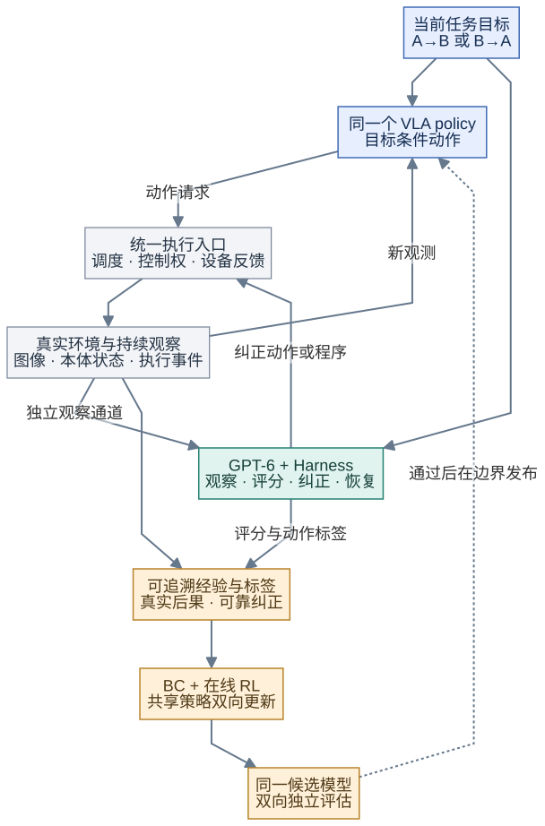
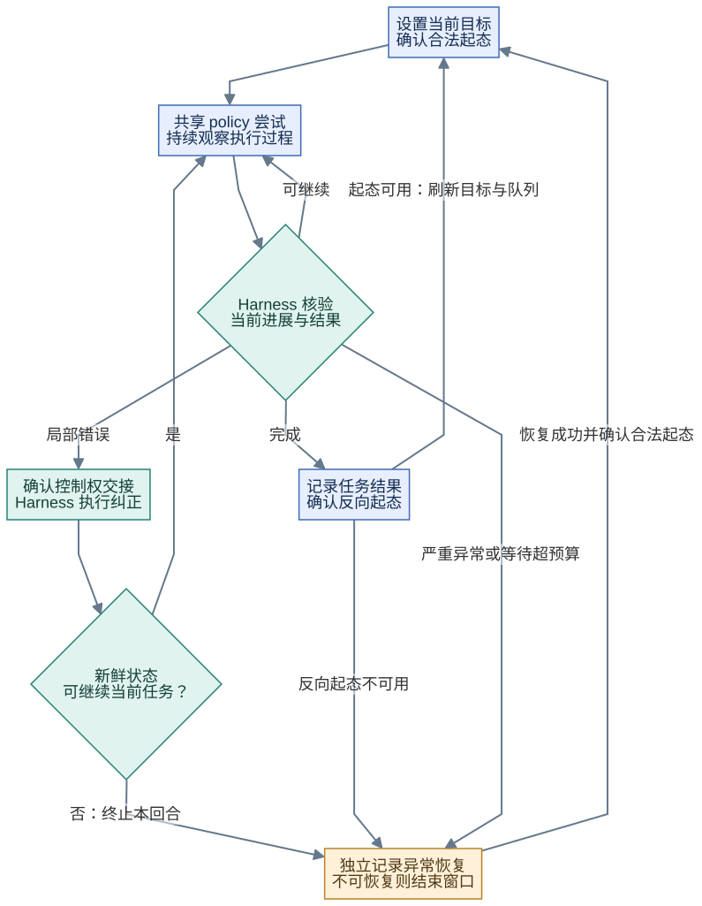
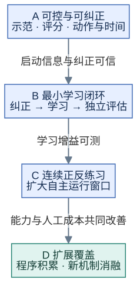

# RL＋Harness：面向真实机器人的自主学习闭环

**技术方案汇报｜2026-09-23｜基于已审查的开发方案 v3；尚未实施集成、训练或真机实验。**

本方案希望让一个初始能力有限的 VLA 策略，在真实环境中持续尝试，由 GPT-6 驱动的 Harness 观察、评分、纠正和恢复，再通过行为克隆（BC）与强化学习（RL）吸收经验。正反任务提供持续练习机会，Harness 减少日常人工介入，学习算法则把有效经验转化为 policy 自身的能力。

汇报围绕三个问题展开：**为什么需要这套闭环？怎样让它真正产生学习？用什么实验判断是否值得继续？**

## 一、动机：真机学习的瓶颈不只在算法

### 1.1 从“能训练”到“能持续练习”，中间仍有大量人工劳动

真实机器人训练通常需要人判断任务结果、纠正错误动作、恢复场景并处理异常。即使算法能够利用在线经验，只要每次失败都要有人到场，学习规模仍受人力限制。

本项目把这三类问题放进同一闭环：

| 问题 | 对应机制 | 预期作用 |
|---|---|---|
| 完成一次任务后，谁恢复下一次练习条件？ | 正反任务循环 | 将一次任务的结束状态尽量转成另一任务的起点 |
| 发生错误后，谁观察、判断与纠正？ | GPT-6＋Harness | 自动提供评分、局部纠正和异常恢复 |
| 怎样避免每次都靠 Harness 救场？ | 可信 BC＋在线 RL | 让策略吸收正确动作，并从真实后果中改进行为 |

这里有两点需要通过实验验证：反向练习可能促进正向能力，也可能造成共享训练冲突；RL 可以利用失败后果，但不保证比持续收集纠正数据做 BC 更快、更好。SFT 也可以利用失败回合中的正确动作片段，不能简单等同于“只能用成功案例”。

### 1.2 首个目标：在有限工位内，验证少人工介入的持续学习

首个任务是单臂将同一物体从 A 区搬到 B 区，再搬回 A 区。**两个方向使用同一个目标条件 VLA policy，均接受 RL 训练与 Harness 纠正。** 正常反向本身是学习任务；异常恢复另行处理。

允许少量遥操作示范和 SFT，初始策略成功率偏低，包括零成功率。不预设另有高成功率策略提供答案；但少量示范、可靠局部纠正或有效探索仍须提供启动信息。全部尝试都失败、奖励没有区分且纠正也无效时，RL 不会自动产生解法。

“完全自学习”先按**限定工位、对象与连续运行窗口**验收：窗口内无需人遥操作、标奖、复位、在线调参或持续值守。前期标定和示范单独计成本；超出恢复能力时允许结束窗口，并如实记录原因。首站可用现有松灵双臂平台的一臂，框架设计优先考虑通用性，品牌适配仅影响部署成本。

## 二、方案：把练习、纠正和策略更新连接起来

### 2.1 总体框架：运行闭环产生经验，学习闭环提升独立能力

*图1｜实线连接动作、观察与数据，虚线表示评估后的版本发布。policy 与 Harness 共用一个执行入口；学习器从可追溯记录构建训练数据。图中是拟议分工，不表示组件已集成。*

VLA policy 负责根据观测和当前目标产生动作。Harness 是整个观察与纠正系统：GPT-6 分析多图、本体反馈与执行历史，调用感知、规划和动作工具。统一执行层负责动作调度、控制权交接和设备反馈，本地保护始终保留。

系统有两条不同的改进路径：**BC＋RL 更新 policy 参数；Harness 则积累经过验证的纠正与恢复程序。** 程序库变强能够减少人工，但不等于 policy 已经学会，二者分别评估。

### 2.2 正反循环：共享能力，同时严格区分正常任务与异常恢复

同一物理状态的含义由目标决定：物体在 B，对“放到 B”是完成，对“放到 A”是起点。因此，目标不仅进入语言指令，也贯穿价值评估、奖励、数据采样和 Harness 判断。两个方向的数据分层采样，同一个候选模型通过双向评估后整体发布。

*图2｜两个方向反复调用同一个 policy，只切换目标。完成后确认下一方向具备合法起态，再刷新目标和队列；未知时先补观测，超预算再转异常处理。恢复失败则结束自主窗口。*

例如，A→B 抓空后，Harness 先确认控制权交接，再调整接近位置并重抓；策略随后继续当前目标。物体在 B 稳定释放、下一任务条件满足后，再切换为 B→A。纠正动作按其真实来源记录，不能冒记为 policy 独立完成。

物体掉出工作区等异常不能直接视为正常反向任务。恢复程序即使把物体放回 A，也不能把此前失败改写为成功；恢复的时间、动作和人工介入都需要记账。

### 2.3 Harness 怎样替代观察员和接管员

| 职责 | 实现思路 | 必须保留的边界 |
|---|---|---|
| 观察与评分 | GPT-6 结合有时间戳的图像、目标、本体状态与动作历史，判定完成、进行中、失败或未知 | 先用独立留出记录校准；工具返回 DONE 不等于任务成功 |
| 局部动作纠正 | 在 policy 实际访问的状态提供动作标签，或接管并执行短程修正 | 不假设 Harness 永远正确；可执行性、监督质量与时间信息分别检查 |
| 异常恢复 | 生成或调用感知、规划、夹爪等工具程序，恢复可继续练习的场景 | 经过受限试验与效果验证；超预算或不可恢复时停止 |
| 能力积累 | 将有效程序和适用条件加入版本化能力库 | 代码生成不能修改成功判据；发布可回退，物理动作不能靠软件回滚撤销 |

这就是本方案采用的 **Harness-DAgger 思路**：持续收集策略实际遇到的状态及可靠纠正，再聚合训练。纠正来源可以是 GPT 生成的目标、动作或本地反馈程序，无需上游强策略；DAgger 的名称也不赋予这些标签正确性保证。

GPT 负责语义判断，本地程序负责快速执行。长动作期间仍保持独立观察通道；申请取消远端调用后，必须确认设备实际停止或保持，才能交接控制权。

奖励先使用可靠的成功事件及明确代价。连续进展分数是后续独立验证项，需检查是否真实反映任务进展及能否被策略利用漏洞；“未知”不能直接变成失败或零奖励。迟到评分只标注对应历史任务，不影响已切换方向的当前控制。

### 2.4 BC＋RL：既吸收纠正，也学习真实行为后果

**BC 回答“可靠动作应怎样做”，RL 回答“真实行为带来什么后果、怎样获得更好回报”。** 两者结合可以降低弱策略启动难度，但前提是数据与学习目标一致。

| 数据来源 | 保留与使用方式 |
|---|---|
| 少量初始示范、Harness 可靠纠正 | 长期保留，合格动作参与 BC；具备真实后果且满足执行协议时，也可参与 RL |
| policy 与 Harness 的真实成功／失败交互 | 保留原始记录，按目标、时间与动作身份构造合格 RL 样本；最终成功不代表全程都适合模仿 |
| 未提交、未执行的动作建议 | 可长期入池作为监督候选或辅助训练数据；没有真实后果，不能伪造为环境转移 |

异步执行是二者融合的关键：机器人执行旧动作时，下一块动作仍在推理；新预测中只有部分实际生效。训练需要知道**当时看到什么、已经承诺执行什么、哪个请求真正影响了队列，以及后来发生什么**。仅按预测数组保存整块动作，或给未执行位置加一个 mask，都不足以保证学习正确。

首版参考设计使用固定执行槽，将已承诺动作队列纳入学习状态。请求成立、进入队列和物理生效分别记录；接管打断协议时，保留事实并隔离不合格样本。Harness 根据后续新观察修改的轨迹，也不能倒填成早先一次规划出的动作。详细时序和学习目标留在开发附录，本汇报只强调其必要性。

### 2.5 联合选型：先证明能协作，再决定采用哪个算法和框架

现有调研支持以下验证顺序，**尚未证明任何组合在本工位最优**。

| 层次 | 优先验证与对照 | 决定取舍的关键 |
|---|---|---|
| 原生 VLA 学习 | RAPolicy 优先做小预算预检 | 保留动作先验是否更易启动；公开 hold 配置须改造后才能满足连续异步执行 |
| 异步学习路线 | 完整动作头＋BC／队列 RL 作详细参考；Real-Time EXPO-FT 作实时对照 | 新头可学性、候选／编辑动作覆盖、有效训练数据比例和独立能力增益 |
| 补充原生对照 | verl-vla 的 π₀.₅ TD3＋BC | 开放配方能否在本任务与执行协议下成立，不外推仿真结论 |
| Harness 骨架 | RPent 首先验证；OpenETA、Strands 及 DimOS／OpenRAL 可复用层参与比较 | 同一 GPT、工具和故障用例下，观察、交接、数据完整性与维护成本 |
| 训练与动作工具 | RLinf 优先，LeRobot 为轻量备选；借鉴 Show-Harness 的语义动作解释器 | 是否能接入统一执行入口、目标与数据契约，避免多个组件各自控制硬件 |

不要求先长时间训练完整头才允许采用原生路线，也不同时完整移植全部候选。先通过接口回放、小样本 BC 和动作覆盖检查筛选，再进入同预算真机比较。不同方法的执行时序和学习目标分别验证，不能把一个框架的 replay 直接接到另一套目标函数上。

通用性通过可替换的本体、模型和学习器接口体现。首轮以两种不同动作定义的模拟适配器检查接口，后续再验证真实本体；接口通用不代表同一权重可以免标定、免训练迁移。

## 三、验证计划：证明策略学会了，同时证明人工减少了

### 3.1 三项假设、三类独立指标

| 待验证假设 | 主要比较 | 需要看到的证据 |
|---|---|---|
| 纠正＋RL 能增加 policy 自身能力 | 初始 BC、同预算持续 Harness-DAgger／BC、BC＋RL | 关闭 Harness 动作辅助后，同一模型双向能力相对对照改善，并报告不确定区间 |
| 正反共享练习能降低练习成本 | 相同任务与预算下比较循环方式，并消融共享／独立参数 | 人工复位时间下降、有效练习增加，两个方向均无不可接受退化 |
| Harness 能减少人工而非掩盖策略失败 | 同一策略的无动作辅助、受限辅助与完整系统 | 系统成功率、纠正次数／时长、连续运行窗口和人工工时共同变化 |

分别记三本账：**policy 独立能力、系统辅助表现、自主学习总成本**。总成本包括遥操作、标奖、复位、值守，以及前期示范与工程、事后审核、GPU 和 GPT 调用；失败与未知不从试次中剔除。关闭动作辅助时仍保留相同底层保护，并使用独立任务核验。

对照统一示范、纠正、交互与算力预算，并逐模块核对可获得的信息，避免额外检测器或历史图像带来不公平优势。预先确定任务分布、试次、重复训练安排和继续／停止阈值；开发、版本选择与最终留出评估分开，不能反复用同一测试集调整方案。

### 3.2 从最小学习闭环逐步扩大自主窗口

*图3｜每阶段先回答一个关键问题，再扩大范围；未达到门槛时回到对应问题修正。阶段进度不以“组件能启动”代替学习或无人运行证据。*

| 阶段 | 首先验证什么 | 进入下一阶段的依据 |
|---|---|---|
| A：可控与可纠正 | 少量双向示范下的可学性；GPT 评分与典型局部纠正；接口和时延 | 有效启动信息、可信局部纠正，以及可追溯的动作与观察 |
| B：最小学习闭环 | “抓空→纠正→数据回流→BC＋RL 更新→双向独立评估” | 数据与学习目标核对通过；相对同预算动态 BC 有可测增益，或明确触发诊断／换路线 |
| C：连续正反练习 | 自动评分、换向、接管与恢复；逐步延长运行窗口 | policy 独立能力保持或提升，同时降低人工成本；停止和恢复原因可解释 |
| D：扩展覆盖 | 代码能力积累，再分别验证稠密奖励与动态延迟 | 新能力通过固定判据、回归与回退检查，收益没有依赖篡改任务或更多隐性人工 |

算力和具体控制条件尚未确定，先测训练、推理、观察及停止的实际耗时，再决定部署规模；当前不承诺固定 GPU 数、训练小时或成功率。

### 3.3 主要风险与改变路线的条件

**Harness 不能产生可靠纠正。** 先缩小到可验证的局部错误，补充必要示范、标定或工具能力；不把更多自动尝试当作有效学习。

**异步和频繁接管使可训练数据过少。** 统计样本隔离原因与覆盖偏差，检查时序和纠正方式；必要时切换学习路线，不能靠拼接错误转移提高数据量。

**系统成功率上升，policy 独立能力不升，或另一方向退化。** 暂不宣称自学习成功，诊断纠正能否被模仿、RL 是否有额外收益及共享训练冲突。

**自动评分或生成程序改变了优化目标。** 用独立留出证据核验，冻结任务判据；异常数据可撤销、相关模型版本可回退。超出恢复能力时结束窗口。

### 3.4 本阶段希望得到的技术结论

本项目首先验证：在一个可控抓放场景内，能否把“持续练习—自动纠正—参数更新”连接成真实有效的闭环，使同一 policy 的双向独立能力提高，同时减少人工劳动。若成立，再扩大任务和异常覆盖；若不成立，按纠正质量、数据时序、学习算法与共享迁移定位原因。

方案价值应由上述实验回答。现阶段的成果是可审查的系统设计与验证路线，长期无人运行及通用任务收益仍待实证。

---

**技术依据与展开材料：** [开发方案 v3](../03_RL_Harness自主学习系统_20260922/01_RL_Harness真机自主学习技术方案.md) · [接口与验收](../03_RL_Harness自主学习系统_20260922/02_接口契约与开发验收.md) · [异步学习附录](../03_RL_Harness自主学习系统_20260922/06_异步动作时间轴与学习目标.md) · [独立调研报告](../04_RL与Harness扩展调研_20260923/01_RL与Harness开源基线深度调研报告.md)。本文概括既有设计，不增加新的论文效果或实测主张。图为本项目方案示意，Mermaid 源文件保存在同目录 `assets/`。
