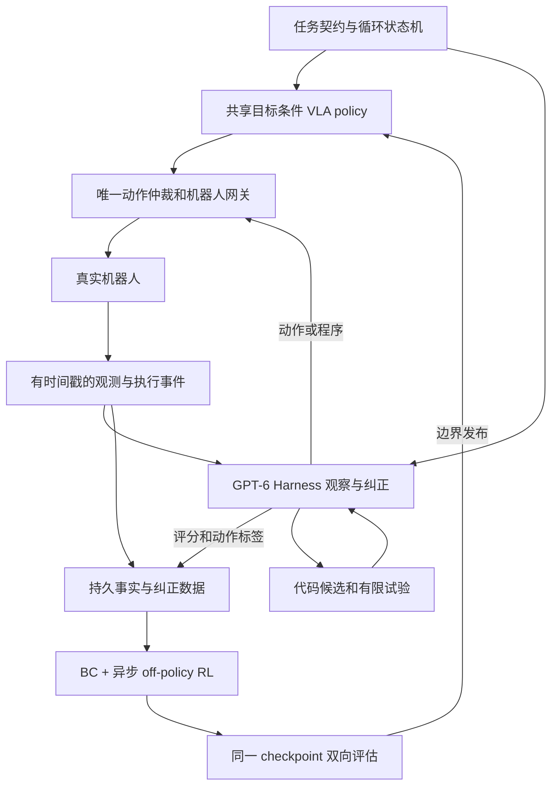
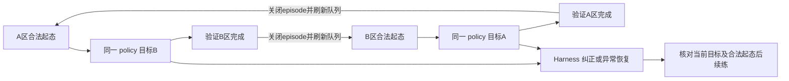

# RL＋Harness 真机自主学习技术方案

**v4｜2026-09-23｜研究与设计文档；未实施集成、训练或真机实验。审查状态见本目录交付记录。**

本方案设计通用的 RL＋Harness 闭环；首个验证场景是松灵 ALOHA 类双臂平台上的单臂抓放：同一物体在 A、B 两区之间反复搬运，另一臂暂不参与。已有 VLA、遥操作与少量示范采集能力；允许少量 SFT，初始策略成功率偏低，包括零成功率。不使用 ACT，不限定全部 VLA 更新或重学动作头；GPU 与机器人具体型号待预检确认。

**最终目标是获得一个在真实任务分布内稳定执行的 VLA policy。** 同一个目标条件模型学习正、反两个任务；GPT-6＋Harness 提供观察、评分、纠正和恢复，BC＋在线 RL 将有效经验转成 policy 参数中的能力。Harness 积累经过验证的程序，是提高纠正质量、持续练习与学习效率的手段；程序更多、系统救场更强或无人运行更久，都不能代替 policy 独立能力的提高。不预设另有高成功率 policy 在上游指导，Harness 的输出也需验证。

本文只描述最终系统、接口边界和实现路线。开发接口见 [接口附录](appendices/01_接口契约与开发验收.md)，异步目标的精确定义见 [异步附录](appendices/02_异步动作时间轴与学习目标.md)。技术路线教学、开源范围、机构与代码比较统一放在独立的 [RL 与 Harness 深度调研报告](02_RL与Harness三轮递进调研报告.md)。历史 [07](../03_RL_Harness自主学习系统_20260922/07_共享策略与异步RL联合选型证据.md)、[09](../03_RL_Harness自主学习系统_20260922/09_RPent与Harness联合选型.md) 保留具体审计依据，旧排序由本版与新调研报告取代。

**框架选型以通用性、学习／执行契约的兼容性、代码完整度和复现证据为主。** 某机器人已有适配只影响首次部署成本，不作为框架优劣的核心依据，也不因缺少 AgileX 适配排除更好的方案。通用接口不等于各本体共用动作维度、标定或训练权重。

本文的**部署policy**是事先声明、可独立运行的动作决策包：可以是更新后的原生VLA，也可以包含VLA表征、完整动作头或选定方法必要的轻量编辑／Q筛选模块。若部署需要这些模块，它们必须一起冻结、计入时延与成本；不能只报告底模，却暗中依靠额外网络。它不包括GPT Harness的临场动作建议、语义救场或恢复程序。复合policy变强与原生VLA参数本身变强是两个不同主张，按实际更新对象报告。

## 1. 核心决定与可行性判断

| 部分 | 本版决定 | 原因与限制 |
|---|---|---|
| 正反任务 | 一个共享参数的目标条件策略；A→B、B→A 均接受 RL 和 Harness 纠正 | 反向也是正在学习的任务，不能只是固定 reset 脚本 |
| 学习目标 | 可信纠正的 BC＋真实交互的 off-policy RL | 持续聚合 policy 访问状态上的纠正；失败反馈不自动提供正确动作 |
| 动作参数化 | RAPolicy 优先做原生头预检，RT-EXPO 作实时挑战者；完整头＋队列 RL 是定义齐全的参考路线 | 不是已证最优；若可靠纠正已在 base 候选＋编辑可达范围内，允许有证据地切换路线 |
| 训练运行时 | 优先验证 RLinf，单机适配成本不合算时用 LeRobot | 复用 worker、数据与发布接口；本项目 goal／队列 target／标签分流仍需新增，不宣称框架默认实现 |
| 异步控制 | 首版固定推理预算及执行槽；显式表示已承诺动作队列 | 不能用整块、错误前缀或裸观测训练 Q |
| 主观察模型 | GPT-6 读取有时间戳的多图、本体状态和执行历史 | 直接判定任务、分析进展、诊断和生成纠正；工位准确率仍需校准 |
| Harness 运行主体 | 优先复用 RPent 认知／工具骨架，配一个状态机、一个动作仲裁器和一个本地网关 | 需补在线 RL、异步监控与实体取消，不允许多 Agent 分别写硬件 |
| 新代码 | 候选→检查→有限真实试验→验证→发布 | 可自动扩展能力；可运行不等于物理行为有效 |
| 发布 | 同一 checkpoint 通过正反双向评估后整体发布 | 不分别挑选两个方向最好的模型来冒充共享策略 |

**这是有原理依据、需要实现和验证的组合设计，不是一套已经开箱验证的现成算法。** 完整头、原生 VLA 更新、实时动作编辑分别有可借用方法；开源组件的具体组合必须独立验收，不把文献背书当成本项目实测。

固定工位、对象可达、观测可用且 Harness 能解决部分实际错误时，持续学习闭环具备工程可行性。最大的两项不确定性是：Harness 是否提供超出当前 policy 的有用纠正；纠正能否按正确动作和时间语义进入训练。只有自动复位、没有有效纠正或探索，弱策略可能持续失败。

“完全自学习”应在限定对象、工位和时间窗内验收。前期允许标定、示范与工程建设；进入自主窗口后，遥操作、远程点选、人工标奖、手工复位、在线改参数都计为人工介入。必须有人持续盯守也不算无需值守。停机不动不是持续学习，Harness 一直代做而 policy 不提升也不是 policy 自学习。

“有所提升”也不等于最终可用。实施前根据任务容错、节拍和恢复代价确定双向独立成功、耗时、扰动覆盖及不确定区间的验收门槛；不为不同任务强设统一成功率数字。最小实验先证明有学习增益，最终部署判定另需满足该任务的稳定性要求。

## 2. Motivation：三部分各自解决什么问题

**正反循环解决能否持续练习。** A→B 的结束状态往往适合作为 B→A 起态，两次都是有效任务，减少人工摆放。共享抓取、搬运、释放的参数可能促进迁移，也可能产生梯度冲突。能反向操作不等于充分理解任务，更不保证正向表现必然提高；迁移收益要单独消融。

**Harness 解决谁观察、判断和纠正。** 它发现抓空，生成重新接近动作，接管局部操作，确认释放，为异常状态生成恢复程序，并把这些行为转为学习数据。因此它不仅是复位器，也承担持续动作标注与纠正。

**BC＋RL 解决怎样改变 policy。** BC 吸收可靠动作，RL 学习行为的真实后果。失败数据有价值，但全零奖励、无有效纠正且缺乏可行探索时，RL 也未必启动。SFT 可以利用失败回合中的正确片段；“SFT 只能用整条成功轨迹”“RL 必然更快、上限必然更高”均不作为前提。

本方案借用 DAgger 的访问状态标注与数据聚合思想，标注来源是 Harness，不要求是人。原始 DAgger 的理论条件也不能直接当作错误率未知的 GPT Harness 的保证。实验必须给动态 BC／DAgger 对照与 RL 同样的纠正、示范和交互预算，评估 RL 的额外收益。[DAgger 原论文](https://proceedings.mlr.press/v15/ross11a.html)

## 3. 一次“抓空—纠正—学习”的完整流程

1. 物体在 A，状态机建立目标 `g=B`。共享 policy 抓取；上一块执行时，下一块正在推理。网关记录真正入队、驱动发出及设备反馈的动作。
2. GPT-6 从有序观测看到末端抬起而物体仍在桌面，结合夹爪反馈判定疑似抓空，提出纠正；证据不足时请求补充观察。
3. Harness 申请控制权。网关停止接纳旧 policy 的新块、取消未执行队列并确认驱动状态。取消远端推理请求不等于机器人已停止。
4. Harness 用新鲜观测重新定位，执行调整、接近和重抓。它可以直接给出目标／轨迹，也可以运行生成并验证过的本地反馈程序；全部经过同一网关。
5. 按相同固定槽协议产生的真实控制决策可进入主 RL；应急微步接管先保留逐帧事实，不拼成从过去观测一次规划出的动作块。可信且符合所选监督定义的片段进入 BC。
6. 回到可继续状态后刷新控制代次、队列与请求，仍由同一个 policy 完成 A→B。纠正动作不冒记为 policy 动作。
7. GPT 按固定判据确认物体在 B 稳定释放，关闭当前任务，清理队列并建立 `g=A`；同一 checkpoint 开始反向 RL 练习。
8. learner 并行读取合格数据做 BC＋RL。候选 checkpoint 双向验证通过后，在边界整体替换执行版本。

Harness 可先覆盖抓空、轻微偏移、释放不彻底等局部错误，不要求第一天就能解决任意完整任务；但必须证明它在部分 policy 失败状态提供了有效行为。

## 4. 总体架构与边界

| 模块 | 负责 | 边界 |
|---|---|---|
| VLA policy | 根据观测、目标和承诺队列预测动作 | 不自行宣布任务成功 |
| GPT-6 Harness | 观察、评分、诊断、动作标签、接管与恢复代码 | 输出需核对事实、参考系、时效；不是设备状态本身 |
| 本地运行时 | 调度、状态机、唯一控制权、任务交接 | 确定性设备保护不替代 GPT 的语义观察职责 |
| 网关与驱动 | 请求、队列接纳、执行、取消及反馈 | 不可静默混合／裁剪后仍记录原动作被执行 |
| 数据服务 | 事实、标签、版本与 loss 资格 | 不给未采纳建议伪造后果 |
| learner | BC、Q、actor 更新和候选 checkpoint | 不能修改成功定义制造提升 |
| 验证发布 | 双向能力、代价、版本依赖与回滚 | 同模型另一段自评不是独立真值 |

GPT 请求、policy 推理、learner 更新可异步运行，但实体执行权唯一。进程异步、网络异步与 action chunk 异步是三件不同的事，前两者成立不代表训练已处理第三者。

## 5. 正反任务怎样耦合

首版共享 VLA 表征、完整动作头及 actor 参数 `θ`，critic 和 target critic 也按目标条件化。目标包含物体身份、目标区域、任务契约版本；规范化 `goal_id` 贯穿 actor、Q、BC、reward、replay、Harness 和评估。仅给 VLA 换语言指令、Q 却不接收目标，会混淆同一物理状态的两种价值。

“物体在 B 且已释放”对 `g=B` 是完成，对 `g=A` 是正常起态。双向 batch 先按方向分层，再各自混合新交互与可靠示范／纠正；可用双向等额作为首个工程初值，之后按数据量、梯度和各方向评估调整并记录。奖励量纲保持一致，成功判据分别求值；不将同一轨迹自动标为两个方向的成功。

正反有各自 episode 边界。成功切换前关闭样本、取消未执行块、刷新观测和目标、重新 prime 队列。局部纠正后继续同一目标；若当前任务终止，则异常恢复独立记录。物体掉落后的恢复不是正常 B→A，恢复程序把物体放回 A 也不使失败的 A→B 获得成功奖励。

双向均从在线 RL 与 Harness 纠正受益；同一个 checkpoint 双向共同发布。反向失败会减少正向练习机会，因此同时统计方向表现和完整循环。未经验证不能直接把两个边际成功率相乘估计循环可靠性，状态与失败可能相关。

## 6. GPT-6＋Harness 的具体实现

### 6.1 主观察与评分

GPT-6 接收按时间排序的多相机图像、本体／夹爪状态、目标、最近已执行动作、控制来源和校准信息。官方 Astra 模型接口支持图像、工具调用和结构化输出，未将原生视频列为支持输入；首版用抽帧后的多图观测包，不假定可以直接传入实时视频。[模型接口](https://developers.openai.com/api/docs/models/gpt-6-astra)、[视觉输入](https://developers.openai.com/api/docs/guides/images-vision)

输出包含 `success / ongoing / failure / unknown`、进展、异常证据、建议和不确定项。要求引用具体观测事实，例如目标区连续可见物体且夹爪已经离开；结构合法不等于事实正确。先用留出录像校准误报、漏报和拒答率，随后才作为训练评分。

关节限位、看门狗和急停由本地设备处理，不是另一套语义小模型。GPT 可生成动作，但不要求远端请求在每个电机控制周期返回。

### 6.2 纠正可以是标签、同协议动作或应急接管

| 形式 | 例子 | 训练用途 |
|---|---|---|
| 不执行的建议 | 对保存的决策上下文给出更合适动作 | 持久保存；审核后 BC；不能借用其他动作的后果做 TD |
| 同协议纠正 | 在固定决策边界生成下一执行槽动作 | 实际运行时决策及其环境后果可做 Q；可信部分也做 BC |
| 应急／反馈式接管 | 立即撤离、用新观测逐步重抓 | 保留真实微步；不自动拼成主宏动作转移；按明确监督定义筛选 BC |

动作来源可以是 GPT 给出的末端目标、轨迹或调用感知、坐标变换、规划、夹爪 API 的程序。每项动作要有参考系、单位、目标时段和前置条件；无可靠深度或平面约束时，像素不是三维动作坐标。生成并验证过的程序在本地快速运行，避免每个微动作都等一次 GPT。[Code as Policies](https://code-as-policies.github.io/)

不以“由 GPT 生成”或“最终整回合成功”证明每个动作正确。记录可执行性、局部目标、引入的新失败、适用域及标注依据；未确认候选留在候选池，不全部当负例，也不直接赋高 BC 权重。

### 6.3 Harness-DAgger 与决策时刻

Harness 持续标注 policy 实际访问的状态，纠正长期入池，每次训练混入可靠纠正与新交互。这是本方案的 DAgger 数据聚合，不需要外部强策略。

异步场景中，`t+n` 看见新图像后产生的纠正，不能不加说明就当成 `t` 时刻的普通同信息集标签。首版优先让 Harness 本地程序在相同决策时刻、相同可见信息与队列协议下产生纠正；历史查询也绑定当时上下文。未来观测不能偷偷作为部署时输入。

更晚、更丰富的信息产生的动作仍可能用作特权／事后 BC，DIDA 提供了相关依据；它不属于原理上禁止的数据，而是需要单独处理可预测性、多模态标签和信息差的扩展。首版暂不混入普通 BC，保留候选记录供后续验证。[DIDA，ICML 2022](https://proceedings.mlr.press/v162/liotet22a.html)

纠正标签另记录决策快照、实际依赖的观测 ID 及其可用时间、是否读过后续反馈、监督类型和可部署范围。普通同信息标签生成器只能读取冻结快照，不能通过 live sensor 或全回合 transcript 偷读未来。用同一起点、两种后续反馈重放检查依赖；若标签随未来变化，转入特权／事后视图。程序选择还检查是否遮住 policy 必须看到的物体；同一 policy 观测若对应相反的必要动作，增加可部署历史／视图或收窄范围，不能只靠更多冲突 BC 标签解决。

历史遥操作有真实物理后果，但一般缺本方案的队列上下文。可做时间语义相符的 BC 预训练，部署前验证延迟条件下行为；只有日志可真实重建时才转成主队列 TD，不能凭空补零队列。

### 6.4 迟到回复与缓存

| 内容 | 允许用途 | 绑定条件 |
|---|---|---|
| 旧观测评分 | 完善相应历史样本 | episode、目标、观测区间／哈希、评分版本、终局去重 |
| 旧决策动作建议 | 历史监督候选 | 决策信息集、目标动作时段、质量与监督类型 |
| 当前执行计划 | 重新验证后申请控制 | 新鲜观测、目标、控制代次、队列、前置条件与预算 |

正向已结束、反向已启动后才返回的正向评分，仍可标注正向历史，但不能改变反向奖励或执行旧动作。旧请求不得覆盖新裁决。缓存只复用同一输入与任务版本的结果；超时保持 pending／unknown，不能广播“最近奖励”。本轮核查 ENPIRE 的全局奖励缓存逻辑说明这不是抽象风险，双向迁移时必须改造。[固定版本源码](https://github.com/NVlabs/ENPIRE/blob/99ee90acf65b5b18957c8382ad580db999528be3/enpire/env/forge/cap/reward/gemini_reward.py)

### 6.5 程序生成与恢复

候选程序只调用受限 API，经过权限、动作域、终止条件、依赖和预算检查后，可在预授权范围进行有限真实试验，不必逐次人工点击批准。结果单列，满足覆盖标准后发布到纠正／恢复库。

生成器不能修改成功判据、硬件限制、原始事实和评估分母。软件回滚不会撤销物理动作；试验失败后根据当前状态恢复或终止窗口。候选产生的数据先隔离，验证后再授予 BC／RL 使用资格。具体主体采用何种开源 Harness，仍必须遵守上述统一契约。

### 6.6 将语义纠正编译成可执行、可学习动作

Harness 的首版动作接口采用“语义小步→本体解释器→规范动作序列”，优先借鉴 Show-Harness 的语义动作和轨迹记录设计，并接入 RPent 工具层。例如 GPT 提出“在目标物上方降低一小步并合拢夹爪”，解释器把已标定的目标、参考系、幅度、持续时间和夹爪语义转成当前机器人可执行命令。用户具体型号未定，不直接复制上游 Piper 驱动或维度。

解释器与 Gateway 分工明确：前者产生候选动作和前置条件；后者决定控制权、检查时效并记录实际生效。坐标、IK、限速或插值改变动作时，保存转换前后及版本。首版不允许解释器绕开网关自行发 ROS/CAN 命令。

一条语义动作可能展开为多个控制步。若全段在槽起点的信息集下生成、长度和提交协议满足异步附录，可成为同协议 U；若解释器不断读新反馈改轨迹，则按反馈动作记录，不能把最后路径倒填成起点的一次动作标签。已有程序能高速闭环，并不使晚到信息自动成为普通 BC。

接入解释器时禁用隐式启动运动、默认双臂归位或 RELEASE；初始化、夹爪状态和非参与肢体保持由明确的能力及前置条件决定，防止中途持物接管反而掉物。

上游的 `DONE`、工具完成或轨迹播放结束只表示该层执行结束，任务成功仍由本项目冻结判据核验。上游的 Pause、协程取消、清队列也不自动满足设备停止回执。成功、失败、纠正和未执行提案均保留，不能只导出成功整回合给 learner。

### 6.7 程序积累怎样服务 policy，以及何时退出纠正

每项已发布程序注明作用路径，避免把“更会替机器人做事”直接记作学习进步。

| 作用路径 | 直接产出 | 最终需要验证 |
|---|---|---|
| 提供可学纠正 | 当前policy访问状态上的可靠动作标签 | 在部署可获得的信息下，policy能否复现并泛化这种处理 |
| 改善探索和经验 | 合格的真实动作、回报和后继 | 是否增加有效RL覆盖，而非只增加被隔离的接管片段 |
| 恢复练习条件 | 更多合法起态、更少人工复位 | 同等总成本下是否增加有价值练习；是否把难例都改成简单起态 |

程序的首次发布依据是受限试验中的物理有效性、记录完整性和适用域，不要求每个程序先单独证明统计显著的policy收益。后续按固定学习周期核查上述贡献；持续只提高辅助成功率、不能改善数据或练习的程序，不作为自主学习有效性的证据。异常维修与超出任务契约的恢复可以留在Harness，无需强迫policy学会全部设施维护。

纠正从局部覆盖开始，优先处理policy重复遇到且能可靠判断的错误。按方向和错误类型安排保留本地保护的独立尝试，达到预先确定的能力与风险标准后才逐步减少动作辅助。接管次数下降本身不触发退出：少做任务、监控漏报、频繁停机或只遇到简单起态都会造成假下降。所有保护性终止和未知仍计入试次。

普通BC优先使用同信息集下的可靠标签；多种合理动作、含噪纠正与偏好监督作为后续消融。被替换动作不自动是负例，几何接近纠正动作的合成样本也没有真实后果。先确认普通BC能吸收纠正，再增加更复杂的筛选或集合监督。

## 7. 奖励：先可靠，再稠密化

GPT 按冻结的任务判据直接评分，首版不必另训练语义分类器。“固定判据”指目标定义不能随优化变化，并非必须由另一模型执行。少量独立标注录像或额外传感证据用于校准；同模型另一个角色不构成独立真值。

首版使用去重成功事件、必要的明确失败事件和可观测代价。奖励返回、实际后果和 episode 终止可能不同步，训练视图须等所需信息齐备。unknown 不是失败，也不是零奖励。局部控制暂停不自动等于任务终止。

GPT 可以提供进展和子目标，稠密奖励随后消融。若采用势函数塑形，在固定目标／版本内定义仅依赖当时因果信息的 `Φ(X,g)`，n 步转移加入 `γ^n Φ(X_next,g)−Φ(X,g)`，终局吸收势一致处理；不同目标的势不跨 episode 相减。回看完整视频的事后解释可以审核标签，不能伪装成当时的状态势。

不必按电机频率调用 GPT；先对决策状态和明确区间异步评分。缺失分数不任意插值并宣称是真实逐步奖励。记录评分错误造成的污染、成本和延迟，不能仅看训练 reward 上升。

## 8. 异步 action chunk 与 RL 的因果关系

### 8.1 C／E／D 不是简单前缀 mask

在全局帧 t 启动长度 H 的预测。前段对应推理尚未完成的时间，机器人实际执行旧块；中段才由当前预测控制；尾段可能被更新推理替换。

- **C，已承诺段：** 来源是先前真实承诺动作，不是当前预测中的同位置数值。
- **E，本次有效段：** 当前块为后续执行槽提供的动作。
- **D，未执行尾段：** 被更新块替换或取消，不能算物理执行。

SmoothRL 明确处理这些区域和执行区策略梯度；ARLI 强调推理期间的动作与中间信息对状态定义的影响。原始论文条件与本方案改造必须分开。[SmoothRL](https://arxiv.org/html/2608.29768v1)、[ARLI v2](https://arxiv.org/html/2608.23831v2)

例如 `t=100，n=6，H=20`：100～105 帧执行旧块 C；当前块下标 6～11 对应 106～111 帧的 E；下标 0～5 不是本次新动作，12～19 不自动进入 TD。实际系统按绝对帧号、接纳／取消事件及设备反馈重建，而非只凭预测数组截取。

### 8.2 首版：固定预算、延迟动作决策、显式队列状态

首版采用固定预算 n，提前完成也不提前切换。n 根据实测延迟与控制需求选；动态延迟留作独立扩展，超时按异常处理。

`X_k` 包括决策时可见观测／历史、目标 g、当前槽承诺动作 C_k 和必要调度上下文。运行时在该边界接纳一次真实控制决策请求，绑定冻结输入、模型、随机种子和目标槽位；其输出 `E_k=π(X_k)` 是下一槽动作。需区分三件事：**实际控制请求成立、动作进入队列、物理动作生效**。

当前槽执行 C_k，产生真实 R_k。正常情况下 E_k 按时入队，下一状态中 `C_(k+1)=E_k`。队列增广转移及目标为：

`(X_k,E_k,R_k,X_(k+1),n)`

`y_k=R_k+γ^n Q_target(X_(k+1),π_target(X_(k+1)))`

动作物理效果延迟到下一槽，通过下一状态中的 C 传回价值。这里的环境包含真实调度队列，并不要求新动作在当前槽已经生效。没有进入实际控制请求流程的 shadow 建议仍无此环境转移，不得伪 TD。[Thinking While Moving](https://arxiv.org/abs/2004.06089)

本式是拟议的一决策步队列实现，**不是声称照搬 SmoothRL 原始 2n 目标**。视觉加有限历史仍是 Markov 近似。ARLI 的中途新观察值得后续接入，但要重定义决策时刻和信息集，不能把 t 之后的观察悄悄塞入 X_k。

### 8.3 终局与接管

若执行 C 时任务在 L≤n 步终止，真实决策请求可能已经建立，而 E 尚未入队。等待该请求在冻结输入下的原始结果可得到合法延迟决策的 terminal 样本，target 为实际 `R_L`，无 bootstrap；不声称 E 已经物理执行。actor 仍按合格的事前 X 采样，不因本次未来提前终止而再次筛选；理想 Q 已包含提前终止的可能性，详见异步附录。若原请求结果缺失，先保留事实，不捏造动作。

不采用“后继槽终止就给前驱额外回填、未终止仍普通 bootstrap”的混合目标；该分支会按未来事件选择 target 并可能产生偏差。终局直接按当前实际控制请求的环境结果处理，具体边界以 [异步附录](appendices/02_异步动作时间轴与学习目标.md) 为准。

Harness 中途改写 C、推理超时、驱动故障、未建模动作混合会破坏正常固定槽契约。受影响宏样本隔离，逐帧事实保留；不伪造 done、零动作或整块执行。符合相同决策边界和提交协议的 Harness 纠正可正常用于 off-policy 学习。隔离会减少数据并产生覆盖／选择偏差，需报告，不宣称由此自动得到无偏训练。

仅加 executed mask 不够：Q 必须知道 C；actor 的环境价值梯度只作用于其负责的 E；BC 可信标签 mask、实际执行 mask、TD 资格是三种不同条件。隐藏平滑或裁剪会改变动作含义；首版禁止未建模的跨块混合，连续性在 C→E 边界显式处理。

## 9. 学习器与持久数据

本节描述完整头参考实现：初期冻结 VLA 表征，将视觉／语言表征、本体状态、规范目标和承诺队列输入完整原始动作头与 Q。动作可直接映射到机器人规范动作空间，不限制为弱 base 的小残差。若外部接口要求整块，适配器明确每个下标的时间含义；无监督位置不自动获得 Q 梯度。

冻结表征减少训练和漂移，但现有 π 代码是否易于提取特征须先验证。完整头探索可能更难，因此先检查少量示范下可学性、归一化、目标和时延；不是因为去掉弱 base 锚定就必然适合零成功起步。

首版拟使用双 Q、目标网络与确定性 actor 的 off-policy 实现，动作噪声在规范动作空间和允许范围内加入：

`L_Q = E[(Qφ(X,E)−stop_gradient(y))²]`

`L_actor = −E[Qφ(X,πθ(X))]+λ_BC L_BC+λ_cont L_continuity`

BC 来自可靠初始示范和 Harness 纠正；continuity 面向实际 C→E 连续性，不是永久模仿弱基础动作。完整公式、采样资格和边界以异步附录为准；尚无本组合已验证的超参数配方。

| 数据 | 保存 | Q／RL 用途 | BC 用途 |
|---|---|---|---|
| 逐帧交互和真实控制请求 | 长期保存 | 重建符合队列定义的转移；异常不强行拼接 | 可靠且符合信息定义的动作 |
| 初始遥操作示范 | 保护性保留 | 有真实所需上下文才能进入本宏 TD | 按原观测、动作时间做预训练 |
| Harness 真实同协议纠正 | 长期保存 | 请求、队列及后果齐备时进入 Q | 质量合格部分进入 BC |
| 未执行且未提交的建议 | 长期保存 | 可补充 RL 的辅助监督，不进真实 TD | 按质量及信息条件采样 |
| 想象后果 | 单独保存 | 首版不混入真实 TD | 不因自评成功自动有资格 |

关键不是“能不能放 buffer”，而是有哪些事实、允许训练哪个 loss。保护示范和可靠纠正的采样份额，避免被大量新失败覆盖；撤销标签后停止采样，并追踪依赖 checkpoint。

动作记录区分 policy 提议、运行时请求、队列接纳、驱动发出和测量。命令位置不是测得位置，偏差也不自动成为 BC 标签。主 Q 使用定义好的动作命令与真实环境结果；破坏执行契约的偏差按异常处理。

Harness 完成任务不等于之前动作都正确。正常 bootstrap 面向当前 policy，不默认未来总会有 Harness 代做。若每次错误立即接管，失败边界数据可能不足；应在可恢复范围内保留独立尝试，记录接管隔离比例。纠正逐步退出应依据同类状态的 policy 独立表现。

## 10. 最终组件分工与选型门槛

### 10.1 首版组件组成

| 层 | 首先实现／验证 | 需要本项目补齐 |
|---|---|---|
| 认知与工具编排 | RPent 骨架，GPT-6 主观察、评分与纠正 | 独立持续观察、共享目标传递、自动 verdict／循环，移除每回合人工依赖 |
| 纠正动作接口 | 借鉴 Show-Harness 的语义小步和本体解释器，通过本体 adapter 接入驱动 | 本体标定、动作展开与版本、同协议／反馈纠正分流，不另起设备写循环 |
| 实体运行时 | 本地固定槽调度＋唯一 Gateway | C/E/D、请求／提交／生效、quiesce、watchdog、实际反馈 |
| 学习运行时 | RLinf 首先验证；LeRobot 为轻量备选 | goal-conditioned actor/Q、异步附录的队列 target、独立 BC 标签采样、双向发布 |
| 学习方法 | 共享完整动作头、可信 BC＋离策略 Q；原生头与实时编辑作候选对照 | 冷启动、时延与数据密度验证；不永久锚定错误 base 动作 |
| 持久数据 | 原始事实日志＋训练视图；按需导出 LeRobot 格式 | Flywheel／平台 buffer 不替代事实日志，不丢失败／标签／时间证据 |

只运行一个实体执行主循环。RPent Toolkit、Show 式解释器和训练平台 env 都提交到 Gateway，不能分别拥有硬件连接与 reset 权限。传输层可以不同，但学习动作的物理语义必须相同。

### 10.2 用小预算预检决定动作头与工程底座

不因初始成功率低就断言“必须重学完整头”，也不因某论文提升快就假定弱 base 足够。P0/P1 用相同的双向示范、典型失败状态和可信 Harness 纠正做以下检查：

1. **可控与可学性。** 保留原生 VLA 头及拟议完整头分别做小规模 BC 检查；验证目标条件、动作单位、局部误差与相同预算下的行为。若新头连基本行为也难以学习，应优先解决接口或保留原生动作先验。
2. **编辑覆盖。** 将可靠纠正与 base 候选及其允许编辑范围比较；同时看代表性失败状态、关键动作维度及可执行性，不只看训练集平均 L2。零成功不自动意味着覆盖不足，覆盖不足也不能靠放大残差边界后仍声称复现原方法。
编辑预检再拆成四步：有限预算下是否出现可用候选、允许编辑是否可达、候选存在时 Q 是否选对、可靠纠正训练后能否迁移为独立闭环行为。有限采样没找到不等于数学支持为零；扩大残差或 latent 范围是新配置。若采用 latent 反演纠正，先核反演后正向解码的动作／夹爪误差及 latent 越界，不能仅凭反演损失下降宣布任意动作可达。

3. **开放实现。** Real-Time EXPO-FT 作为首要异步代码对照；RAPolicy 升为优先评估的原生 VLA 在线学习候选，verl-vla 的 π₀.₅ TD3＋BC 保留为补充对照。RAPolicy 的弱起点真机与共享多任务证据更接近本项目，但其公开示例在推理期间保持机器人，不能直接满足本文连续执行要求。各协议独立，不能把它们的 replay／target 当成 异步附录的队列目标。
4. **通用性与底座成本。** 比较是否能替换本体、VLA、learner、观察模型，并完整传递动作／目标／时间／数据契约，再比较依赖与维护成本。RLinf 有真机 worker 和学习入口，LeRobot 的数据／单机组件较轻；两者都不默认实现本项目全部 VLA RL。先完成最小联调再锁定运行时。某一品牌的现成适配只计部署成本，不计方法适合度。

5. **Harness 骨架比较。** 用同一 GPT、工具 schema、两个不同维度的模拟 adapter 和故障回放比较 RPent、OpenETA、Strands，以及可复用的 DimOS／OpenRAL、PhyAgentOS-core 层。检查持续观察、唯一控制权、停止、标签与事实日志、组件替换及维护成本。RPent 只是首先验证者；若其他底座以更少改造通过契约，就切换底座。VoLoAgent 风格辅助作为独立系统对照，不与低层学习算法混排。

**同时对齐信息条件。** 为 actor、Q、候选筛选／编辑模块及 Harness 分别记录输入视图、历史长度、派生位置／速度、来源时间、实际可用时间、预处理版本和成本。相同相机不代表相同信息。允许架构不同，但先统一可获得的信息来源，或增加输入消融，区分算法增益与额外状态估计的收益。派生特征只使用对应决策前可获得的记录，其计算延迟计入总时延；缺失时标记 unknown 并按预定降级处理，不能以未来帧补齐在线输入。训练专用信息另声明，不能让部署 actor 暗中依赖它。

上述异步比较分别记录观测龄期、自然推理／网络／排队耗时和人为 sleep／旧帧注入；先测真实部署再作注入消融。不能把同一论文不同延迟条件的汇总成绩当成当前设备 deadline 已满足的证据。

原生头、编辑或完整头路线都须在同一任务、资源预算和纠正规则下比较独立双向能力、可用 TD 密度及总成本，并通过各自时序契约；完整头不享有免于验证的默认优先权。若使用不同时间协议，应先完成该协议自己的推导和验收、建立独立训练视图，再纳入同任务对照；不能仅更换算法名字。当前优先顺序是预检顺序，最终训练路线由上述证据决定；不是跨论文评出的性能冠军。

### 10.3 纠正并非完美数据：BC 与 RL 的责任分开

Harness 可能给出次优但可执行的动作。真实同协议交互可按真实后果训练 Q；是否适合 BC 另由质量、目标和信息条件决定。初期保留经验证的示范／纠正 BC 份额；critic 尚不可信时，不让它单独决定哪些纠正是真值。

后续可比较按状态调节 BC 权重或保守价值门控，检验是否减少错误模仿；这些属于独立消融，不把它们当作首版缺少的启动条件。接管原因必须细分抓空／危险趋势、评分未知、主动观察、时间超限、人工测试等。不能因为发生接管，就向前一帧或前一 chunk 自动添加“任务失败惩罚”；尤其异步下发出接管的时刻不等于造成问题的动作时刻。

完整候选比较、代码证据及为何保留／改变上述决定，见独立调研报告。本文不再维护一张容易与实现脱节的论文排行榜。

### 10.4 原生 VLA 候选怎样进入同一个系统

RAPolicy 优先进入 P0/P1 的原生头预检；§8–9 和异步附录 仍是当前完整定义的队列学习参考实现。保留参考实现是为了先有可检查的时间、数据和 loss 契约，不是认定重学完整头更好。原生路线若用更少改造通过同等门槛，应优先采用，而不必先完成完整头的长时间训练。

RAPolicy 的价值学习采用 replay 中的动作与状态价值备份，actor 按优势加权拟合行为，区别于本文对动作求 Q 梯度。接入时须让 actor、Q、V 都接收目标与所需承诺队列，独立定义回报区间、折扣、终止与接管规则；不能只更改动作 mask 或切换配置名称。当前尚未完成这一原生头队列改造，不把上游真机分数视为改造后的保证。

采用该类学习器还要保留 rollout 噪声、动作归一化、模型与执行版本。没有原始噪声的示范或未执行建议使用明确的 actor BC／监督模式，不能伪装成带原始采样噪声的在线转移。真实示范若满足目标与时间契约，仍可独立用于 Q／V；缺少噪声不等于缺少环境后果，纯建议则没有这种资格。Harness 读到新反馈后修改的轨迹，仍按 §6、§8 分流。成功快速轨迹的优先采样不能淘汰初始示范、困难反向任务或有价值的纠正。

混合行为数据上学到的高价值不等于当前 policy 无辅助时可达到同一回报。原生路线也必须通过双向独立评估；critic 预热、优势权重或高成功 demo 池都不代替 Harness 标签质量检查。其依赖的 RLinf fork 与主线运行时须分别锁定，避免同名接口被当成二进制或数据兼容。

### 10.5 本次新证据对实现的约束

动态 BC 对照优先借鉴 ABC 的持续纠正与新旧数据混合，不能只与不再更新的 SFT 比较；上游人工数据来源需替换为经核验的 Harness 标签，默认导出也不等于论文完整配方。失败回合中的可靠局部纠正使用独立 BC 视图，不能被 success-only 导出器丢掉。按源回合／会话分组切分数据，goal 使用真实时间线，防止片段泄漏或跨目标错标。

RAPolicy 进入少量双向示范预检；RT-EXPO 需单独核编辑支持、goal 条件和局部 BC 接口，其 `N=1` 默认快选会跳过编辑／Q，不能直接当“只减少候选数”的消融。FlowDAgger 的 latent steering、SDP 的集合监督、FutureRTC 的预测补偿均保留为有条件扩展，不把监督机制当成已有在线 TD 栈。

Harness 端吸收 PhyAgentOS-core 的意图持久化和调用身份对账；其 HTTP 记账不能替代实体 Gateway。AGP 工具轨迹用于行为分析及审计学习，不把缺连续动作资产的公开数据接成低层 BC／TD。Flux 的进度加权机制先检验无进展反例；兜底上升曲线不能充当真实 reward。开源范围、固定版本及取舍理由集中在调研报告，本文只保留影响实现的决定。

## 11. 交接、版本和故障

控制权是带代次的独占租约，作用于规范物理资源；末端运动、关节运动、夹爪、reset 等工具须声明资源依赖，不能各按工具名独立上锁。多资源未全部取得前不运动，只读遥测不被动作锁阻断。policy、Harness、候选试验、恢复程序都通过同一权限。接管包括停止旧请求、失效旧结果、取消队列、取得驱动回执、确认新鲜状态、授予新控制权；无法确认取消时不得假定已交接。

目标、policy、动作归一化、调度协议均在边界切换；不在 chunk 中途热换权重。历史标签保留原版本；模型表征、动作定义或 reward 改变后，明确哪些 replay 可复用、需重标或隔离。

网络超时、观测失效、推理超预算、物体不可达、夹爪异常各有保持／取消／恢复／终止路径与预算，不无限重试。奖励未知则等待或隔离训练；无法恢复则如实终止自主窗口。撤销污染数据需追踪模型依赖，回退不能删除事实。

实现时还需守住三个容易在复用代码时丢失的边界。第一，队列出队、发送命令、设备生效是不同事件；来源标签绑定事件发生时的控制代次，缺动作记录用未知标记，不能补绝对位置零值。第二，执行状态只按当前调用身份和事件序号单调推进；`unknown` 不释放物理所有权，跨任务也不能绕过未决动作。图像新鲜度依据源采样时间和同步误差，收到一张旧图的时间不能使它变新。第三，reset、换向或发布需要处理在途推理与有状态处理器的屏障；丢弃旧结果仍不等于允许并发修改正在读取的状态。

发布检查包括参数／adapter、模型配置、normalizer、动作 schema、服务精度和必要推理模块。对相同观测、目标、承诺队列及随机噪声，比对训练导出前与部署加载后的规范动作及物理单位输出，必要时作受限闭环复核；检查全部缺失／多余参数键，而非“加载未报错”即通过。训练和服务可使用隔离依赖环境，通过版本化接口连接，不强行把互不兼容的依赖装到同一进程。这些要求来自本次源码核查，但尚未在本项目执行。

## 12. 实现路线

| 阶段 | 交付物 | 进入下一阶段依据 |
|---|---|---|
| P0 接口和时间预检 | 型号、动作／时间契约、VLA／GPU 接口、候选底座最小联调及版本锁 | 请求／入队／执行可区分，能选择 n；验证可替换本体 adapter，不把设备支持当学习闭环已就绪 |
| P1 共享 BC 冷启动 | 同一 θ 双目标 BC；原生头／完整头和编辑覆盖预检 | 基本可控行为或可靠局部纠正；依据 §10.2 记录路线决定，不要求预先高成功率 |
| P2 GPT Harness | 留出录像校准，典型错误的动作／程序纠正 | 成功判定和局部纠正有可检验证据 |
| P3 学习语义贯通 | 队列 Q、BC、terminal、接管及异常处理 | 用可手算短轨迹核对 target、mask、goal 和来源 |
| P4 最小实机闭环 | 双向采样、更新、冻结评估 | 相对同预算动态 BC 有可测增益；没有增益则留在本阶段诊断／换路线 |
| P5 自主循环 | 自动评分／纠正／恢复和边界发布 | policy、吞吐及人工成本一起改善 |
| P6 受限进化 | 新代码试验、发布和回滚 | 恢复覆盖提升且任务定义不变，再消融稠密奖励和动态延迟 |

首个迭代只打通“抓空→Harness 同协议纠正→数据＋BC→一次 RL 更新→双向无动作辅助评估”。先证明数据改善 policy，再扩展复杂恢复和代码生成。没有硬件与实测依据时，不承诺 GPU 数量、训练时长或成功率。

达到当前限定任务的稳定性门槛后即可验收部署policy；P6是扩大适用范围的可选阶段，不以不断增加程序或新机制延迟已有目标的验收。

## 13. 评估与工程验收

**policy无动作辅助能力是主结果，系统表现与成本解释训练手段是否有价值。** 独立评估保留已声明的部署policy模块，以及共同的动作解码、固定调度和本地保护；关闭Harness临场动作生成、外部候选改写及任务内语义路线替换。任务目标预先给定，评分可事后核验；不能让Harness在评估中重排动作后仍计policy成功。保护性终止、失败和未知全部记入试次，不静默剔除。

| 项目 | 至少报告 |
|---|---|
| Policy | 同一 checkpoint 双向成功率及不确定区间、耗时、失败类型、扰动起态 |
| 系统 | 辅助后成功率、纠正次数／时长、循环吞吐、恢复成本 |
| 自主学习 | 人工控制／复位／标奖分钟、必要值守时间、有效小时、连续窗口与停止原因 |
| 数据 | 合格 TD 和 BC 比例、隔离原因、评分误报／漏报／未知、撤销与重标 |
| 实时性 | 推理延迟、超预算、取消耗时、C/E/D 比例、动作连续性和跟踪偏差 |
| 总成本 | 机器人、GPU、GPT 调用，前期示范与工程、事后审核的人力 |

### 13.1 H1：隔离 RL 对持续纠正学习的额外收益

**问题与分组。** 从同一个双向 BC checkpoint、同一初始示范集分出动态 Harness-DAgger／BC 与 BC＋RL 两组；冻结 Harness 版本、触发规则、动作接口、任务判据和执行协议。两组均在线访问各自状态并聚合可靠纠正，只有实验组增加真实后果的 RL 更新。初始 BC 不再训练，仅作为起点参照。若同时替换动作头或增加输入，则另列消融，不能只将差异归因给 RL。

**执行。** 主实验预先固定机器人总时间及纠正／GPT／计算资源上限，按方向和实测起态分层、交错安排运行；实际消耗全部报告。在线策略不同，访问状态和获得的轨迹本来就会不同，不能声称数据逐条相同。可在共同固定数据上补做 loss 消融，但该结果不等同在线闭环收益。按有效交互量绘制次级学习曲线，时间、交互量与算力不要求同时严格相等。

**判定。** 训练后冻结同一双向部署包，在共同独立起态上关闭 Harness 任务内动作辅助，分别报告两方向效果差值、区间、耗时和总成本。预先填写有实际意义的增益门槛与允许回归；另一方向退化不能被平均值掩盖。辅助成功率上升而独立能力未升，不通过学习增益门槛；区间过宽则结论为证据不足，不能宣布算法已被证明等效或无效。

### 13.2 H2：将省复位与共享迁移分开测

构造四组：分开练习＋共享参数、分开练习＋独立参数、正反循环＋共享参数、正反循环＋独立参数。四组都训练两方向，起点、示范和学习配方一致；独立组复制相同初始参数后分别训练，只作消融，并记录额外模型、计算和存储成本。

分开练习组每次按已登记起态方案复位，人工或自动工具类型固定并分别计费；主人工复位对照不得偷偷更换成熟自动 reset。循环组上一终态满足下一 `init_set` 才继续，否则整理、失败恢复或中止都计入时间。主比较固定机器人总时间，回答能否减少人工并增加有效练习；次级在匹配交互量和起态分层下比较学习效率。若起态支持不重叠，不外推匹配结论。

固定参数方式比较循环效果；固定循环方式比较共享效果，同时检查交互作用。独立评估仍使用共同留出起态，不沿用训练时越来越容易的摆放作为唯一评测。双向分别报告并重点看最弱方向。若还要主张“反向数据本身改善正向”，需追加正向专训与双向共享的匹配正向数据对照，并报告额外反向交互／计算；四组实验本身不足以单独证明该命题。

### 13.3 H3：程序积累是否转化为 policy 收益

**训练贡献对照。** 复制同一初始 policy 和 learner 配置，一组使用固定程序库，一组允许按已冻结门禁扩展纠正／恢复程序。初始观测模型、工具能力、rubric、起态范围、预算和评估相同；新程序的生成、试验、失败恢复与额外计算计入总成本。各训练块记录实际程序版本，禁止拿最终留出错误直接改程序再复测同一实例。

训练所得 policy 都关闭 Harness 动作辅助后测试。达到更高独立能力，或达到同等预定能力时更少人工和总成本，才支持“程序积累改善学习过程”。新程序可以通过可靠监督、有效真实经验或增加练习机会发挥作用；首次发布先验物理有效性和记录完整性，不能要求每个程序先单独证明统计学习增益。

**机制消融。** 若要归因到监督质量，补做固定采集事实、只改变新程序纠正标签是否用于 BC 的训练对照；不能删除真实 reward／后继状态制造假控制组。若要归因到练习机会，固定训练更新规则，比较恢复可用性与相应采集分布并记录差异。主两组测的是程序扩展的整体效果，不自动识别三条路径各自贡献。

**运行归因诊断。** 周期性冻结旧／新 policy 与旧／新 Harness，测试四种组合，另测两个 policy 无动作辅助。交叉组合先通过接口／版本兼容预检；不能强接不兼容包，或只丢弃不利组合。这能发现配合退化和救场来源，不能替代上面的训练贡献实验。若最终只有辅助系统变强，应明确报告系统收益而非 policy 学习成功。

### 13.4 统一统计、停止与阶段门槛

开发集改方案、晋级集选版本、最终留出审计集支持结论。预先记录试次数、独立重复训练预算、任务分层、主要指标、最小实际增益、允许回归和停止规则；不得“试到过线才停”或每方向挑不同最佳 checkpoint。按任务需要确定阈值，不跨任务统一规定成功率。

区分训练重复、冻结 checkpoint 的测试回合、相关的连续循环窗口三种单位。按实际分组／时间相关性估计区间，不把视频帧、同一回合的动作或两个相关方向当独立重复训练。报告两方向结果及差值区间；样本不足则保留逐次结果并限定结论。未知保留分母、单列比例，可报告成功比例的保守界与未知全成功的上界；不能把评分服务故障伪造为训练失败奖励。[RL 评估方法参考](https://arxiv.org/abs/2108.13264)

汇报 A 对应 P0–P2：建立可控动作、可靠评分和局部纠正；B 对应 P3–P4：先核时间／loss，再以 H1 证明学习增益；C 对应 P5：以 H2 扩大循环、测人工成本和共享退化；D 对应可选 P6：用 H3 评估程序扩展，再逐一比较新奖励和延迟机制。P0–P6 全部待实现／待实验，阶段表不是已完成清单。

最低工程验收包括：同状态不同 goal 的 Q、同一包双向发布、评分不串任务、旧动作不复活、唯一 owner、请求／入队／出队／发出／生效区分、C/E/D、执行区梯度、BC 信息时序、terminal 奖励去重、接管不伪 TD、故障重启、标签撤销与模型回滚。详见接口和异步附录；错误异步目标先在回放／可控环境反证，不直接用于无保护真机。

## 14. 当前结论

本版把共享正反策略、Harness 自动数据聚合、BC＋RL、GPT-6 主观察和异步队列学习放进同一因果流程。仍需验证 VLA 表征与完整头冷启动、GPT 工位能力、固定预算可行性、合格 RL 数据密度、共享迁移效果和动作纠正何时能退出。

文档审查只能发现定义、逻辑、来源与兼容性问题，不能代替真机实验。本次三份文档、方法附录和图示按同一版本联合审查，开发方案与专家汇报均须连续五轮无必要修订；状态及独立报告见 [交付与审查记录](04_交付与连续审查记录.md)。旧02–05保留为研究历史，不抵充本次轮次。科学家知识库保持只读，全部产物位于本会话目录。
