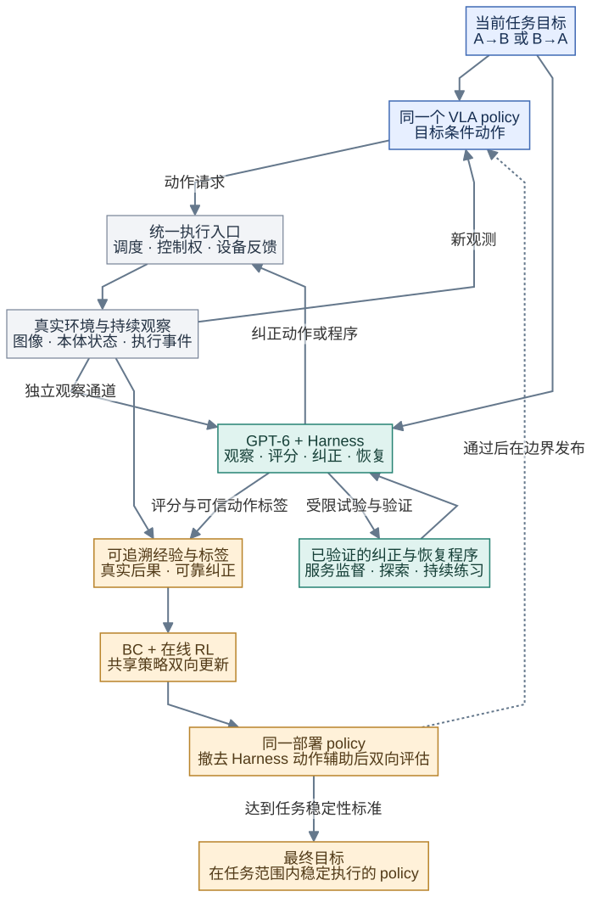
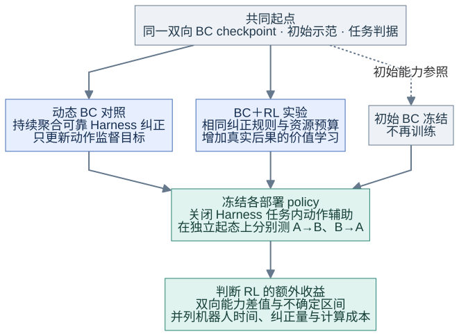
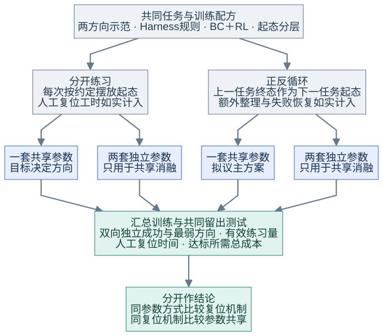
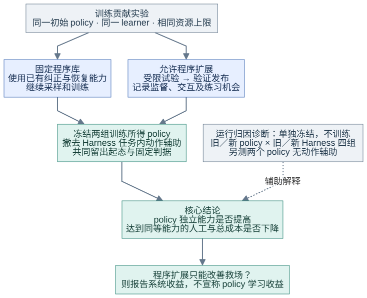
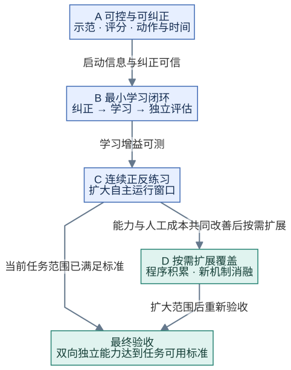

# RL＋Harness：面向真实机器人的自主学习闭环

**技术方案汇报 v4｜2026-09-23｜研究与设计文档；未实施集成、训练或真机实验。审查状态见本目录交付记录。**

本方案希望让一个初始能力有限的 VLA 策略，在真实环境中持续尝试，由 GPT-6 驱动的 Harness 观察、评分、纠正和恢复，再通过行为克隆（BC）与强化学习（RL）吸收经验。正反任务提供持续练习机会，Harness 减少日常人工介入，学习算法则把有效经验转化为 policy 自身的能力。

汇报围绕三个问题展开：**为什么需要这套闭环？怎样让它真正产生学习？用什么实验判断是否值得继续？**

## 一、动机：真机学习的瓶颈不只在算法

### 1.1 从“能训练”到“能持续练习”，中间仍有大量人工劳动

真实机器人训练通常需要人判断任务结果、纠正错误动作、恢复场景并处理异常。即使算法能够利用在线经验，只要每次失败都要有人到场，学习规模仍受人力限制。

本项目把这三类问题放进同一闭环：

| 问题 | 对应机制 | 预期作用 |
|---|---|---|
| 完成一次任务后，谁恢复下一次练习条件？ | 正反任务循环 | 将一次任务的结束状态尽量转成另一任务的起点 |
| 发生错误后，谁观察、判断与纠正？ | GPT-6＋Harness | 自动提供评分、局部纠正和异常恢复 |
| 怎样避免每次都靠 Harness 救场？ | 可信 BC＋在线 RL | 让策略吸收正确动作，并从真实后果中改进行为 |

这里有两点需要通过实验验证：反向练习可能促进正向能力，也可能造成共享训练冲突；RL 可以利用失败后果，但不保证比持续收集纠正数据做 BC 更快、更好。SFT 也可以利用失败回合中的正确动作片段，不能简单等同于“只能用成功案例”。

### 1.2 首个目标：在有限工位内，验证少人工介入的持续学习

首个任务是单臂将同一物体从 A 区搬到 B 区，再搬回 A 区。**两个方向使用同一个目标条件 VLA policy，均接受 RL 训练与 Harness 纠正。** 正常反向本身是学习任务；异常恢复另行处理。

允许少量遥操作示范和 SFT，初始策略成功率偏低，包括零成功率。不预设另有高成功率策略提供答案；但少量示范、可靠局部纠正或有效探索仍须提供启动信息。全部尝试都失败、奖励没有区分且纠正也无效时，RL 不会自动产生解法。

“完全自学习”先按**限定工位、对象与连续运行窗口**验收：窗口内无需人遥操作、标奖、复位、在线调参或持续值守。前期标定和示范单独计成本；超出恢复能力时允许结束窗口，并如实记录原因。首站可用现有松灵双臂平台的一臂，框架设计优先考虑通用性，品牌适配仅影响部署成本。

## 二、方案：把练习、纠正和策略更新连接起来

### 2.1 总体框架：运行闭环产生经验，学习闭环提升独立能力

*图1｜实线连接动作、观察与数据，虚线表示评估后的版本发布。policy 与 Harness 共用一个执行入口；学习器从可追溯记录构建训练数据。图中是拟议分工，不表示组件已集成。*

VLA policy 负责根据观测和当前目标产生动作。Harness 是整个观察与纠正系统：GPT-6 分析多图、本体反馈与执行历史，调用感知、规划和动作工具。统一执行层负责动作调度、控制权交接和设备反馈，本地保护始终保留。

部署policy可包含所选方法必要的学习动作头或轻量编辑器，需作为一个整体冻结并计入成本；独立评估关闭的是 Harness 临场动作辅助。复合policy的收益不能冒称底层VLA参数已经吸收了全部能力。

**最终产物是能够稳定执行真实任务的 policy。** BC＋RL 更新它的参数；Harness 积累经过验证的纠正与恢复程序，为它提供更可靠的监督、更多有效尝试，并降低练习所需人工。程序积累是手段，policy 变强是目的；后续评估始终以撤去动作辅助后的策略能力为主要依据。

### 2.2 正反循环：共享能力，同时严格区分正常任务与异常恢复

同一物理状态的含义由目标决定：物体在 B，对“放到 B”是完成，对“放到 A”是起点。因此，目标不仅进入语言指令，也贯穿价值评估、奖励、数据采样和 Harness 判断。两个方向的数据分层采样，同一个候选模型通过双向评估后整体发布。

*图2｜两个方向反复调用同一个 policy，只切换目标。完成后确认下一方向具备合法起态，再刷新目标和队列；未知时先补观测，超预算再转异常处理。恢复失败则结束自主窗口。*

例如，A→B 抓空后，Harness 先确认控制权交接，再调整接近位置并重抓；策略随后继续当前目标。物体在 B 稳定释放、下一任务条件满足后，再切换为 B→A。纠正动作按其真实来源记录，不能冒记为 policy 独立完成。

物体掉出工作区等异常不能直接视为正常反向任务。恢复程序即使把物体放回 A，也不能把此前失败改写为成功；恢复的时间、动作和人工介入都需要记账。

### 2.3 Harness 怎样替代观察员和接管员

| 职责 | 实现思路 | 必须保留的边界 |
|---|---|---|
| 观察与评分 | GPT-6 结合有时间戳的图像、目标、本体状态与动作历史，判定完成、进行中、失败或未知 | 先用独立留出记录校准；工具返回 DONE 不等于任务成功 |
| 局部动作纠正 | 在 policy 实际访问的状态提供动作标签，或接管并执行短程修正 | 不假设 Harness 永远正确；可执行性、监督质量与时间信息分别检查 |
| 异常恢复 | 生成或调用感知、规划、夹爪等工具程序，恢复可继续练习的场景 | 经过受限试验与效果验证；超预算或不可恢复时停止 |
| 程序积累 | 保存有效纠正／恢复程序与适用条件，服务后续策略练习和学习 | 观察它带来的监督、有效交互与复位成本收益；程序数量不是最终成果 |

这就是本方案采用的 **Harness-DAgger 思路**：持续收集策略实际遇到的状态及可靠纠正，再聚合训练。纠正来源可以是 GPT 生成的目标、动作或本地反馈程序，无需上游强策略；DAgger 的名称也不赋予这些标签正确性保证。

GPT 负责语义判断，本地程序负责快速执行。长动作期间仍保持独立观察通道；申请取消远端调用后，必须确认设备实际停止或保持，才能交接控制权。

奖励先使用可靠的成功事件及明确代价。连续进展分数是后续独立验证项，需检查是否真实反映任务进展及能否被策略利用漏洞；“未知”不能直接变成失败或零奖励。迟到评分只标注对应历史任务，不影响已切换方向的当前控制。

### 2.4 BC＋RL：既吸收纠正，也学习真实行为后果

**BC 回答“可靠动作应怎样做”，RL 回答“真实行为带来什么后果、怎样获得更好回报”。** 两者结合可以降低弱策略启动难度，但前提是数据与学习目标一致。

| 数据来源 | 保留与使用方式 |
|---|---|
| 少量初始示范、Harness 可靠纠正 | 长期保留，合格动作参与 BC；具备真实后果且满足执行协议时，也可参与 RL |
| policy 与 Harness 的真实成功／失败交互 | 保留原始记录，按目标、时间与动作身份构造合格 RL 样本；最终成功不代表全程都适合模仿 |
| 未提交、未执行的动作建议 | 可长期入池作为监督候选或辅助训练数据；没有真实后果，不能伪造为环境转移 |

异步执行是二者融合的关键：机器人执行旧动作时，下一块动作仍在推理；新预测中只有部分实际生效。训练需要知道**当时看到什么、已经承诺执行什么、哪个请求真正影响了队列，以及后来发生什么**。仅按预测数组保存整块动作，或给未执行位置加一个 mask，都不足以保证学习正确。

首版参考设计使用固定执行槽，将已承诺动作队列纳入学习状态。请求成立、进入队列和物理生效分别记录；接管打断协议时，保留事实并隔离不合格样本。Harness 根据后续新观察修改的轨迹，也不能倒填成早先一次规划出的动作。详细时序和学习目标留在开发附录，本汇报只强调其必要性。actor 的状态采样也不能按事后“是否活到新动作执行”再次筛选；详细反例与验收放在异步附录。

纠正能否退出，要按方向和错误类型观察独立能力，逐步安排保留本地保护的自主尝试。接管率下降也可能来自少做任务、只做简单起态或监控漏报；不能单凭次数下降宣布学会。异常恢复可以继续服务练习，无需把超出正常任务的所有维修能力都塞进policy。

### 2.5 联合选型：先证明能协作，再决定采用哪个算法和框架

现有调研支持以下验证顺序，**尚未证明任何组合在本工位最优**。

| 层次 | 优先验证与对照 | 决定取舍的关键 |
|---|---|---|
| 原生 VLA 学习 | RAPolicy 优先做小预算预检 | 保留动作先验是否更易启动；公开 hold 配置须改造后才能满足连续异步执行 |
| 异步学习路线 | 完整动作头＋BC／队列 RL 作详细参考；Real-Time EXPO-FT 作实时对照 | 新头可学性、候选／编辑动作覆盖、有效训练数据比例和独立能力增益 |
| 持续纠正对照 | 借鉴 ABC 的动态 BC；FlowDAgger 等作为条件性扩展 | RL 是否优于持续获得可靠纠正的学习；纠正能否被部署 policy 表达和学会 |
| 补充原生对照 | verl-vla 的 π₀.₅ TD3＋BC | 开放配方能否在本任务与执行协议下成立，不外推仿真结论 |
| Harness 骨架 | RPent 首先验证；OpenETA、PhyAgentOS-core、Strands 及可复用运行层参与比较 | 同一 GPT、工具和故障用例下，观察、交接、数据完整性与维护成本 |
| 训练与动作工具 | RLinf 优先，LeRobot 为轻量备选；借鉴 Show-Harness 的语义动作解释器 | 是否能接入统一执行入口、目标与数据契约，避免多个组件各自控制硬件 |

不要求先长时间训练完整头才允许采用原生路线，也不同时完整移植全部候选。先通过接口回放、小样本 BC 和动作覆盖检查筛选，再进入同预算真机比较。不同方法的执行时序和学习目标分别验证，不能把一个框架的 replay 直接接到另一套目标函数上。

通用性通过可替换的本体、模型和学习器接口体现。首轮以两种不同动作定义的模拟适配器检查接口，后续再验证真实本体；接口通用不代表同一权重可以免标定、免训练迁移。

## 三、验证计划：证明策略学会了，同时证明人工减少了

### 3.1 三项假设：每项用什么实验回答

以下均是**待执行实验**。先确定任务起态、预算、试次及可接受的能力／成本差异，再采集结果；图中箭头表示实验流程，不表示已经获得提升。

#### H1：加入 RL，是否比持续收集纠正做 BC 更有效？

例如两组 policy 都会抓空，也都能得到同样规则下的 Harness 重抓纠正；区别是其中一组除模仿可靠动作，还利用真实成功与失败后果做 RL。

*图4｜动态 BC 和 BC＋RL 从同一初始模型出发，使用相同示范、纠正规则和资源上限；各自在线采样，不要求轨迹完全相同。初始 BC 只是能力参照，不是同预算竞争者。*

**看什么：**撤去 Harness 任务内动作辅助后，分别比较 A→B、B→A 的成功、耗时与差值的不确定区间，并列实际资源消耗。若只提高辅助后成功，或未显示相对动态 BC 的额外收益，就不能宣称 RL 已证明更合适；证据不足时继续诊断，而非解释为“RL 必然无效”。

#### H2：正反循环是否省复位劳动，共享参数是否有益？

这包含两个独立问题：物体搬到 B 后直接练搬回 A，是否比每次重新摆放更省人；两方向使用同一模型，是否比各自训练更有效。不能把两者一次改变后都归功于“正反理解”。

*图5｜构成“分开练习／正反循环 × 共享／独立参数”四组；两方向都训练，独立参数组只用于消融。固定同一轴，比较另一轴；模型数量带来的训练和存储成本单列。*

**看什么：**先以相同机器人总时间比较人工复位工时、有效练习量及双向独立能力；再按匹配的有效交互量比较学习效率。循环后起态可能更容易，需记录起态分层，并用共同的留出起态评估。如果只减少复位，就只确认运行收益；共享使某方向明显退化，则不能确认共享迁移收益。

#### H3：Harness 程序积累能否帮助 policy 学会，并降低人工成本？

例如新增“偏位后重新接近”程序，可能提供可学纠正，也可能只是反复替 policy 完成困难步骤。因此要分别检查**训练贡献**与**运行时救场能力**。

*图6｜主实验从同一初始 policy 训练两组：一组固定程序库，另一组允许受限扩展；训练后均撤去动作辅助。另用新旧 policy、新旧 Harness 四种冻结组合及两个 policy 无辅助试次，检查运行时配合；四组合本身不能证明程序对训练的因果贡献。*

**看什么：**新增程序产生的可靠监督、合格交互和恢复练习机会，是否伴随独立 policy 提升，或以更少人工／总成本达到同等能力。程序生成与试验成本也计入。若只会救场，则报告系统收益；若要进一步区分“标签更好”还是“练习更多”，再做相应数据用途消融，不从这两组直接推断。

三项实验分别记**policy 独立能力、系统辅助表现、总成本**，主结果始终是第一项。保留相同本地保护，采用独立任务核验；失败、未知、保护终止和拒绝起态都有记录，不能删掉困难试次。统一信息来源与资源上限并列实际消耗，不能声称同时严格匹配时间、步数和计算量。

开发诊断、版本晋级与最终留出评估分开；多次测试同一个 checkpoint 不能替代独立重复训练，连续循环也不能把相关帧当独立样本。完整实验执行和判定口径见 [开发方案 §13](01_开发技术方案.md#13-评估与工程验收)。

### 3.2 从最小学习闭环逐步扩大自主窗口

*图3｜每阶段先回答一个关键问题，再扩大范围；未达到门槛时回到对应问题修正。阶段进度不以“组件能启动”代替学习或无人运行证据。*

| 阶段 | 实际做什么 | 进入下一阶段的依据 |
|---|---|---|
| **A：可控与可纠正** | 对应开发 P0–P2。采少量双向示范；让 policy 做基本抓放；向 GPT 提供抓空、偏位等实录，检查判分并执行短程纠正，同时测接口和时延 | 能得到有效启动信息与可靠局部纠正；动作、观测和控制交接可追溯。此时不要求高成功率 |
| **B：最小学习闭环** | 对应 P3–P4。选一种典型错误，打通“抓空→纠正→数据入池→BC＋RL 更新→撤去辅助做双向测试”；先手算核对短轨迹，再运行 H1 对照 | 数据与目标核对通过，相对动态 BC 有可测且有实际意义的增益；否则留在本阶段诊断、扩大证据或换路线 |
| **C：连续正反练习** | 对应 P5。让同一 policy 连续 A→B→A，自动判分、换向和纠正；逐步延长窗口，运行 H2 并按错误类型减少帮助 | 独立能力达到阶段门槛，复位／接管／值守工时下降；窗口中断原因和遗漏试次可解释 |
| **D：按需扩展覆盖** | 对应可选 P6。在已稳定场景之外增加一种异常及其恢复程序，用 H3 检查训练贡献；稠密奖励、动态延迟分别另做消融 | 新范围内双向能力、成本及回退验证达标；收益没有依赖改变判据或增加隐性人工。当前任务已达标可直接验收，无需先进入 D |

算力和具体控制条件尚未确定，先测训练、推理、观察及停止的实际耗时，再决定部署规模；当前不承诺固定 GPU 数、训练小时或成功率。

当前任务已达到可用标准时即可验收；D用于扩大范围，不是必须堆叠新模块后才能发布policy。

### 3.3 主要风险与改变路线的条件

**Harness 不能产生可靠纠正。** 先缩小到可验证的局部错误，补充必要示范、标定或工具能力；不把更多自动尝试当作有效学习。

**异步和频繁接管使可训练数据过少。** 统计样本隔离原因与覆盖偏差，检查时序和纠正方式；必要时切换学习路线，不能靠拼接错误转移提高数据量。

**系统成功率上升，policy 独立能力不升，或另一方向退化。** 暂不宣称自学习成功，诊断纠正能否被模仿、RL 是否有额外收益及共享训练冲突。

**自动评分或生成程序改变了优化目标。** 用独立留出证据核验，冻结任务判据；异常数据可撤销、相关模型版本可回退。超出恢复能力时结束窗口。

### 3.4 本阶段希望得到的技术结论

本项目首先验证：在一个可控抓放场景内，能否把“持续练习—自动纠正—参数更新”连接成真实有效的闭环，使同一 policy 的双向独立能力提高，同时减少人工劳动。若成立，再扩大任务和异常覆盖；若不成立，按纠正质量、数据时序、学习算法与共享迁移定位原因。

初步增益并不等于可用。最终还需达到任务预设的双向可靠性、节拍和扰动覆盖标准；不跨任务强设统一成功率门槛。现阶段成果是系统设计与验证路线，稳定policy、长期无人运行及通用任务收益仍待实证。

---

**技术依据与展开材料：** [开发方案](01_开发技术方案.md) · [接口与验收](appendices/01_接口契约与开发验收.md) · [异步学习附录](appendices/02_异步动作时间轴与学习目标.md) · [独立调研报告](02_RL与Harness三轮递进调研报告.md)。本文概括既有设计，不增加新的论文效果或实测主张。图为本项目方案示意，Mermaid 源文件保存在同目录 `assets/`。

文档内容与配图的联合审查记录见 [交付记录](04_交付与连续审查记录.md)；文档审查不代表完成真机验证。
