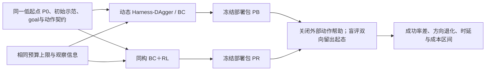
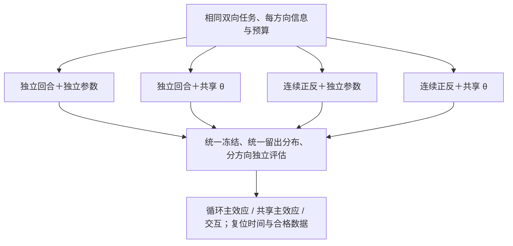
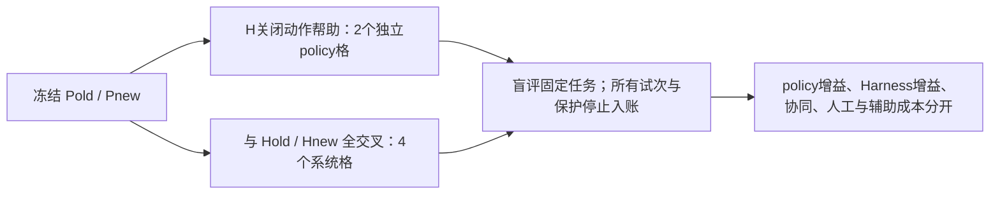
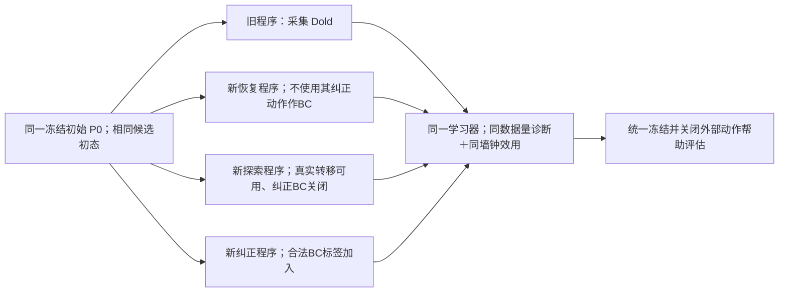
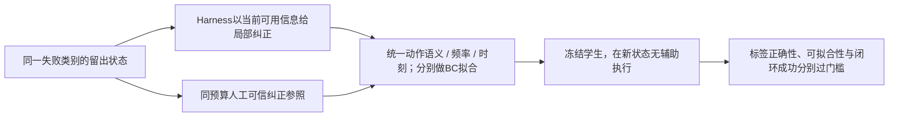
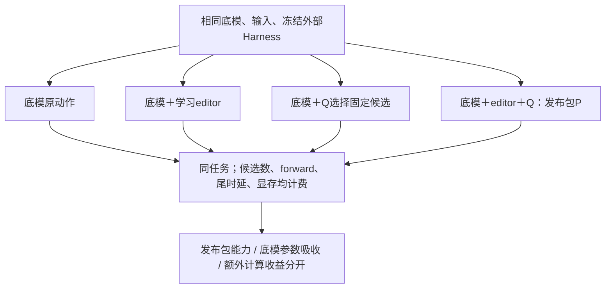

# S3：联合证据、归因实验与可否证验收

核查日期：2026-09-23。范围：第三轮递进研究的证据／验证子任务；不是后续五轮文档审查。以下实验均为本项目建议，**没有执行训练、仿真、真机或上游程序**。科学家库、S1／S2及三份正文均只读。

## 1. 先总结与枚举：本轮到底要区分什么

S2 已证实“存在纠正、replay、开源仓库、发布脚本”都不足以证明最终 policy 学到。本轮不再按论文名重排，围绕下列联合反例补证。

| 假设／混杂 | 要分开的变量 | 定向学习对象 |
|---|---|---|
| BC＋RL 的增益 | 新数据量与分布、监督质量、RL 目标、更新／调参预算 | ABC 动态 DAgger；RLDG 的动作／状态分布实验 |
| 正反循环＋共享 θ | 物理连续性、复位方式、每方向样本、参数共享、总容量 | DBAP／CRONOS／REVERSAL 定向回访及已有复位链；不重复报新 |
| Harness 程序积累 | 推理时代做、训练期动作标签、探索覆盖、恢复后的练习机会 | Scaling Up；AnyTask；RLDG |
| 独立 policy | 底模、学习编辑器、Q 选择、固定调度；外部 GPT 动作帮助 | 部署包消融与信息可用性核查 |
| 假提升 | 目标时间轴、未来图像、片段泄漏、数据原址替换、LoRA／normalizer／精度 | ABC 固定代码与新 PR；S2 OpenPI／LeRobot 反例组合 |
| 少量试次结论 | 固定样本与顺序停止、独立训练与重复评估、连续循环相关性 | STEP／N-SCORE 原论文、官方代码与假设 |

最终因果链仍是：**少量启动信息 → 同一目标条件 policy 的正反练习 → Harness 产生可信监督／有后果探索／恢复机会 → BC＋RL 更新 → 冻结后退出外部动作帮助的双向能力**。零或低初始成功率允许存在；是否能启动取决于可学纠正和可探索范围，不能用“先收成功样本”偷偷排除最难起点。

## 2. 第三轮新增证据：不仅是重新访问 S1／S2

### 2.1 ABC：强动态 BC、新数据捷径，以及配方与默认导出的差别

**原论文事实／作者报告。** ABC §5.3 以持续 DAgger 改善箱体折叠；项目页的 24%→85% 指平均任务进度，不能写成整任务成功率。论文每轮继续训练，混合旧数据、新干预及新自主片段；仅用干预数据会利用有笼／无笼采集环境与数据来源的虚假相关性。其配方约为 80:10:10，不能只比较初始静态 BC 后将全部提升归给 RL。[论文 §5.3](https://arxiv.org/html/2606.27375#S5.SS3)、[作者项目页](https://abc.bot/)

**新增固定实现证据。** GitHub API 固定官方 `amazon-far/abc@6c467cebcecf16a4dce79e6fd87a7ca2281c3ef0`，2026-09-18。读了启动器、部署说明、导出器、checkpoint 保存和 dataloader 目标解析；有限文本副本与哈希见 [读取目录](evidence/validation/) 和 [API记录](evidence/validation/api_retrieval_log.json)。

- `deploy/recording/export.py` 的 auto 模式对 DAgger 默认只导出 INTERVENTION，discard 片段不导入训练；这不是论文 80:10:10 配方的自动实现。可以另选 whole_episodes，但构造混合和可信度仍由用户实现。
- 同文件默认 `val_mode="same_as_train"` 明确供过拟合调试；切为 split 后，随机切的是导出的 episode_id。来自同一 source_h5 的多段纠正可以分到两边。本项目必须在切片之前按原始回合／session 分组。**不据此指控 ABC 论文采用泄漏评测。**
- 导出器强制显式选择 normalizer 来源；checkpoint 保存 model、norm_stats、配置等且用临时文件替换。可以吸收这些工程机制，但不是执行动作、标签正确或数值等价已获证明。

[固定导出器](https://github.com/amazon-far/abc/blob/6c467cebcecf16a4dce79e6fd87a7ca2281c3ef0/deploy/recording/export.py)、[固定部署说明](https://github.com/amazon-far/abc/blob/6c467cebcecf16a4dce79e6fd87a7ca2281c3ef0/deploy/README.md)、[固定 checkpoint](https://github.com/amazon-far/abc/blob/6c467cebcecf16a4dce79e6fd87a7ca2281c3ef0/abc_minimal/checkpointing.py)。

**改变方案：**动态 BC 必须持续拿到同预算纠正；检查数据来源捷径；不照搬导出默认配置作为独立验证；完整事实账本保留失败／丢弃段，训练过滤与评价分母分开。

### 2.2 新 PR 把“目标标签错位”从理论担忧变成实际维护反例

ABC [PR #23](https://github.com/amazon-far/abc/pull/23) 于 2026-09-18 合并。维护者报告：multi_drawer_search 运行时随目标物体放置逐次换 prompt，导出却把首目标标在所有帧上；约 65.4% 帧因此错目标。维护者重放 783 个回合重建目标时间轴，其中 4 个不一致，标 excluded；原数据 key 被原址替换并更新 manifest 内容哈希。数量属于维护者报告，本轮没有下载数据复算。

**本轮直接代码核查：**固定 dataloader 的 `_prompt_timeline`、`_prompt_at` 和 `build_prompt` 已按 frame 解析目标，并跳过显式 excluded 回合；PR diff 与该文件相符。[固定 dataloader](https://github.com/amazon-far/abc/blob/6c467cebcecf16a4dce79e6fd87a7ca2281c3ef0/abc_minimal/dataloader.py)、[合并 diff](https://github.com/amazon-far/abc/pull/23/files)

**项目推论：**同一 θ 的 A→B／B→A不能按回合名、导出时 live goal 或最后一次评分重标旧动作。必须保存 observation、proposal、dispatch、effect 和 goal／epoch 的时间关系；chunk 横跨目标切换时需明确截断／mask，不能仅修正起始帧标签。数据 URL、文件名和代码 SHA 都不足以单独冻结训练集合，还需内容 hash、标签版本和撤销记录。

### 2.3 RLDG：把状态覆盖与动作质量拆开，并暴露教师频率差

RLDG 的原论文 §5.1 在相同人类状态上用收敛 RL 专家重标动作，与原人类数据及真实 RL rollout 数据比较，分别探查动作质量和状态覆盖。最终 generalist 用监督微调；这不是该 generalist 自己运行 TD。实验教师与 OpenVLA 的控制频率不同，论文还讨论速度优化动作在蒸馏后出现提前释放等失败。因此“教师做对”不足以保证学生在不同频率／信息下可学。[原论文 §3–5](https://generalist-distillation.github.io/static/high_performance_generalist.pdf)

公开 [RLDS 数据卡](https://huggingface.co/datasets/charlesxu0124/RLDG) 和 [OpenVLA／Octo 权重卡](https://huggingface.co/charlesxu0124/RLDG) 有具体任务与接口；本轮未下载、未验证全部权重／许可或重跑训练。相同成功轨迹数的论文对照，**不等于**专家训练、示范和失败尝试总成本匹配。

**改变方案：**为 Harness 加“同状态动作监督”与“新状态真实后果”两条归因实验；未执行的重标动作只能是有来源的 BC 标签，不能拼旧 next_state 当其 TD。教师看到后续帧或更高频反馈时，应拆成学生能观察到的决策点。

### 2.4 程序 → policy 有先例，但未证本项目整套联合目标

Scaling Up 用 LLM、采样规划与仿真特权状态收集带恢复的轨迹，再蒸馏到视觉语言条件策略；官方仓库可见数据生成与训练入口。它支持“程序产生学习数据”的机制，不能推出在本项目真实时延、少示范、共享双向 TD 下已经成立。[论文](https://arxiv.org/html/2307.14535)、[官方代码](https://github.com/real-stanford/scalingup)

AnyTask 的原论文进一步组合程序规划、接触采样与 RL 数据生成；真实部署部分依赖点云、多相机与仿真特权注释，且为仿真训练后的部署。其原论文／机构项目页可读，本轮未找到可确认的完整官方训练仓库／权重／数据发布链。因此只吸收“程序可提供探索与数据，而不必永远在线代做”的对照思想，不作为立即替换 learner 的开源基线。[AnyTask 正文](https://arxiv.org/html/2512.17853v2)、[机构项目页](https://anytask.rai-inst.com/)

### 2.5 STEP／N-SCORE：停止规则和采样假设必须一起写

STEP 提供二元成功的顺序比较；N-SCORE 扩展到预先定义、归一到有界范围的进度等指标。顺序方法可以边收集边按其规则停止，但不能修复反复换 policy、挑指标、挑子群的多重比较。N-SCORE 附录 C-C 专门讨论共用初态、分层与相关性，不能把正反循环中的相邻回合直接当独立样本。[STEP 正文](https://arxiv.org/html/2503.10966v2)、[N-SCORE 正文及附录](https://arxiv.org/html/2603.13616v1)

官方实现有 [STEP 仓库](https://github.com/TRI-ML/sequentialized_barnard_tests) 和 [N-SCORE 仓库](https://github.com/dasnyder5/nscore)。N-SCORE README 的 FailToDecide 是证据不足；不是两个策略相等，也不是证明无效。所读示例使用新独立环境；本项目若采用配对／簇设计，应选与该抽样结构匹配的检验，不直接复制独立样本示例。没有执行这些统计代码或核全部许可。

## 3. 开放资产与补漏收束

| 候选 | 实际开放／读取到什么 | 不能外推什么 | 对主线决定 |
|---|---|---|---|
| ABC 2026 | 官方代码固定 SHA；BC／VLA训练、DAgger、部署、仿真入口；checkpoint 下载入口；HF 数据卡 | 没下载大权重／gated 数据；没运行依赖；公开入口不是独立真机复现 | 增加强 BC 与数据／发布检查；不为大预训练数据替换少示范约束 |
| RLDG | 原论文分析、RLDS 数据卡、任务权重卡、使用说明 | 不证明 GPT 纠正、同 θ 在线 RL 或总成本优势 | 吸收状态／动作拆分；作为离线监督桥参照 |
| Scaling Up | 官方生成／训练代码及论文 | 特权仿真信息不等于真实 GPT 输入；本轮未核全部权重及许可 | 保留程序采集→policy参照 |
| AnyTask | 原论文和机构项目页 | 本轮没核完整代码／权重链，不称可复现开放基线 | 方法边界参照，非首版依赖 |
| STEP／N-SCORE | 原论文、官方统计代码／教程 | 不自动适配串行循环、共享初态或反复模型选择 | 可选顺序评估工具；首版可用预注册固定样本 |
| DBAP／CRONOS／REVERSAL | 定向回访发现；本地检索确认 CRONOS／REVERSAL 早已在02／04覆盖 | 不把旧工作重新计为新候选；不把仿真reset oracle当设备复位 | 保留已有可恢复域与reset预算思想 |
| PoRSE | 本轮搜索到 ICLR 原论文 PDF线索，未进一步代码审计 | 摘要／会议信号不足以支持本任务选型 | 不进入首版；本轮收束，不为名单数量扩张 |

ABC 代码的 Apache-2.0、DiT 的 DINO 派生限制、VLA 的 Gemma 条款与数据 gate 要分开记录。其 [官方仓库许可说明](https://github.com/amazon-far/abc#licenses) 与 [HF 数据卡](https://huggingface.co/datasets/XDOF/ABC-130k) 可读，后者要求同意共享联系信息；本轮没有接受条件。没有以机构、stars、HF下载量、仓库数量或 issue 中自报的 wrapper／mock 测试作为独立复现。没有找到足以替换全部“低起点＋同θ双向＋真实TD＋GPT程序”的完整联合开放证据；这是本轮范围内的结论，不能写成全球不存在。

## 4. 七个可否证实验：每项都有对照框架

下列 H1–H3 对应汇报的三项主假设；H4–H7 为使主假设可识别的子实验／门禁。图都是本项目实验建议。记 P 为**冻结的完整部署动作决策包**，H 为外部 Harness；P可含事先声明的学习动作头／editor／Q，二者边界见 H6。

### H1：BC＋RL 相比同预算动态 BC，确实提高独立能力

**实际操作。** 从相同初始化／数据起分叉；两臂都有持续 Harness 标注／纠正、同一动作头容量、同一观测历史／相机、同一冻结奖励核验协议和更新机会。静态 BC 只用来展示起点，不能充当唯一竞争者。先冻结 Harness 的程序版本，避免算法比较时混入程序增长。

做两种不同问题的比较，不强行称“所有预算同时相等”：

1. **机制诊断：固定数据。** 两学习器读取同一按时间封存的事实账本及相同纠正标签，按相同数据 cut-off／梯度步／模型选择预算训练。BC只用合法监督；RL额外用合格真实转移。比较共享数据时的更新目标差异。可用汇总日志作离线诊断，但不能把这种共享池结果说成两个在线系统有相同访问分布。
2. **系统效用：固定资源上限。** 各自产生数据，在相同机器人时长、示范／人工分钟、GPT调用与GPU预算上限下运行；上限向量逐项报告，某臂先耗尽即按预设规则停。允许轨迹分布不同，因为这也是在线算法影响的一部分。另给等合格交互量曲线，区别样本效率与墙钟效率。

**通过条件。** 预注册主效应量δ_min、每方向可接受退化ε_g。独立评估差值区间下界超过δ_min，且两个方向各自差值下界高于−ε_g；若主张“两方向都提高”，两个方向都须分别过正增益门槛。最终可用另需各方向可靠性、节拍和扰动门槛。预算用尽但区间跨门槛标“未决”，不是正结论。

**否证与转向。** 仅相对静态 BC提高、相对动态 BC不提高，说明不能声称RL独立贡献；若可模仿纠正已有效而RL无增益，先保留动态BC并诊断TD覆盖／critic，不靠调高BC权重把结果仍称RL突破。初始独立成功为零时仍可进入监督可学性实验；不伪造成功奖励。

### H2：正反物理循环节省练习成本；共享参数另有可辨识收益

**实际操作。** 2×2消融：循环方式×参数共享。连续正反在A→B终态满足B→A起始契约后换向；独立回合用预先记录的合法起态分布复位。所有臂都练两个目标，不把只练正向的臂充作共享基线。先在相同每方向合格交互量下看学习；再固定墙钟看吞吐／人工成本。测试时均用相同独立起态分布，避免“训练最后一段恰好容易”污染比较。

循环带来的起态变化是中介，不能默认为控制住：记录每方向起态难度、对象位姿、终态到下一起态的可达性；若独立臂无法匹配循环的起态边际，明确只估计整体循环效应。连续循环按运行窗口／重置块统计，不能把相邻episode算独立复制。

**参数公平。** 主消融令独立策略每个方向与共享策略有相同结构和单方向容量，因此独立臂总参数可能为2P，共享为P；报告总存储／优化开销。不能声称这同时也是总参数匹配。总容量匹配的两个半尺寸策略可作次级敏感性对照，但其架构变化另有混杂。梯度余弦或共享表示相似仅为诊断，不替代行为因果对照。

**通过条件。** 循环对照的每合格练习人工复位／值守成本比区间上界低于预设1−κ，同时双向独立能力非劣；共享对照需独立显示学习／成本优势，不能从循环有效推出共享有效。总平均升而反向超出退化界限，否证“共享双向有益”；保留用户目标同θ，优先查goal覆盖／梯度冲突，独立参数臂只用于诊断。

### H3：Harness 减少人工，而不是靠评估时救场掩盖策略失败

四格记录为 S00=Pold+Hold、S01=Pold+Hnew、S10=Pnew+Hold、S11=Pnew+Hnew；另有 N0=Pold+Hoff、N1=Pnew+Hoff。随机交错评测顺序和起态块，冻结评分者／判据／任务分布；超时、unknown、保护停止全部计入已发起试次，不将救场后任务通过记成policy独立成功。

可报告 `S10−S00`、`S11−S01` 的policy变化，`S01−S00`、`S11−S10` 的Harness变化，以及差分交互 `S11−S10−S01+S00`。它们是**固定版本的部署效应**，不是训练因果证明。共享任务判据才有这种解释；版本改变允许信息、超时或成功定义则不能直接相减。

**通过条件。** N1相对N0满足能力门槛；在达到同样任务质量的条件下，辅助系统的人力／值守成本达到预设降低κ，报告GPT／GPU及事后审核成本。若只有S11提高、N1不提高，结论只能是“系统辅助／恢复更好”；再由H4判断程序是否改善学习机会。只减少前台接管却增加后台审核，不算总人工下降。

### H4：程序积累通过可学标签、有效探索或恢复机会改善最终 policy

这张图表达四种用途对照，不要求首版四个复杂系统同时全建。先选一个反复出现的“抓空→恢复→再试”程序族，比较旧／新程序；随后按实际通道做逐项消融。

- **标签价值：**尽可能固定policy访问的决策状态，给两臂相同数量／质量预算的纠正标签；只有可靠同状态标签才可比。未来图像闭环程序不能整段当旧观测的标签。不要把未执行提议与成功替代拼成强偏好。
- **探索价值：**关闭新程序的BC标签入口，保留它实际执行后产生、且满足学习契约的真实经验；若学习器使用不同动作接口，则重建合法转移／边界，不能把宏程序硬当一条policy action。等交互量下比较困难状态覆盖、可训练TD与最终能力，不以“新状态数”独立证明有用。
- **恢复机会：**只用程序恢复练习条件，恢复动作本身不进BC／TD；相同墙钟下比较新增合格练习和最终P，另在相同合格练习数下比较P。前者有益而后者不变，仍可证明合法的吞吐／人力价值，无需强行证明恢复动作被学生模仿。
- **排除调度捷径：**新程序不能只把物体放到容易位置，任务困难层的配额／评测仍固定。程序库读取的成功案例、历史图像和隐藏目标不得进入仅对新臂可见的policy输入。

**通过条件。** 至少一条通道产生可重复的下游能力增益或等能力的总成本降低；训练期总收益由从同一P0分叉的实验确认。单次程序发布先过物理／记录／任务一致门禁，不要求每个程序单独有统计显著收益；周期性程序族评估才做上述因果拆分。无下游增益时缩小程序范围／修改采样；不将库条目增长当RSI学成。

### H5：Harness 的纠正位于学生可观测、可表达、可执行的范围

**操作与否证。** 标明教师和学生各自能看到的图像历史、goal、队列、触觉和程序记忆。先检验同状态动作物理合法，再做有限纠正集的过拟合诊断，再做独立留出状态闭环检验。训练集损失低只过拟合诊断通过，不能晋级为学成。若人工同接口可学而Harness不可学，定位教师错误／信息错配；两者都不可学，先查动作头表达、观察历史、频率或任务可辨识性。RLDG的重标动作只能启发这条监督对照，不能为虚构next_state开绿灯。

初始成功为零时允许补最小可信纠正／必要示范；增加的信息及成本显式计入所有对应对照。若该任务有两种需要不同动作但学生观测相同的隐藏情形，先补可部署观测／历史或收窄任务，不能靠多轮BC强迫不可辨识映射成立。

### H6：独立 policy 的提升来自哪个学习模块

P必须事先固定包含哪些参数、候选生成器、候选数K、Q及目标输入、editor、历史缓存和固定调度。若editor是学习动作头、只用可部署信息并随P冻结，则可属于独立policy；GPT临场改写候选、选择新语义路线或读取新增程序库代做仍属于H。

Q比较必须包含等K无Q／随机或原规则选择对照，区分“多采样就更好”与Q排序有效。editor关闭可能形成从未训练的输入分布，因此消融解释为组件依赖；若要证明底模参数吸收，需额外评估更新后的底模在其合法部署接口下的行为，或重新蒸馏后再测，不能只凭复合包变好。

**通过条件。** 最终冻结包达到独立能力与延迟预算；具体论文主张只归给实际变化的模块。Q只在已有候选中择优，低起点候选没有可行动作时应暴露覆盖失败，不能把多次Harness改写后的成功记为Q学会。

### H7：数据和部署身份门禁能抓住足以制造“假提升”的变更

这是工程门禁，先在离线日志／受控回放测试，不执行破坏性真机反例。通过条件与行为实验不同：已列出错误应被拒绝或按预先定义容差显式暴露，不能期待统计均值“平均掉”身份错误。

| 注入／实际操作 | 预期结果 | 反例失败怎样误导结论 |
|---|---|---|
| goal在chunk在途时A→B切换；把整段标为最后goal | 能追溯proposal／执行时goal、epoch；跨边界不伪装同目标TD | 正反标签互相污染，看似负迁移或虚假成功 |
| 给迟到图像新的接收时间；把后续纠正动作回填旧观测 | 按capture时间及允许信息边界隔离；不会只看receive时间 | 未来信息泄漏让离线BC好、真实policy差 |
| 同source_h5切成不同episode_id进入train/test；val指向train | 分组manifest／内容指纹审计阻止；开发调试集不能做晋级／终测 | 验证loss大幅下降却无泛化 |
| 数据URL不变但字节／标签更新 | manifest检测内容hash、标签版本、训练cut-off；重建受影响样本和模型lineage | 把数据修复差异当算法改进 |
| 换normalizer／漏LoRA／EMA和raw混装／FP32文件用BF16服务 | 同obs、goal、噪声、步数核对中间张量与最终物理单位动作；核实际服务dtype | 新模型表面上线但仍是旧能力；系统救场掩盖失败 |
| 固定θ只换服务栈或动作排序，能力变了 | 旧新θ×旧新服务栈的同输入离线交叉诊断；冻结后再做实机比较 | 把运行时修复计为参数学习 |
| 删除人工丢弃段、unknown、停止与救場失败 | 事实总分母仍保留；训练eligible可不同 | 回合成功率、人力和有效TD均被美化 |

已有 OpenPI／LeRobot 证据采用 S2 固定版本；本轮新增的是将它们与ABC目标／数据发布／split反例组合为联合验收，而不是声称重新核了当前所有上游代码。

## 5. A／B／C／D阶段：实际做什么，凭什么通过

| 阶段 | 一次可执行的工作单元 | 留下的结果 | 进入下一阶段的条件／失败动作 |
|---|---|---|---|
| **A 可控与可纠正** | 定义一个可逆抓放对A↔B；少量双向示范后测低起点；对抓空／偏位等单一错误，记录Harness与可信纠正；离线跑H7错误注入和H5可学性诊断；量实际推理／观察／停止时延 | 任务／接口／版本manifest；全部事实与隔离原因；可部署观察清单；纠正质量与数据谱系 | 目标、实际动作、capture时间、owner可追溯；关键错误注入被挡住；至少一类局部纠正可由学生拟合并在未见同类状态闭环执行。无可信纠正则补工具／示范／观测，不能跳到RL |
| **B 最小学习闭环** | 冻结Harness，运行H1固定数据诊断，再做两臂同预算在线比较；每次“抓空→局部纠正→BC/TD合法分流→参数更新”后冻结双向测试；H6限定最终包 | 动态BC与BC＋RL的完整预算、每方向独立试次、学习曲线、部署身份对照 | H1主增益／非劣界限通过且任务所需可靠性继续改善；若仅纠正有效但RL不增益，记录为BC结果、留B诊断或改RL路线；不先宣称长期无人学习 |
| **C 连续正反练习** | 用已通过的模型在逐步延长的固定窗口练A↔B；选少数版本做H2 2×2消融及H3四格＋两独立格；独立审计reset、换向、不可恢复停止 | 按运行窗口的吞吐／人工分钟／恢复时间／停止原因；双向初态覆盖；冻结policy不退化 | 循环降低总人工或等预算增加有效练习，双向能力不低于预设界限；共享效应单独说明。无限救场／初态变易／反向退化则缩小可恢复域或改数据配比 |
| **D 按需扩展覆盖** | 只扩一个程序族或一种新扰动；按H4拆标签／探索／恢复通道；再单独研究稠密奖励或动态延迟，不同时全改；周期性交叉评估与版本回退 | 程序族的下游收益、额外成本和旧任务回归；独立终测前封包 | 新增范围达到预设可靠性／成本条件且旧范围非劣；程序有效但未证明学习收益时只作为恢复设施标注；当前任务已可用可在C验收，D不是强制堆模块 |

**精炼的首批实验建议：**先用一个抓放任务对、两个典型局部失效、一个冻结Harness版本；只比较一个可表达的主动作头＋动态BC与同构BC＋RL。先完成A与B，再增加H2的循环／共享消融；不要并行完整移植所有论文、三个大模型和全部恢复程序。对照分叉需要不同训练重复；回放同一模型多次只是评估重复。

## 6. 统计、成本和停止门槛：预注册成一页执行卡

1. **冻结对象。** 分开开发集、晋级集、最终留出集；按任务实例／物体／场景／日期／原始session成组，不按相邻帧。最终留出只用于一次冻结结论，若结果驱动改方案即转为开发资料，另建留出。程序库、提示词、奖励器的开发也不能读最终留出。
2. **统计单位。** 独立policy成功率单位为episode，不能帧级扩样；学习结论另外需要独立训练重复，建议先至少3个训练重复估波动，但3个不是统计充分保证。连续自主成本以独立运行窗口／复位块为单位，并报告窗口内相关性。物理配对初态只近似复现，保存姿态误差并随机交错顺序。
3. **两类判据。** 研究增益：差值区间下界超过δ_min，方向退化不越ε_g；任务验收：各方向成功率下界达到p*_g、耗时／保护触发等达到预定需求。δ_min、ε_g、p*_g、成本下降κ、N_max和资源上限都必须在看晋级结果前确定；目前本体和业务要求未知，不冒造统一数值。
4. **样本量不能用习惯数字代替。** A的小样本只筛接口／可学性；B的pilot估基线、效应量与方差，再按检验和多重比较计划定试次数。即使独立二元试验n次全成功，一侧95%精确下界为0.05^(1/n)；若要下界达到95%，至少59次全成功，达到99%至少299次。两个方向、多模型或簇相关会改变所需样本，不能把这两个示例直接套成验收预算。
5. **选一种停止模式。** 首版可固定N后一次检验；若成本需要中途停止，采用正确实现且符合采样假设的STEP／N-SCORE或相应置信序列，并预分配多方向、多候选、多版本的错误预算。普通95%区间不能每十次看一遍、看到正增益就停。换候选继续试也不是同一检验。达到N_max仍不确定写未决，不能接受“没有差异”。
6. **主指标不能被进度代替。** 双向严格成功率是最终能力主指标；固定rubric的进度分数是诊断／排序辅指标。只进度显著而成功率未过任务门槛，不发布“可靠policy”。判分者对算法／版本盲化；训练GPT奖励与最终核验分开，unknown先保留并做最坏情形敏感性分析，必要时同标准复核全体。
7. **成本向量。** 分别计 robot wall-clock、合格执行秒／转移、不可用日志、人工演示／接管／reset／标奖／值守／工程／审核、GPU时间／显存、GPT token／调用／延迟。主效用可报“达到p*所需总资源”和“固定资源内达到的p”；成本单价未给时保留向量，不把分钟、token和GPU时混成未经解释的一个数。前期工程摊销分别给一次性和重复运行成本。
8. **继续／停止。** 因数据错位、身份不一致而停止是工程门禁；因独立能力超退化界限停止是回归门禁；因证据证明效果低于最小实用值可停止该候选；因预算耗尽／区间宽则未决。循环出现契约外不可恢复状态，结束当前窗口并按原因计账，不让自动reset无限消耗掩盖失败。

以上统计公式是独立同分布二元试验的示例推导；没有执行功效分析或将文献数据当本项目样本。

## 7. 给根审的变更建议与边界

应修改评估与实验表述，**不改变同θ双向policy作为最终目标**：

- 把“同预算”拆成固定数据机制诊断与固定资源在线效用；动态BC持续收纠正，不能只打静态起点。
- 四格旧新P×旧新H只定位部署贡献；程序训练价值另做同P0分叉及标签／探索／恢复通道消融。
- 循环和共享参数必须2×2拆开，容量／起态分布无法同时完全匹配时明确报告。
- P允许冻结学习editor／Q，但不把复合包收益叫底模吸收；候选数与推理成本必须匹配或单独计效用。
- 根据ABC新证据，增加目标timeline、分组split、内容hash、来源环境捷径和默认导出配方验收；训练过滤不删事实分母。
- 从A可学纠正，到B独立policy增益，再到C成本／连续运行，D按需扩展；每阶段明确通过／未决／否证后的动作。

本轮解决的是证据边界与实验可识别性，未解决本体上实际纠正准确率、动作表达能力、TD覆盖、可靠性、时延或总成本；这些都留给上述可否证实验。没有足够新证据要求换掉主线，足够新证据要求**强化动态BC、训练归因、数据发布与统计门槛**。

