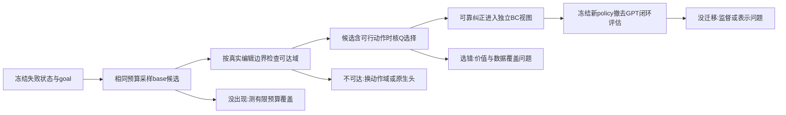
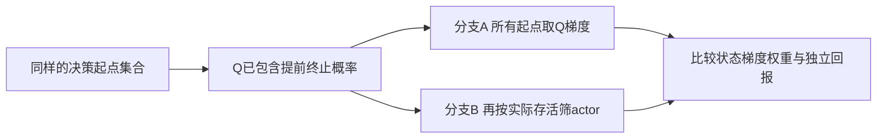
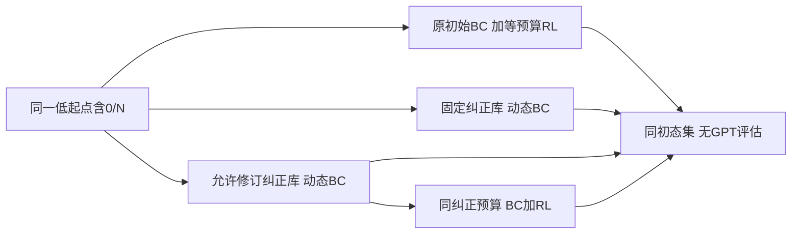
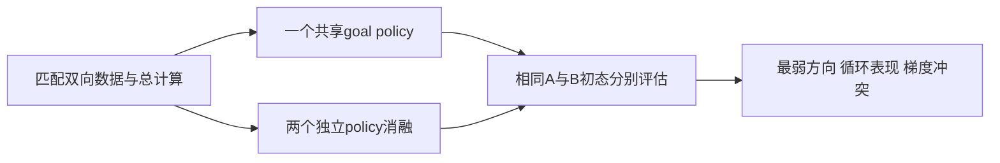
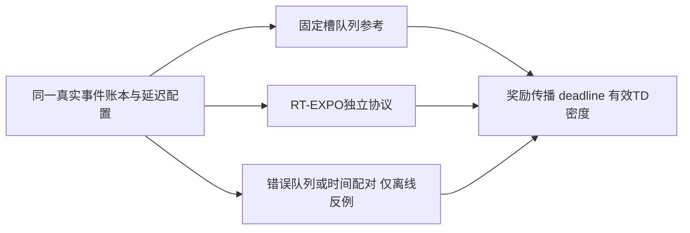
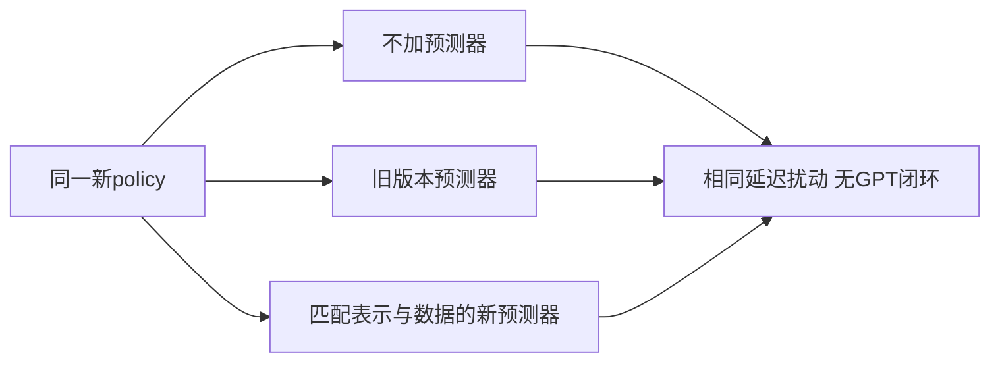
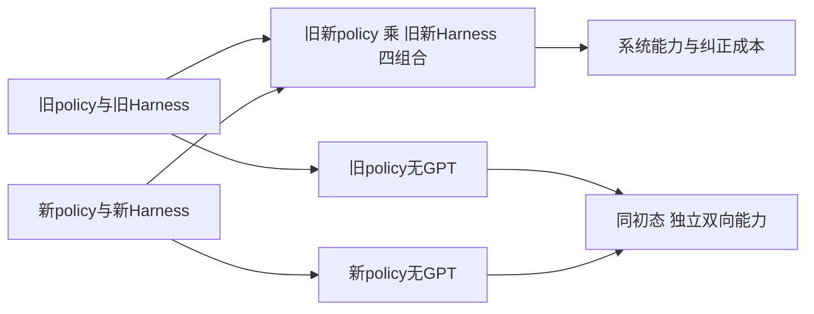

# S3：RL、纠正与异步执行的联合反证

研究日期：2026-09-23。本轮是第三轮递进研究，不是文档审查。只读科学家与既有方案，仅在本 S3 目录保存产物；未安装、运行上游训练代码或开展真机实验。已按科研技能先读技术点、枚举反例，再查原始来源。真实检索与阅读记录见 [rl_joint_log.json](rl_joint_log.json)。

## 1. 本轮结论与相对 S2 的增量

**保留 RAPolicy 原生头预检、RT-EXPO 实时挑战者和完整动作头队列参考三条职责；没有证据支持仅据论文成绩宣布最终胜者。** 本轮改变的是决定路线的诊断顺序：先证明可靠纠正能提供新行为，区分动作不可达、有限采样没覆盖、Q 排错和 BC 没迁移，再比较各自合法时间协议下的独立双向收益。完整头可表达全部动作也不代表少量数据足以学会。

新增深入阅读了 **SynthDemo-RL** 和 **TORL-VLA**。前者直接补上“LLM 改程序→首批成功覆盖→SFT→RL”的证据，同时给出真实视觉闭环失败、开环轨迹可执行的反例；后者将任务价值与介入风险价值分开，但依赖“介入能指示即将失败”的条件。本轮还重新读取 RT-EXPO 的弱起点门槛、编辑范围、成功 BC 与快选实现；RAPolicy 的 0/20 起点证据已在旧 04 §11，不计作新发现。

根审随后转来 Harness 组新线索 **FlowDAgger**。本组有限补读两个 backend 的训练循环，新增“物理纠正反演为 latent 监督”的可比较路线；它不提供 TD，也不替代异步队列目标。相关限制与覆盖预检见 §3.6。

最需要并入正文的修订为：**零成功启动单列覆盖诊断；把自动纠正的成功轨迹可执行性与闭环可迁移性分开；介入删失与 actor 选择偏差各有一个可手算反例；RT-EXPO 的单候选消融不能误关编辑器。** 这些修订不要求增加新硬件或同时移植所有方法。

## 2. 先总结技术条件，再列反例

目标是同一个 goal-conditioned 部署 policy 在 A→B、B→A 独立执行。部署包可以包含预声明的 VLA、完整头、editor、Q 选择器或预测器；独立评估撤去 GPT 临场动作帮助，不撤去该方法本来需要的学习模块。冻结 base 仍可能学得更好的复合 policy；若只 editor 变强，不能称 base 参数学会了。

| 技术点 | 原有成立条件 | 本轮优先反例 |
|---|---|---|
| 稀疏奖励低起点 | 至少有有效探索、局部纠正或可信成功路径 | 两方向均无成功且老师只会原地保持；训练更新很多却无有效回报差异 |
| RAPolicy replay 锚定 | 行为/latent/信息条件可对齐，较好行为可迁移 | 教师以未来图像修正的混合 chunk 被当早先普通标签；Q/V 变高而学生仍不会 |
| RT-EXPO 编辑与筛选 | 有用动作出现在候选或编辑可达域，Q 能辨别 | 必要旋转被 mask；张爪幅度不够；候选存在但 Q 选错；N=1 消融意外关闭 editor |
| 完整头队列 RL | 全动作接口可学、Q 在相关动作上有证据 | 自由度大但少示范无法学会；Q 把离回放很远的动作估得过高 |
| 接管和删失 | 物理事实、决策单位、后继和任务终止各自真实 | 最难状态总被删除；剩余 replay 看似越来越好，独立 policy 无改进 |
| actor 样本筛选 | 明确优化哪个状态分布 | Q 已平均提前终止概率，actor 又按本次是否存活筛一遍 |
| 共享双向 | actor、全部价值/编辑/筛选模块同目标条件 | 图像与关节相同，两个 goal 的 Q 输入却相同；正向支配快速成功池 |
| 自动 DAgger | 教师动作在学生可见与可表达信息空间中有足够规律 | 教师依赖真值位姿或闭环新反馈；整条路径能执行，视觉学生仍不成功 |

以上反例是研究问题，不是本项目已观察到的故障。

## 3. 定向新学到什么

### 3.1 SynthDemo-RL：解决首批覆盖，不等于真实闭环已经成立

原文 §III、§IV-C、§IV-E/F：仿真真值位姿、深度和实例 mask 配合 GraspGen、闭环伺服及 LLM 参数/路径修订，合成成功示范后训练 π0.5，再用 PPO。固定初始程序在 57 个扰动任务中有 12 个未合成成功；修订后均可产出成功轨迹。匹配的是 PPO 阶段计算，不含教师与额外 SFT 全成本。最关键的边界是作者明确报告初步真实视觉闭环未成功，真机 20/20 展示采用仿真生成的整轨迹开环执行和人工名义摆位。代码/数据官方发布链本轮未定位。[原论文](https://arxiv.org/html/2609.21650v1)

**本项目推论：** Harness 是否足以启动，要单独测它在 policy 失败状态是否产生可验证的新行为；学生是否从这些行为获得独立闭环能力，要再测一次。把二者合并为“程序已经成功，所以 policy 能学会”会漏掉信息差、行为多模态和闭环分布偏移。首批成功来自额外教师成本仍有价值，但必须计入总预算。不能把这个仿真工作升级为 GPT 真机自动 DAgger 已验证。

### 3.2 TORL-VLA：分开介入风险与任务价值的有条件参考

原文 §3.2、§6、附录 A.3.3/A.4.2：冻结力觉 VLA，用阶段路由的轻量 refiner；保留 task Q，另设介入边界截 bootstrap、加介入成本的 Q_ic，并通过相对参考动作的 hinge 约束 actor。原文承认依赖可靠介入指示即将失败。最终 replay 上的 boundary AUC 属训练后诊断，不能替代独立评估；官方页仍列主代码 Coming Soon，另链 RLT reproduction 不是本方法完整代码。[原论文](https://arxiv.org/html/2606.09337v1)、[作者项目](https://torl-vla.github.io/)

**本项目推论：** 可以研究一个不污染任务奖励的介入风险辅助头，但不要把 GPT 的 unknown、补观察、网络超时接管当同一种失败监督。介入概率本身还随 Harness 版本与阈值变化；若用作学习目标，必须版本化、单独消融。无需为本轮引入力觉与多阶段 actor。

### 3.3 回访 RAPolicy：承认弱起点证据，同时保留目标差别

重新读 §III-B/D、§IV-A/C：单任务十示范后 Stack Blocks 的 0/20→14/20 属真实弱起点证据，但有人类纠正；五任务共享实验为每任务 30 示范。replay 的较优行为经 Q/V 与优势加权 actor 传递，不是对当前部署策略进行无条件精确评价。以上已在旧 04 被记录，本轮不重复计新。[论文](https://arxiv.org/html/2609.22888v1)

**新联合推论：** 若教师可执行而 policy 不可表达，或标签依赖学生看不到的信息，replay 内较优价值仍可能高于学生可兑现值。增加 critic 预热并不解除这个障碍。无原始 latent 的纠正可以走明确 BC，不应伪造采样噪声；原仓 actor-loss 消融确有另用新 flow time/noise 的 `aloe_flow`，但它是不同训练模式，不能把无 latent 片段静默混进原 likelihood。[固定 actor loss](https://github.com/flyfaerss/RAPolicy/blob/ef4b1044f0cc78c0f6143180a2d78ae267ab03ea/rlinf/algorithms/awac_actor_loss.py#L31)

### 3.4 RT-EXPO：更明确地划出零成功接入缺口

本轮细读 §IV-C、附录 VII-E：初始化先做 RTC-SFT 至约 30% 或更高，原生 base 的在线 BC 使用成功 episode；有界 editor 与 Q 筛选属于部署 policy。该实验不是完全零成功的原生头启动证明。[论文](https://arxiv.org/html/2609.18207v1)

重新读固定源码后得到两项直接适配结论：`BatchProcessor` 的 HIL-only 分支是独立模式，不能推断默认 RT-EXPO 已消费失败回合中的可信局部纠正；`_jitted_fast_select` 在 `N<=1` 时直接取第一个窗口，跳过编辑与 Q。因此用 N=1 做“候选数消融”会改变不止候选数，须显式实现单候选仍编辑的对照。[batch processor](https://github.com/pd-perry/expo-ft/blob/803381fc3b4c91a0c47904f1b688fc5e35904f50/expo_ft/data/batch_processor.py#L83)、[快选分支](https://github.com/pd-perry/expo-ft/blob/803381fc3b4c91a0c47904f1b688fc5e35904f50/expo_ft/agents/alg/realtime_expo_ft.py#L168)

固定快选函数的 critic/editor 参数是 image/state/action，没有显式语言目标。这与其 task-specific 实验相容；双向接入时须另加 goal，而不是仅改变 base prompt。未运行上游，不声称发现跨配置必现运行故障。

### 3.5 FutureRTC 与 ForceRFT：补充的是条件，不是替代主线

重新读取 [FutureRTC 正文与附录](https://arxiv.org/html/2607.24008v1) 的承诺动作条件预测，与 S2 真机/仿真分支结果对照：预测器要在真实有效承诺与当前表示空间上工作。RL 改变 VLA 后，旧 latent predictor 即便输入 shape 相同，也可能不再预测新表示；必须独立检查闭环净收益。

重新读取 [ForceRFT §IV-D](https://arxiv.org/html/2609.22840v1)：接管截止信用明确是自主片段 surrogate，人工只给投影后的 BC，不能当本项目完整目标的无偏等价替换。冻结 base 的残差部署仍是学习 policy；限制其适配的是传感、动作域、目标和资产，不能仅因 base 冻结而否定它。

### 3.6 FlowDAgger：物理纠正可以反演，但须验可达性与时序

官方 main README 现含 π0.5/JAX/MetaWorld 与 GR00T N1.7/PyTorch/LIBERO57 两 backend；TRANSPARENCY 仍只描述 π0.5 参考，范围文字不能覆盖当前整个代码树。后者要求额外 GR00T/LIBERO 固定依赖与 gated Cosmos-Reason2，已读 README 的基座约0.6成功也不是零起点。[官方仓库](https://github.com/microsoft/FlowDAgger)、[透明说明](https://github.com/microsoft/FlowDAgger/blob/main/TRANSPARENCY.md)、[GR00T依赖](https://github.com/microsoft/FlowDAgger/blob/main/flowdagger_gr00t/README.md)

两 backend 学习噪声 steering、冻结 base，属于复合 policy 的 BC 改进；没有 TD。π0.5 loop 默认跳过失败 episode，检查反演 latent 的 p99 与 steering 输出界；GR00T trainer 默认10个专家 seed 回合、专家概率1.0，其 evaluate 才撤去 expert。GR00T 先缓存起点 ctx，专家逐步读环境执行16步，再对整段按旧 ctx 反演；这可作事后监督研究，不能自动算首版同信息集 BC，更不是合法宏 TD。[π0.5 loop](https://github.com/microsoft/FlowDAgger/blob/main/flowdagger_pi05/dagger_loop.py#L138)、[GR00T loop](https://github.com/microsoft/FlowDAgger/blob/main/flowdagger_gr00t/train_groot_flowdagger.py#L306)

**最小影响：** 加入潜空间纠正的低成本离线可学性对照。对同一可靠纠正做动作编码→反演→原 sampler 正向→实际动作解码，分别检查执行维度、夹爪事件、latent 范围与新状态闭环；不能只看 padded model-space 平均 MSE。透明说明明确反演只能忠实覆盖 base 动作流形有界邻域，复杂/多模态区可能退化，因此不以“可反演”否定覆盖问题。超域时选择原生头SFT或完整头；不强制先实现新路线。反演成功也不能解除教师未来反馈/特权信息的可预测性缺口。

本组读取的是2026-09-23 web返回的main快照；API与commits页无法访问，Harness组也只核main，因此本轮没有锁定该主仓SHA，不伪造固定版本证据。两backend外部权重未下载，未核全部资产许可，不把主仓MIT当权重许可。

## 4. 联合反证一：覆盖到底缺在哪一环

对于已核验、与决策时刻相容的纠正 `U*`，令本次有限预算 base 候选为 `B_N(X)`，编辑域为 `E(X,b)`。编辑后可表达集合为 `S_N(X)=∪_{b∈B_N(X)}{b+e:e∈E(X,b)}`，还须经过真实归一化、夹爪语义和控制接口检查。

区分四种失败：

1. **候选覆盖**：同一状态、goal 和预算下，是否出现完成局部目标的候选；多模态好动作不必等于唯一 `U*`。
2. **编辑可达**：所需修正是否处于各维度允许范围；被 mask 的维度不能靠更多编辑采样补回来。
3. **价值排序**：已有可行动作时，Q 是否选中；先判断候选质量，再看排序，避免用 Q 自评同时充当真值。
4. **迁移到 base**：可靠纠正进入训练后，新的 base 自主行为是否改变；复合 policy 提升与 base 蒸馏收益分别报告。

有限 N 没采到不能证明理论支持为零。相反，若所有本次候选夹爪输出都低于张爪阈值且有界编辑跨不过阈值，就能否证该配置在这些上下文中的当次可达性。扩大 edit scale 是新的实验配置，重新测动作分布与安全边界，不冒充原版复现。

**选型影响：** 若 editor 范围覆盖、排序能学且总时延合格，RT-EXPO 不因冻结部分 base 而被排除；若动作域反复排除必要行为，优先原生头/完整头。若完整头连同预算 BC 都弱于原生头，就不能以自由度更大为理由强行推进完整头。

## 5. 联合反证二：删去被接管槽仍会留下选择偏差

当前附录保留准确前驱、隔离断裂槽，是维护转移真实性的正确局部决定；它并未给出总体无偏性保证。令 `M=1` 表示样本满足 TD 准入。若接管与未观测风险有关，可能有 `E[Y|X,U,M=1]≠E[Y|X,U]`。

**可手算反例：** 同一可见 X 下，动作 A 有一半分支回报 +1、一半 −1；Harness 总在坏分支完成前接管，坏分支被隔离。留存 replay 只显示 A 的 +1；动作 B 始终回报 0.2 且不被接管。完整独立目标应偏向 B，而留存数据可能偏向 A。这不是要求让机器人去撞坏分支；可先用解析转移表/安全仿真验证，再在可恢复状态安排分层自主尝试。

此外，**有效同协议人工/Harness 数据不必一概从 task Q 排除**。在相同 MDP、可确认后继和当前目标 policy bootstrap 下，它是合法离策略经验；从“人工后来成功”直接回填 earlier reward、MC 辅助回报，或用未兑现的教师价值替代学生能力，才会引入另一类目标错配。TORL/Force 的截断方式是有条件的 surrogate，不能作为所有接管数据的通则。

最低新增日志：按 goal、失败状态类、介入原因和 Harness 版本报告 TD 准入率、连续有效长度、接管后的独立复尝试覆盖。只给总体隔离率会掩盖最难反向状态全部缺失。若某状态总被接管，保留日志本身不能识别其自主回报；逆概率加权也不能凭空创造缺失支持。

## 6. 联合反证三：terminal actor mask 可能重复施加存活权重

S3 调研开始时的附录规定“当前 C 内提前终止，U 未激活”只训练 critic、不取 actor Q 梯度。这可作为保守工程选择，但要与完整 critic 分布分开验证。

设某个 X/C 以 `p_s(X)` 存活到 U 能发挥作用，终止分支对 U 无作用。若 Q 已正确学到两种分支的期望，则 `∇_U Q(X,U)=p_s(X)∇_U Q_survive(X,U)`。再只用本次实际存活行更新 actor，采样期望会额外乘一个 `p_s(X)`。两个同等采样状态存活率分别 1 和 0.2、条件存活梯度相同，则预期 Q 梯度比为 1:0.2；按实际存活再次筛选后变为 1:0.04。共享参数下折中会改变；这是本项目推导，不是上游论文实验结果。

S3 联合根审决定修订主方案：**actor 从全部合格事前非终止决策 X 采样，包括本槽 C 随后真实终止的分支，不再按未来实际存活二次筛选；终局信息只决定 critic backup。** 已终止状态本来不产生新 request。理想 Q 在必然终止状态对 U 无差异，随机终止状态的动作梯度已含存活概率。

先用小型解析 MDP 对照验证：critic 保留相同真 terminal 和正常转移，只改变 actor 状态采样；旧保守 mask 作为对照变体，另测近似 Q 的虚假动作梯度。不要用事后 L/终止标签作为在线 critic 的额外观测，也不要改真实 terminal target。本修订只消除额外存活筛选，replay 仍是离策略状态分布，不等于已得到真实部署分布的无偏策略梯度；deadline/抢占造成协议失效的记录也不会自动恢复资格。

## 7. 每项主要假设的可否证实验框架

以下均是待实施方案；同一试验只改变对应因素，主终点是冻结完整部署包撤去 GPT 后的双向成功与耗时。试次、种子、初态分层、预算和停止条件在执行前确定。

### H1：Harness 能把观测零成功策略带入有效学习区

看每方向/失败类的首个可信成功、可信 BC 覆盖、达到预声明独立能力阈值的总成本。修库的 GPT/机器人试错与额外 SFT 全计费；无新覆盖时不靠更多 TD 更新宣称启动。`0/N` 是有限样本事实，不是成功概率严格为零的证明；例如 0/20 的单侧 95% 二项上界约 13.9%。

### H2：RL 在相同纠正机会下优于动态 BC

在线训练访问分布不可强称相同：可先用固定日志隔离 learner，再用配对初态及相同纠正查询预算比较闭环。没有增益则检查可信 TD 密度、奖励覆盖、Q 外推，不能只增训练时长。教师生成的新数据对两组公平可用或分开报告信息预算。

### H3：共享双向带来迁移，而不只是增加正向机会

另外固定正向交互条数比较加入反向数据的收益，分开“共享迁移”和“复位后多练了”的效应。共享 actor/Q/editor/filter 均条件化 goal；同一张图、同一 C 换 goal 的检查必须覆盖整个包。分方向保护困难纠正，不让最快成功池吞掉反向。

### H4：正确异步条件和目标比只加线程有效

各方法先各自正确，再比较；不能让 RT-EXPO 读取新观测却把其决策标在旧起点。记录自然感知/推理/网络延迟与人工注入各自占比。RAPolicy hold 只能检验学习可达性，不能用于证明连续执行已经通过。

### H5：预测补偿在 policy 更新后仍有净收益

固定机器人实际有效承诺数据，比较跟踪/latent 误差与最终成功、总时延；检查接管取消后预测是否失效。训练预测误差降低而闭环不升即否证“这个补偿值得加入”；不为了复用 FutureRTC 强制增加主系统复杂度。

### H6：程序积累最终提升 policy，而非永久代做

预声明 editor/Q/predictor 保留在部署包内。若系统成功显著升而 policy 无辅助表现未升，说明当前收益在纠正服务；可保留有用程序，但不能记为已达成 policy 自学习。SynthDemo-RL 的开环硬件边界正好说明为何必须保留这一检查。

四组合只诊断部署时是谁在发挥作用，不能证明程序扩展造成训练收益。另从同一初始 policy 出发，固定程序库与允许扩展程序库分组训练，使用相同示范、纠正规则和资源上限，列实际交互与计算消耗；结束后冻结 policy 撤去 GPT 比较。程序探索的额外预算单列；主实验允许把更多有效练习视为整体收益，再以匹配交互量的消融区分数据机会与更新效率。

## 8. 需要并入方案的最小文字与接口修订

| 位置 | 最小修改，不扩大首版方法范围 |
|---|---|
| 开发方案 P1/P2 | 补任务/失败类的 `0/N`、可信纠正覆盖、首次成功及总生成成本；不把必须先到30%设成本项目门槛 |
| 动作头预检 | 采用候选出现→编辑可达→Q选择→BC迁移四段；各维度及夹爪事件单独核对 |
| RT-EXPO适配 | 增加可靠局部纠正独立 BC 视图，保护保留；不照搬success-only门槛；N=1消融保留editor需显式改分支 |
| 部署包/共享目标 | base、editor、Q、filter、predictor、normalizer、目标编码与调度作为一包冻结；同图换goal检查所有目标相关学习组件 |
| 异步附录接管 | 增加按goal/原因/状态分层的删失统计与自主复尝试覆盖；不声称完整前驱保留自动消偏 |
| 异步附录terminal | 主方案改为全部合格事前非终止决策X的actor采样；旧存活mask仅作对照，加入§6解析反例；不改真实terminal target |
| 研究报告新证据 | SynthDemo-RL与TORL加入有边界的定向补漏，不以机构/star或不同任务成功率排序 |
| 纠正可学性预检 | 可比较FlowDAgger式latent BC；先查反演往返动作误差、latent界、信息条件和失败样本筛选，不将其计为TD路线 |
| 专家汇报 | 每个主要假设附上述对应实验框架图、否证现象和行动；不只给总体系统框架图 |

## 9. 未测边界与收束理由

未测：GPT 在工位的评分/纠正可靠性；同 θ 双向动作覆盖；原生头与完整头少数据表现；候选排序的真实质量；接管删失的可识别性；合法 TD 密度；终局 actor 采样差别；本机总延迟；部署整个包的无辅助收益。论文、源码和本轮推导不能替代这些实验。

本轮已覆盖能改变当前路线的关键新反例，继续扩展无代码或额外传感/世界模型候选不会解除上述依赖，因此收束。科学家知识库未写入、未执行 UPDATE/goal，三份正文未编辑。公开网页通过 web 工具成功阅读；本机 urllib/curl 的批量原始下载长时间等待/超时后停止，末次核对仅 ForceRFT HTML 成功落盘，其余不声称已缓存。部分准确 web 返回保存在 [web_capture.json](evidence/rl_joint/web_capture.json)，落盘哈希见 [partial_manifest.json](evidence/rl_joint/partial_manifest.json)，阅读粒度、失败与 URL 全见日志。
